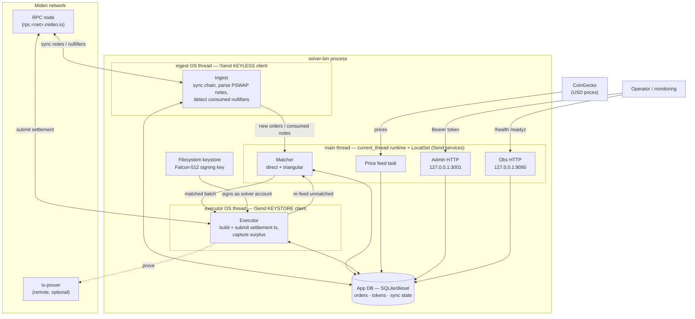

# Miden PSWAP Solver

An off-chain **matching engine + settlement bot** for Miden
[PSWAP](https://0xmiden.github.io) (partially-fillable swap) notes. It watches
the chain for resting swap orders, matches compatible ones **off-chain**
(pairwise *direct* matching and 3-cycle *triangular* matching), and **settles
the matches on-chain** by consuming the notes from its own account — keeping the
price spread as surplus.

Because PSWAP notes are permissionlessly fillable, the solver needs no special
privileges: it is just a well-capitalised participant that consumes matched
orders atomically and pockets the difference.

---

## How it works



### Execution model (L2 threading)

A miden `Client` is `!Send`, so the process is split across **three execution
contexts** connected only by `Send` channels:

| Context | Client | Role |
|---|---|---|
| **ingest OS thread** | keyless (no authenticator) | syncs the chain, parses PSWAP notes into orders, detects consumed-note nullifiers. Holds **no keys**. |
| **executor OS thread** | keystore-backed | builds & submits the settlement transaction that consumes matched notes; captures surplus. The **only** signing path. |
| **main thread** (`current_thread` runtime + `LocalSet`) | — | hosts the `Send` services: matcher, price feed, admin HTTP, obs HTTP. |

Data flow: `ingest → matcher` (new orders + consumed-note events) → `matcher →
executor` (matched batches) → `executor → matcher` (re-feed of orders that
didn't settle). All three persist to a shared SQLite app DB. The order lifecycle
is `Active → Settling → Executed → OnchainNullified` (the last is terminal and
authoritative — the chain nullifier is the source of truth).

### Workspace layout

| Crate | Purpose |
|---|---|
| `solver-bin` (root) | binary: config loading, tracing, Ctrl-C, wires `solver::start`. |
| `crates/solver` | the engine: matching, ingest, executor, admin, obs, price, db. |
| `crates/consume-script` | the MASM "consume-asset" tx script (sweeps surplus into the solver vault). |
| `crates/e2e` | standalone devnet end-to-end harness (provision/fund/load/run). See [crates/e2e/README.md](crates/e2e/README.md). |
| `crates/mock-price` | standalone mock CoinGecko price service (devnet/local pricing). Tiny, no miden deps. |
| `crates/mock-mirror` | devnet liquidity harness: posts favorable PSWAP counter-orders so the solver matches. See [crates/mock-mirror/README.md](crates/mock-mirror/README.md). |
| `crates/lp-sdk` | `pswap-lp-sdk`: client SDK external DEXes (liquidity providers) use to receive and fill routed orders over the RFQ websocket. Standalone — no solver or `miden-client` dependency. See [crates/lp-sdk/README.md](crates/lp-sdk/README.md). |

---

## Configuration

Copy the template and fill it in (the real file is gitignored):

```bash
cp solver.toml.example solver.toml
```

Config can be pointed at any path via `--config <path>` or the `SOLVER_CONFIG`
env var (default: `./solver.toml`).

### `[rpc]`
| Field | Req | Description |
|---|---|---|
| `endpoint` | ✅ | Miden node gRPC URL (e.g. `https://rpc.devnet.miden.io`). Must match the network your account is provisioned on. |
| `timeout_ms` | ✅ | Per-RPC timeout in ms (e.g. `10000`). |

### `[solver]`
| Field | Req | Description |
|---|---|---|
| `account_id` | ✅ | Hex id of the solver's on-chain account. Must be a **0.15-format** id provisioned on the target network. |
| `keystore_path` | ✅ | Filesystem keystore **directory** holding the account's Falcon-512 key (see [Credentials](#credentials)). |
| `app_db_path` | ✅ | SQLite application DB (orders / tokens / sync state). |
| `executor_store_path` | ✅ | miden-client store for the **executor** (signing) client. The solver account state lives here. |
| `ingest_store_path` | ✅ | miden-client store for the **keyless ingest** client. **Must be a distinct file** from the two above. |
| `read_pool_size` | — | Concurrent SQLite read connections. Default `4`. |

### `[[pairs]]` (one block per trading pair)
| Field | Req | Description |
|---|---|---|
| `name` | ✅ | Human label, e.g. `"USDC-ETH"`. |
| `asset_x_faucet_id` | ✅ | Hex faucet id of token X. |
| `asset_x_external_symbol` | — | CoinGecko id for X (e.g. `"usd-coin"`). Needed for USD pricing; tokens without it aren't priced and won't match. |
| `asset_y_faucet_id` | ✅ | Hex faucet id of token Y. |
| `asset_y_external_symbol` | — | CoinGecko id for Y (e.g. `"ethereum"`). |

### `[engine]`
| Field | Req | Default | Description |
|---|---|---|---|
| `pulse_interval_ms` | ✅ | — | Matcher tick interval. |
| `fetch_interval_ms` | ✅ | — | Chain sync interval (ingest + executor). |
| `price_interval_ms` | ✅ | — | How often the price task polls CoinGecko. |
| `triangular_enabled` | — | `true` | Run 3-cycle matching. Set `false` to skip the O(T³) enumeration on large token sets. |
| `admin_port` | — | `3001` | Admin HTTP port (binds `127.0.0.1` only). |
| `obs_port` | — | `9090` | Observability HTTP port (binds `127.0.0.1` only). |
| `debug_mode` | — | `false` | MASM debug instrumentation. **MUST be `false` on mainnet.** |
| `readiness_freshness_secs` | — | `60` | `/readyz` returns 503 if the last successful sync is older than this. |
| `router_enabled` + `router_*` | — | off | External liquidity routing (RFQ websocket to other DEXes). Off by default; 9 `router_*` knobs + the `SOLVER_ROUTER_TOKENS` env allow-list. See [docs/external-liquidity-routing.md](docs/external-liquidity-routing.md). |

> **External liquidity routing** lets allow-listed DEXes fill orders the matcher can't
> cross internally, over a websocket RFQ. Architecture + config + operator runbook:
> [docs/external-liquidity-routing.md](docs/external-liquidity-routing.md). DEX-side
> integration + the `pswap-lp-sdk`: [docs/filler-integration.md](docs/filler-integration.md).

### Price feed — devnet without CoinGecko

The matcher needs a USD price for **both** tokens of a pair. The solver always
uses its real `HttpPriceClient`; only the **base URL** is configurable via
`[engine].price_api_base_url` (default: public CoinGecko). On **devnet/local**
the faucet tokens aren't listed and you may have no `COINGECKO_API_KEY`, so run
the bundled **mock CoinGecko** service and point the solver at it — exercising
the exact same price path, no test-only code:

The solver queries the price API by each pair's `asset_*_external_symbol`. For
your own faucets the simplest convention is **`external_symbol = the faucet id
hex`** — then the price "id" *is* the faucet id, so you price a faucet by its id:

```toml
# solver.toml
[[pairs]]
name = "TOK_A-TOK_B"
asset_x_faucet_id       = "0x<faucetA>"
asset_x_external_symbol = "0x<faucetA>"   # id == faucet id
asset_y_faucet_id       = "0x<faucetB>"
asset_y_external_symbol = "0x<faucetB>"

[engine]
price_api_base_url = "http://127.0.0.1:8089/api/v3/simple/price"
```

> **id vs usd:** in every entry (`--price <id>=<usd>`, `/set?id=&usd=`, and the
> response `{"<id>":{"usd":<n>}}`) the **id/left side is the faucet id**, and
> **`usd` is the price field** — its value is the price (a plain number), and the
> field name stays `usd` because that's what the solver reads. Don't put a faucet
> id in the price value. The numbers only need a **consistent scale** — the
> matcher compares ratios, not real dollars (e.g. A=2.5, B=1.0 ⇒ 1 A = 2.5 B).

Run the standalone **mock CoinGecko** crate (`crates/mock-price` — tiny, no miden
deps). It's fully runtime-configurable — **keep adding faucets without restarting**:

```bash
# A live JSON config file (id -> usd). Re-read on EVERY request, so editing it
# to add/change faucets takes effect immediately. Created if missing.
cargo run -p mock-price --release -- --port 8089 --prices-file prices.json

# also accepts inline seeds and a catch-all default:
#   --price 0x<faucetA>=2.50 --price 0x<faucetB>=3000   (seed specific ids)
#   --default-usd 1.0                                   (price ANY id, zero config)
#   --drift-bps 50                                      (jitter each request)
```

Add or change a faucet two ways, anytime, no restart:

```bash
# 1) edit prices.json  ->  {"0x<faucetA>": 2.5, "0x<faucetC>": 4.0, ...}
# 2) over HTTP (also persisted back into prices.json if --prices-file is set):
curl "http://127.0.0.1:8089/set?id=0x<faucetC>&usd=4.0"
curl  "http://127.0.0.1:8089/prices"     # inspect the current table
```

The endpoint the solver calls is `GET /api/v3/simple/price?ids=<csv>&vs_currencies=usd`
→ `{"<id>":{"usd":<f64>}}`. `e2e provision` writes `price_api_base_url`
automatically. Leave it unset for live CoinGecko. **Don't pin a mock on mainnet.**

### Environment variables
| Var | Description |
|---|---|
| `SOLVER_ADMIN_TOKEN` | Bearer token for `/admin/*`. **If unset, all admin routes return 404** (token management disabled). |
| `COINGECKO_API_KEY` | Sent as `x-cg-demo-api-key`. Without it the public free tier applies (rate-limited / may 403). |
| `RUST_LOG` | Log filter. Default `info,solver=info`. Use `solver=debug` for per-tick matcher detail. |
| `LOG_FORMAT` | `pretty` (default) or `json` for log aggregators. |
| `SOLVER_CONFIG` | Config path (overridden by `--config`). |

---

## Credentials

The solver authenticates as `solver.account_id` using a **filesystem keystore**
— there is **no password, env var, or CLI secret**. At startup the executor
client is built with `FilesystemKeyStore::new(keystore_path)` passed as its
`authenticator` ([src/client_factory.rs](src/client_factory.rs)); when it
settles a batch it looks up the account's Falcon-512 key in that directory and
signs. The ingest client is built **keyless** and never signs.

You provision the account + key **out-of-band** before first run:
the account record must exist in `executor_store_path` and its key in
`keystore_path`. Use the `miden` CLI, or our harness:
`cargo run -p e2e --release -- provision` creates a wallet, writes the key into
the keystore, and emits a ready config.

> ⚠️ **The keystore directory is the solver's private key.** Anything that can
> read it can drain the solver. Restrict filesystem permissions, keep it off
> shared volumes, and back it up securely.

---

## Adding a trading pair

A "pair" is just two tokens the solver tracks + prices. Two ways:

**1. Static (config, requires restart)** — add a `[[pairs]]` block:
```toml
[[pairs]]
name = "USDC-ETH"
asset_x_faucet_id = "0x…usdc_faucet"
asset_x_external_symbol = "usd-coin"
asset_y_faucet_id = "0x…eth_faucet"
asset_y_external_symbol = "ethereum"
```

**2. Runtime (admin API, no restart)** — register each token (requires
`SOLVER_ADMIN_TOKEN`). Registering a token both **subscribes ingest** to its
notes and **enables pricing**:
```bash
curl -X POST http://127.0.0.1:3001/admin/tokens \
  -H "Authorization: Bearer $SOLVER_ADMIN_TOKEN" \
  -H "Content-Type: application/json" \
  -d '{"token_id":"0x…usdc_faucet","external_symbol":"usd-coin"}'

curl -X POST http://127.0.0.1:3001/admin/tokens \
  -H "Authorization: Bearer $SOLVER_ADMIN_TOKEN" \
  -H "Content-Type: application/json" \
  -d '{"token_id":"0x…eth_faucet","external_symbol":"ethereum"}'
```
Other admin routes: `GET /admin/tokens` (list), `PATCH /admin/tokens` (update
symbol), `DELETE /admin/tokens` (remove) — same body shape, all Bearer-auth.

Once both tokens of a pair are registered and priced, the matcher will pair any
crossing orders between them automatically.

---

## Observability

- `GET http://127.0.0.1:9090/health` — liveness (always 200 while the process is up).
- `GET http://127.0.0.1:9090/readyz` — readiness: 200 only if the DB is reachable **and** the last sync is within `readiness_freshness_secs`; otherwise 503.

---

## Price-query API

A **public, read-only** HTTP endpoint for wallets to fetch a token's current
price by faucet id (for swap UIs). It runs on its **own OS thread** (isolated
from the fund-handling matcher), serves only **registered** tokens, and is
bound to `127.0.0.1` by default (`price_query_bind`).

```bash
GET /v1/price/{faucet_id}?precision=&allow_stale=
GET /v1/prices?ids=<faucet_a>,<faucet_b>          # → { "<faucet_id>": {…}, … }
```
```jsonc
// GET /v1/price/0x8fe0…?precision=4
{ "faucet_id":"0x8fe0…", "ticker":"USDC", "vs_currency":"usd",
  "price":"1.0000",      // price of ONE WHOLE token; value a base-unit amount via (units / 10^decimals) * price
  "precision":"4",       // decimals of the PRICE number (config `price_precision` or ?precision=full|0-18)
  "decimals":8,          // the TOKEN's on-chain decimals (fetched on-chain; null until known) — distinct from `precision`
  "as_of":1781896971, "stale":false, "source":"coingecko" }
```
- **404** unknown faucet · **503** registered-but-no-price, or stale (older than
  `price_staleness_secs`; pass `?allow_stale=true` to get a 200 with `stale:true`)
  · **400** bad faucet id / precision / over-`price_query_max_batch`.
- Prices come from the same feed the matcher uses (CoinGecko or the `mock-price`
  service via `price_api_base_url`); `decimals`/`ticker` are fetched on-chain
  **once, when a token is registered** (config tokens at boot, admin-added tokens
  via the subscribe relay), then cached — never re-polled. Quote currency is
  `price_vs_currency` (default `usd`; not `usdt`).
- **CORS** is enabled (any origin, GET) so browser wallets / extensions can
  fetch it cross-origin. Front it with HTTPS in production — browsers block
  `http://` calls from an `https://` page (mixed content).
- Versioned under `/v1` so a future model lands as `/v2` without breaking clients.
- See the `[engine]` price-query knobs in `solver.toml.example`.

---

## Testing

```bash
cargo test -p solver               # unit + integration + adversarial proptest
cargo test -p consume-script       # MASM script compiles + behaves
```
- **Adversarial fuzzing:** `crates/solver/src/matching/tests/test_proptest_adversarial.rs`
  (proptest) checks the matcher never makes the solver lose funds and never
  panics on arbitrary amounts. See the assessment in
  [docs/security/pentest-2026-06-19.md](docs/security/pentest-2026-06-19.md).
- **Price-query API** (`crates/solver/src/price_api/tests.rs`, `axum-test`,
  `cargo test -p solver --release price_api`): 12 cases exercising the public
  surface end-to-end against a real temp-file DB —
  - **Registered-vs-priced:** unregistered faucet → `404`; registered but no
    price yet → `503` (not a misleading 404).
  - **Faithful price:** a sub-$1 value (`0.0034`) is preserved at `full`, never
    rounded to `0.00`.
  - **Precision (mirrors CoinGecko):** `?precision=2` formats to 2 dp; `0` → an
    integer; `18` is accepted; `19`, `-1`, and garbage → `400`; omitting the
    param falls back to the configured `price_precision` default.
  - **Token decimals & ticker:** served from the on-chain-fetched DB columns
    (populated once at registration); `null` (never a fabricated default) until
    that fetch lands.
  - **Staleness fails closed:** an old snapshot → `503`, unless
    `?allow_stale=true` (then `200` with `"stale":true`).
  - **Batch (`/v1/prices`):** returns a map, caps the id count (`> max_batch` →
    `400`), and omits unknown/unpriced ids CoinGecko-style (empty `ids` → empty map).
  - **Surface hardening:** malformed faucet id → `400` with a JSON error body;
    routes are `/v1`-scoped (no prefix → `404`) and GET-only (`POST` → `405`);
    `vs_currency` is config-driven and echoed back.
- **Live devnet end-to-end:** see [crates/e2e/README.md](crates/e2e/README.md)
  (`provision → load → run`, verifies on-chain settlement). The price API was
  also verified live on devnet — the ingest thread fetched MTA's on-chain
  `decimals=8`/`ticker=MTA`, and `GET /v1/price/<MTA>?precision=4` returned the
  served price with those fields.

---

## Running it

```bash
# 1. Build the binary.
cargo build --release --bin solver-bin

# 2. Provision a solver account + keystore on the target network (one-time).
#    Easiest: the e2e harness (also funds it + writes a config):
cargo run -p e2e --release -- provision
#    …or provision with the `miden` CLI and note the account id + keystore dir.

# 3. Create and fill the config.
cp solver.toml.example solver.toml
#    Set: [rpc] endpoint/timeout; [solver] account_id + the keystore/3 store
#    paths; one or more [[pairs]] with faucet ids + CoinGecko symbols;
#    [engine] intervals/ports. (See the Configuration tables above.)

# 4. Provide secrets via env (admin token enables runtime token management;
#    CoinGecko key avoids free-tier 403s).
export SOLVER_ADMIN_TOKEN="$(openssl rand -hex 32)"
export COINGECKO_API_KEY="<your-key>"

# 5. Run.
./target/release/solver-bin --config solver.toml
#    (or: SOLVER_CONFIG=/path/solver.toml ./target/release/solver-bin)

# 6. Verify it's live and synced.
curl -s -o /dev/null -w '%{http_code}\n' http://127.0.0.1:9090/readyz   # 200
```

The solver now watches its configured pairs, matches crossing orders, and
settles them on-chain. Watch progress with `RUST_LOG=solver=info` (look for
`ingested PSWAP orders`, `matcher produced batch`, `batch executed successfully`).
Shut down with Ctrl-C (graceful: in-flight work drains before exit).
