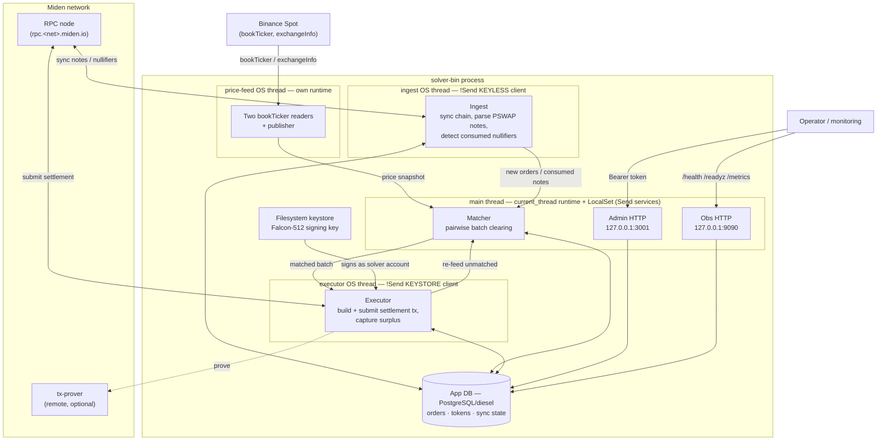

# Miden PSWAP Solver

An off-chain **matching engine + settlement bot** for Miden
[PSWAP](https://0xmiden.github.io) (partially-fillable swap) notes. It watches
the chain for resting swap orders, matches compatible ones **off-chain**
with exact-price pairwise batch clearing, and **settles
the matches on-chain** by consuming the notes from its own account — keeping the
price spread as surplus.

Because PSWAP notes are permissionlessly fillable, the solver needs no special
privileges: it is just a well-capitalised participant that consumes matched
orders atomically and pockets the difference.

---

## How it works


```mermaid
flowchart TB
    subgraph chain["Miden network"]
        NODE["RPC node<br/>(rpc.&lt;net&gt;.miden.io)"]
        PROVER["tx-prover<br/>(remote, optional)"]
    end
    BIN["Binance Spot<br/>(bookTicker, exchangeInfo)"]
    OPS["Operator / monitoring"]

    subgraph proc["solver-bin process"]
        subgraph main["main thread — current_thread runtime + LocalSet (Send services)"]
            MATCH["Matcher<br/>pairwise batch clearing"]
            ADMIN["Admin HTTP<br/>127.0.0.1:3001"]
            OBS["Obs HTTP<br/>127.0.0.1:9090"]
        end
        subgraph ingestthr["ingest OS thread — !Send KEYLESS client"]
            INGEST["Ingest<br/>sync chain, parse PSWAP notes,<br/>detect consumed nullifiers"]
        end
        subgraph pricethr["price-feed OS thread — own runtime"]
            PRICE["Two bookTicker readers<br/>+ publisher"]
        end
        subgraph exethr["executor OS thread — !Send KEYSTORE client"]
            EXEC["Executor<br/>build + submit settlement tx,<br/>capture surplus"]
        end
        DB[("App DB — PostgreSQL/diesel<br/>orders · tokens · sync state")]
        KS["Filesystem keystore<br/>Falcon-512 signing key"]
    end

    NODE <-->|sync notes / nullifiers| INGEST
    NODE <-->|submit settlement| EXEC
    EXEC -.->|prove| PROVER
    BIN -->|bookTicker / exchangeInfo| PRICE
    PRICE -->|price snapshot| MATCH
    OPS -->|Bearer token| ADMIN
    OPS -->|/health /readyz /metrics| OBS

    INGEST -->|new orders / consumed notes| MATCH
    MATCH -->|matched batch| EXEC
    EXEC -->|re-feed unmatched| MATCH
    KS -->|signs as solver account| EXEC

    INGEST <--> DB
    MATCH <--> DB
    EXEC <--> DB
    ADMIN --> DB
    OBS --> DB
```

### Execution model (L2 threading)

A miden `Client` is `!Send`, so the process is split across **four execution
contexts** connected only by `Send` channels:

| Context | Client | Role |
|---|---|---|
| **ingest OS thread** | keyless (no authenticator) | syncs the chain, parses PSWAP notes into orders, detects consumed-note nullifiers. Holds **no keys**. |
| **executor OS thread** | keystore-backed | builds & submits the settlement transaction that consumes matched notes; captures surplus. The **only** signing path. |
| **price-feed OS thread** (own runtime) | — | two Binance `bookTicker` readers and the publisher of the price snapshot ([ADR 0004](docs/adr/0004-binance-bookticker-prices.md)). Kept off the main thread so a long clearing pass cannot stall its sockets. |
| **main thread** (`current_thread` runtime + `LocalSet`) | — | hosts the `Send` services: matcher, admin HTTP, obs HTTP. |

Data flow: `ingest → matcher` (new orders + consumed-note events) → `matcher →
executor` (matched batches) → `executor → matcher` (re-feed of orders that
didn't settle). All three persist to a shared PostgreSQL app DB. The order lifecycle
is `Active → Settling → Executed → OnchainNullified` (the last is terminal and
authoritative — the chain nullifier is the source of truth).

### Workspace layout

| Crate | Purpose |
|---|---|
| `solver-bin` (root) | binary: config loading, tracing, Ctrl-C, wires `solver::start`. |
| `crates/solver` | the engine: matching, ingest, executor, admin, obs, price, db. |
| `crates/consume-script` | the MASM "consume-asset" tx script (sweeps surplus into the solver vault). |
| `crates/e2e` | standalone devnet end-to-end harness (provision/fund/load/run). See [crates/e2e/README.md](crates/e2e/README.md). |
| `crates/mock-binance` | local stand-in for Binance Spot market data (`exchangeInfo` + combined `bookTicker` stream) for devnet/local runs and tests. Tiny, no miden deps. |
| `crates/mock-mirror` | devnet liquidity harness: posts favorable PSWAP counter-orders so the solver matches. See [crates/mock-mirror/README.md](crates/mock-mirror/README.md). |
| `crates/lp-sdk` | `pswap-lp-sdk`: client SDK external DEXes (liquidity providers) use to receive and fill routed orders over the RFQ websocket. Standalone — no solver or `miden-client` dependency. See [crates/lp-sdk/README.md](crates/lp-sdk/README.md). |

---

## Configuration

Copy the template and fill it in (the real file is gitignored):

```bash
cp solver.toml.example solver.toml
```

Config can be pointed at any path via `--config <path>` or the `SOLVER_CONFIG`
env var (default: `./solver.toml`).

### PostgreSQL schema preparation

The solver application database is PostgreSQL. The two Miden client stores
remain separate SQLite files. Prepare a fresh application database before the
first run; ordinary startup only verifies its migration history and acquires
one PostgreSQL-held solver ownership lock:

```bash
SOLVER_MIGRATION_DATABASE_URL='postgresql://…' cargo run --bin solver-bin -- migrate-db
SOLVER_DATABASE_URL='postgresql://…' cargo run --bin solver-bin -- check-db
SOLVER_DATABASE_URL='postgresql://writer@…?connect_timeout=5&sslmode=verify-full' \
SOLVER_READ_DATABASE_URL='postgresql://reader@…?connect_timeout=5&sslmode=verify-full' \
  cargo run --bin solver-bin
```

`migrate-db` uses a role allowed to create the schema and its migration-history
table. `check-db` only reads that history and requires an exact match with the
migrations compiled into this solver binary. A missing, older, or newer schema
causes an error. The normal runtime role needs `SELECT` permission on
`__diesel_schema_migrations`; it does not need schema-creation permission.
PostgreSQL credentials belong in environment variables or the deployment's
secret store, not in committed configuration.
The writer role needs DML on the application tables and sequence usage; the
reader role needs SELECT on those tables and the migration-history table.
The runtime does not run migrations, copy SQLite data, or open a second writer.

The PostgreSQL schema and query tests use a real database and each create an
isolated temporary schema inside it. Run them with an operator-capable test URL:

```bash
SOLVER_TEST_DATABASE_URL='postgresql://…' cargo test -p solver --lib -- --ignored --test-threads=2
SOLVER_TEST_DATABASE_URL='postgresql://…' cargo test -p solver --test integration_startup_failure -- --ignored
SOLVER_TEST_DATABASE_URL='postgresql://…' cargo test -p solver --test integration_already_consumed -- --ignored
SOLVER_TEST_DATABASE_URL='postgresql://…' cargo test -p solver --test integration_three_user_direct -- --ignored
SOLVER_TEST_DATABASE_URL='postgresql://…' cargo test -p solver --test integration_partial_fill -- --ignored
SOLVER_TEST_DATABASE_URL='postgresql://…' cargo test -p solver --test integration_unpriced_direct -- --ignored
```

`integration_unpriced_direct` locks audit finding C2: a pair whose Binance
market is not confirmed never settles. CI runs all six.
Deploy and rollback order for later schema changes is in
[docs/postgres-runbook.md](docs/postgres-runbook.md#schema-migrations).

### `[rpc]`
| Field | Req | Description |
|---|---|---|
| `endpoint` | ✅ | Miden node gRPC URL (e.g. `https://rpc.devnet.miden.io`). Must match the network your account is provisioned on. |
| `timeout_ms` | ✅ | Per-RPC timeout in ms (e.g. `10000`). |

### `[solver]`
| Field | Req | Description |
|---|---|---|
| `account_id` | ✅ | Hex id of the solver's on-chain account. Must be a **0.15-format** id provisioned on the target network. |
| `keystore_path` | ✅ | Filesystem keystore **directory** holding the account's Falcon-512 key (see [Credentials](#credentials)). |
| `executor_store_path` | ✅ | miden-client store for the **executor** (signing) client. The solver account state lives here. |
| `ingest_store_path` | ✅ | miden-client store for the **keyless ingest** client. **Must be a distinct file** from the executor store. |
| `read_pool_size` | — | Concurrent PostgreSQL read connections. Default `4`. |
| `app_db_path` | removed | Former SQLite application database path. Ignored if still present; the application database is PostgreSQL (`SOLVER_DATABASE_URL`). |

### `[[pairs]]` (one block per trading pair)
| Field | Req | Description |
|---|---|---|
| `name` | ✅ | Human label, e.g. `"USDC-ETH"`. |
| `asset_x_faucet_id` | ✅ | Hex faucet id of token X. |
| `asset_x_binance_asset` | — | Binance asset code of X (e.g. `"ETH"`). The price API values X by the `<ASSET><valuation quote>` market; without it X has no price. |
| `asset_y_faucet_id` | ✅ | Hex faucet id of token Y. |
| `asset_y_binance_asset` | — | Binance asset code of Y (e.g. `"USDT"`). |
| `binance_symbol` | — | Approved Binance Spot symbol of the direct X/Y market (e.g. `"ETHUSDT"`); needs both asset codes. Without it the pair never clears internally. Orientation comes from Binance's listing. |

### `[engine]`
| Field | Req | Default | Description |
|---|---|---|---|
| `pulse_interval_ms` | ✅ | — | Matcher tick interval. |
| `fetch_interval_ms` | ✅ | — | Chain sync interval (ingest + executor). |
| `clearing_fee_ppm` | — | `0` | Protocol fee and minimum eligibility edge in ppm. Clearing always uses a fresh, exact Binance midpoint. |
| `admin_port` | — | `3001` | Admin HTTP port (binds `127.0.0.1` only). |
| `obs_port` | — | `9090` | Observability HTTP port (binds `127.0.0.1` only). |
| `debug_mode` | — | `false` | Ignored since Miden 0.16 (miden-client removed debug mode); a warning is logged if set. |
| `readiness_freshness_secs` | — | `60` | `/readyz` returns 503 if the last successful sync is older than this. |
| `verify_interval_ms` | — | `5000` | In verification mode (cannot settle: no fee headroom, RPC or PostgreSQL down), how often the executor re-checks before accepting batches again. |
| `router_enabled` | — | `false` | Must remain disabled: the clearing matcher does not route notes externally. |

> The RFQ router library is retained for separate integration; the running solver uses only pair clearing. Historical design:
> [docs/external-liquidity-routing.md](docs/external-liquidity-routing.md). DEX-side
> integration + the `pswap-lp-sdk`: [docs/filler-integration.md](docs/filler-integration.md).

### `[binance]` — the price source

Binance Spot public market data is the solver's only price source
([ADR 0004](docs/adr/0004-binance-bookticker-prices.md)); no API key. Two readers
each stream every configured symbol's `<symbol>@bookTicker`; the publisher keeps
the highest update ID per symbol and publishes the exact midpoint
`(bid + ask) / 2`. The matcher clears a pair only while its quote is younger
than `quote_ttl_ms`; the price API applies the same TTL.

| Field | Req | Default | Description |
|---|---|---|---|
| `quote_ttl_ms` | ✅ | — | A quote is usable — for clearing, swap guidance and wallet prices alike — while `now − received_at < quote_ttl_ms` (local receipt time). At most `60000`: the TTL is what pauses clearing when both readers stall. |
| `max_spread_bps` | ✅ | — | Widest accepted spread `10_000 × (ask − bid) / mid`, inclusive. A wider or crossed quote makes the symbol invalid until a newer valid one. |
| `min_notional` | — | unset | Least displayed notional (`quantity × price`, in the symbol's quote asset, e.g. `"5000"`) on each side of a quote; a thinner side makes the quote invalid, so a one-lot top of book cannot set the price. Unset accepts any positive size. |
| `stream_endpoints` | — | `["wss://data-stream.binance.vision:443", "wss://stream.binance.com:443"]` | Stream base URLs (scheme and host only) of the two readers; logs and metrics name each reader by its endpoint. Different endpoints by default, so one endpoint failing does not take out both readers. Binance refuses some regions on the main endpoint (observed for the US); there, point both readers at the market-data endpoint. Plaintext `ws://` is accepted for loopback hosts only. |
| `rest_endpoint` | — | `https://data-api.binance.vision` | `exchangeInfo` checks (scheme and host only), one request per symbol. |
| `valuation_quote_asset` | — | `"USDT"` | The price API values each token by `<ASSET><QUOTE>`; the quote asset itself is worth 1. |
| `connect_timeout_ms` / `request_timeout_ms` | — | `10000` | Handshake and HTTP timeouts. |
| `idle_timeout_ms` | — | `60000` | Reconnect a stream with no frame at all; Binance pings every 20 s. |
| `data_idle_timeout_ms` | — | `60000` | Reconnect a stream that stays up but delivers no quote (a stalled backend keeps pinging). |
| `connection_lifetime_secs` | — | `82800` | Longest connection, below Binance's 24 h limit; each lasts a random 50–100% of it, so the readers renew apart. |
| `retry_min_ms` / `retry_max_ms` | — | `500` / `60000` | Jittered exponential backoff (each delay a random 50–100% of its step, capped) for reconnects and `exchangeInfo` retries. |
| `max_connection_attempts` | — | `30` | Connection attempts per 5 minutes, both readers together. Binance allows 300 per IP counted over every process behind that IP, so the sum across your processes must stay below 300 (each value 1–299). |
| `validation_timeout_secs` | — | `60` | How long startup retries failed `exchangeInfo` lookups before it fails. |
| `stable_connection_secs` | — | `60` | A connection that delivered a quote and lasted this long resets its reader's backoff, so a flapping endpoint keeps backing off. |
| `shutdown_timeout_ms` | — | `5000` | How long the feed's tasks get to stop at shutdown before they are aborted, so a stuck DNS lookup cannot hold the process. |
| `log_interval_secs` | — | `10` | Repeated feed warnings (rejected quotes, reconnects) are logged at most once per interval, with a count of the skipped ones. |

At startup every configured market is checked once through `exchangeInfo`,
and startup fails on any problem, with all of them listed, so the
configuration is fixed before the solver runs:

- a symbol Binance does not list, lists with other assets, or lists with spot
  trading disallowed. This includes the wallet-valuation market of every
  token with a Binance asset code, `<ASSET><valuation_quote_asset>` (e.g.
  `USDCUSDT`);
- a clearing pair whose token has no on-chain decimals yet (startup reads them
  from the database once ingest has fetched them);
- a lookup that cannot succeed (a wrong REST path, another bad request, an
  unreadable answer): startup fails at once;
- a lookup still failing for a temporary reason (a network failure or
  timeout, a rate limit, a Binance server error) at `validation_timeout_secs`:
  such lookups are retried with backoff until then.

A symbol in a temporary state (`BREAK`, `HALT`) is subscribed with a warning
instead: its book sends nothing until trading resumes, so the TTL pauses the
pair, and it resumes on its own. Markets are static configuration: a new market
means a change to `solver.toml` and a restart.

Binance's `serverShutdown` event, which precedes a disconnect, reconnects at
once; a connection that keeps answering pings but delivers no quote is replaced
after `data_idle_timeout_ms`.

**Devnet / local.** Faucet tokens have no Binance market of their own: map
them to real assets and price them on Binance's public **Spot Testnet**. It
has the same API and real symbols, needs no API key, and there is nothing to
run locally:

```toml
[binance]
stream_endpoints = ["wss://stream.testnet.binance.vision", "wss://stream.testnet.binance.vision"]
rest_endpoint = "https://testnet.binance.vision"
quote_ttl_ms = 30000   # testnet markets update only when their book changes
max_spread_bps = 100
```
`e2e provision` writes this section. Its prices are not yours to set, its
markets are quieter than Binance's (keep the TTL long), and it is reset from
time to time. For fixed prices, failure drills or offline work, run the bundled
mock (`crates/mock-binance`) and point both endpoints at it:

```bash
cargo run -p mock-binance --release -- \
  --market ETHUSDT=ETH/USDT:2718.65/2718.66 --market BTCUSDT=BTC/USDT:86369.99/86370
# change a quote at runtime / inspect them
curl "http://127.0.0.1:8089/set?symbol=ETHUSDT&bid=3000&ask=3000.5"
curl  "http://127.0.0.1:8089/markets"
```
```toml
[binance]
stream_endpoints = ["ws://127.0.0.1:8089", "ws://127.0.0.1:8089"]
rest_endpoint = "http://127.0.0.1:8089"
quote_ttl_ms = 30000
max_spread_bps = 100
```
**Don't point a mainnet solver at the testnet or a mock.**

### Environment variables
| Var | Description |
|---|---|
| `SOLVER_ADMIN_TOKEN` | Bearer token for `/admin/*`. **If unset, all admin routes return 404** (token management disabled). |
| `RUST_LOG` | Log filter. Default `info,solver=info`. Use `solver=debug` for per-tick matcher detail. |
| `LOG_FORMAT` | `pretty` (default) or `json` for log aggregators. |
| `SOLVER_CONFIG` | Config path (overridden by `--config`). |

---

## Credentials

The solver authenticates as `solver.account_id` using a **filesystem keystore**
— there is **no password, env var, or CLI secret**. At startup the executor
client is built with `FilesystemKeyStore::new(keystore_path)` passed as its
`authenticator` ([src/client_factory.rs](src/client_factory.rs)); when it
settles a batch it looks up the account's Falcon-512 key in that directory and
signs. The ingest client is built **keyless** and never signs.

You provision the account + key **out-of-band** before first run:
the account record must exist in `executor_store_path` and its key in
`keystore_path`. Use the `miden` CLI, or our harness:
`cargo run -p e2e --release -- provision` creates a wallet, writes the key into
the keystore, and emits a ready config.

> ⚠️ **The keystore directory is the solver's private key.** Anything that can
> read it can drain the solver. Restrict filesystem permissions, keep it off
> shared volumes, and back it up securely.

---

## Adding a trading pair

A "pair" is two tokens the solver tracks, priced by an approved Binance market.
Pairs and their markets are **static configuration** (restart to change) — add a
`[[pairs]]` block:
```toml
[[pairs]]
name = "ETH-USDC"
asset_x_faucet_id = "0x…eth_faucet"
asset_x_binance_asset = "ETH"
asset_y_faucet_id = "0x…usdc_faucet"
asset_y_binance_asset = "USDC"
binance_symbol = "ETHUSDC"
```

The admin API (requires `SOLVER_ADMIN_TOKEN`) registers a token at runtime, which
**subscribes ingest** to its notes. It accepts only a token mapped to a Binance
asset in `solver.toml` (others get `422`), since prices come from that file
alone:
```bash
curl -X POST http://127.0.0.1:3001/admin/tokens \
  -H "Authorization: Bearer $SOLVER_ADMIN_TOKEN" \
  -H "Content-Type: application/json" \
  -d '{"token_id":"0x…eth_faucet"}'
```
Other admin routes: `GET /admin/tokens` (list) and `DELETE /admin/tokens`
(remove) — same body shape, all Bearer-auth.

Once a configured pair's Binance market is confirmed and quoting, the matcher
clears crossing orders between the two tokens automatically.

---

## Observability

- `GET http://127.0.0.1:9090/health` — liveness (always 200 while the process is up).
- `GET http://127.0.0.1:9090/readyz` — readiness: 200 only if a PostgreSQL read answers, the writer still holds its ownership lock, and the last sync is recent; otherwise 503. The schema is verified once at startup.
- `GET http://127.0.0.1:9090/metrics` — Prometheus text counters and gauges for PostgreSQL operations, writer ownership, channel capacity, and matching ticks skipped under executor backpressure. For the Binance feed, per reader (`{reader="0"|"1",endpoint="…"}`, the position and endpoint in `stream_endpoints`): `solver_price_feed_connected`, `_connections_total`, `_frames_total`, `_discarded_frames_total`, `_rejected_quotes_total`; overall: `_reader_panics_total`, `_server_shutdowns_total`, `_publications_total`, `_conflicting_updates_total` (the two endpoints disagreed on one update ID), `_budget_waits_total` (attempts the shared connection budget delayed), `solver_price_feed_publish_delay_seconds`; per symbol: `solver_price_quote_valid{symbol}` (the newest update passed validation), `solver_price_quote_fresh{symbol}` (and is younger than the TTL — alert on this one), `solver_price_quote_age_seconds{symbol}`; and for the matcher `solver_matcher_price_skips_total{reason}` (`no_market`, `no_quote`, `invalid`, `stale`, `future_receipt`).
  Suggested alerts: `solver_price_quote_fresh == 0` for a configured symbol longer than a few TTLs; `solver_price_feed_connected == 0` on both readers; `solver_price_feed_conflicting_updates_total` rising (endpoint divergence); `rate(solver_matcher_price_skips_total{reason="stale"})` while orders wait.

---

## Price-query API

A **public, read-only** HTTP endpoint for wallets to fetch a token's current
price by faucet id (for swap UIs). It runs on its **own OS thread** (isolated
from the fund-handling matcher), serves only **registered** tokens, and is
bound to `127.0.0.1` by default (`price_query_bind`).

```bash
GET /v1/price/{faucet_id}?precision=&allow_stale=
GET /v1/prices?ids=<faucet_a>,<faucet_b>          # → { "<faucet_id>": {…}, … }
GET /v2/pair-price?offered_faucet=&requested_faucet=
GET /v2/swap-eta?offered_faucet=&offered_amount=&requested_faucet=&requested_amount=&min_fill_step=
GET /v1/swap-eta?offered_faucet=&offered_amount=&requested_faucet=&requested_amount=   # frozen
```
```jsonc
// GET /v1/price/0x8fe0…?precision=4
{ "faucet_id":"0x8fe0…", "ticker":"ETH", "vs_currency":"usdt",
  "price":"2718.6550",   // price of ONE WHOLE token; value a base-unit amount via (units / 10^decimals) * price
  "precision":"4",       // decimals of the PRICE number (config `price_precision` or ?precision=full|0-18)
  "decimals":8,          // the TOKEN's on-chain decimals (fetched on-chain; null until known) — distinct from `precision`
  "as_of":1781896971, "stale":false, "source":"binance" }
```
- **404** unknown faucet · **503** `no_market` (no Binance market configured for
  the token — nothing to retry), `no_price` (its market has no valid quote right
  now), or `stale` (quote at least `quote_ttl_ms` old; pass
  `?allow_stale=true` to get a 200 with `stale:true`) · **400** bad faucet id /
  precision / over-`price_query_max_batch`.
- A token's price is the exact Binance midpoint of `<ASSET><QUOTE>` (its
  `asset_*_binance_asset` against `[binance].valuation_quote_asset`, default
  USDT); the quote asset itself is `1`. `decimals`/`ticker` are fetched on-chain
  **once, when a token is registered** (config tokens at boot, admin-added tokens
  via the subscribe relay), then cached — never re-polled.
- `/v2/pair-price` gives a pair's clearing price (mid and mid after the fee)
  to build an ask from; `/v2/swap-eta` judges that exact order the way the
  matcher would clear it now: price band (`at_market` / `tolerated` /
  `off_market`), fill status (`full` / `partial` / `none` with a reason),
  fillable and available amounts, under the same TTL and fee as the matcher
  (see `docs/price-api.md`).
- `/v1/swap-eta` is the original check (top of book, raw mid), frozen for
  wallets built against it.
- **CORS** is enabled (any origin, GET) so browser wallets / extensions can
  fetch it cross-origin. Front it with HTTPS in production — browsers block
  `http://` calls from an `https://` page (mixed content).
- Versioned: the swap model lives under `/v2`; `/v1` keeps answering as it always has, so existing clients do not break.
- See the `[engine]` price-query knobs in `solver.toml.example`.

---

## Testing

```bash
cargo test -p solver               # unit + integration + adversarial proptest
SOLVER_TEST_DATABASE_URL='postgresql://…' cargo test -p solver --lib -- --ignored --test-threads=2
cargo test -p consume-script       # MASM script compiles + behaves
```
- **Adversarial fuzzing:** `crates/solver/src/matching/tests/test_proptest_adversarial.rs`
  (proptest) checks the matcher never makes the solver lose funds and never
  panics on arbitrary amounts. See the assessment in
  [docs/security/pentest-2026-06-19.md](docs/security/pentest-2026-06-19.md).
- **Price-query API** (`crates/solver/src/price_api/tests.rs`, `axum-test`):
  end-to-end cases against isolated PostgreSQL schemas. Run them with
  `SOLVER_TEST_DATABASE_URL` and `cargo test -p solver price_api -- --ignored` —
  - **Registered-vs-priced:** unregistered faucet → `404`; registered but no
    price yet → `503` (not a misleading 404).
  - **Faithful price:** a sub-$1 value (`0.0034`) is preserved at `full`, never
    rounded to `0.00`.
  - **Precision:** `?precision=2` rounds half up to 2 dp; `0` → an
    integer; `18` is accepted; `19`, `-1`, and garbage → `400`; omitting the
    param falls back to the configured `price_precision` default.
  - **Token decimals & ticker:** served from the on-chain-fetched DB columns
    (populated once at registration); `null` (never a fabricated default) until
    that fetch lands.
  - **Staleness fails closed:** a quote at least the TTL old → `503`, unless
    `?allow_stale=true` (then `200` with `"stale":true`).
  - **Batch (`/v1/prices`):** returns a map, caps the id count (`> max_batch` →
    `400`), and omits unknown, unpriced and stale ids (empty `ids` → empty map).
  - **Surface hardening:** malformed faucet id → `400` with a JSON error body;
    routes are `/v1`-scoped (no prefix → `404`) and GET-only (`POST` → `405`).
- **Binance price feed** (`crates/solver/src/price/binance`): exact midpoint,
  orientation, spread and TTL boundaries (incl. proptests), and the feed's two
  readers against `mock-binance` — reconnects, `Retry-After`, invalid quotes,
  frame limits, a blocked caller thread, reader panics. A live check against
  Binance's public endpoints:
  `cargo test -p solver --lib live_binance -- --ignored --nocapture`.
- **Live devnet end-to-end:** see [crates/e2e/README.md](crates/e2e/README.md)
  (`provision → load → run`, verifies on-chain settlement). The price API was
  also verified live on devnet — the ingest thread fetched MTA's on-chain
  `decimals=8`/`ticker=MTA`, and `GET /v1/price/<MTA>?precision=4` returned the
  served price with those fields.

---

## Running it

```bash
# 1. Build the binary.
cargo build --release --bin solver-bin

# 2. Provision a solver account + keystore on the target network (one-time).
#    Easiest: the e2e harness (also funds it + writes a config):
cargo run -p e2e --release -- provision
#    …or provision with the `miden` CLI and note the account id + keystore dir.

# 3. Create and fill the config.
cp solver.toml.example solver.toml
#    Set: [rpc] endpoint/timeout; [solver] account_id + the keystore/3 store
#    paths; one or more [[pairs]] with faucet ids, Binance asset codes and
#    the approved binance_symbol; [engine] intervals/ports; [binance]
#    quote_ttl_ms + max_spread_bps. (See the Configuration tables above.)

# 4. Provide secrets via env (admin token enables runtime token management).
export SOLVER_ADMIN_TOKEN="$(openssl rand -hex 32)"

# 5. Run.
./target/release/solver-bin --config solver.toml
#    (or: SOLVER_CONFIG=/path/solver.toml ./target/release/solver-bin)

# 6. Verify it's live and synced.
curl -s -o /dev/null -w '%{http_code}\n' http://127.0.0.1:9090/readyz   # 200
```

The solver now watches its configured pairs, matches crossing orders, and
settles them on-chain. Watch progress with `RUST_LOG=solver=info` (look for
`ingested PSWAP orders`, `matcher produced batch`, `batch executed successfully`).
Shut down with Ctrl-C (graceful: in-flight work drains before exit).
