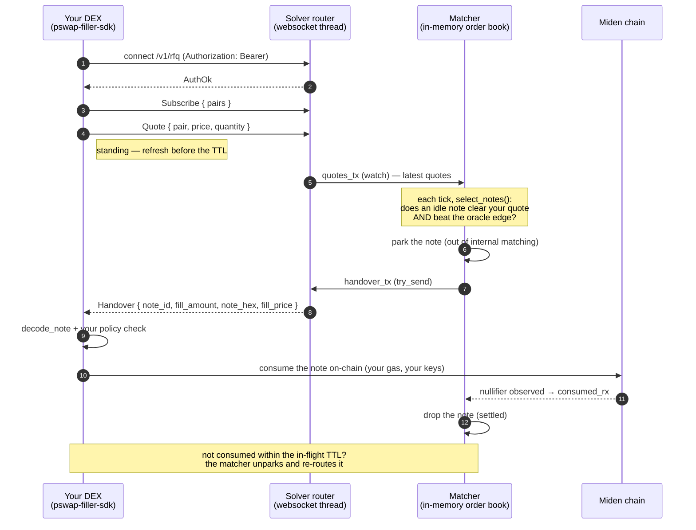

# pswap-filler-sdk

Rust client SDK for external DEXes (**"fillers"**) to fill Miden **PSWAP** orders
that the solver can't cross internally and routes out over its RFQ websocket.

You connect, declare the pairs you can fill, post standing `{price, quantity}`
quotes, and receive **handovers** — serialized PSWAP notes you consume on-chain
(on your own gas) at the note's fixed rate.

> **Full integration guide:** [`docs/filler-integration.md`](../../docs/filler-integration.md)
> — protocol reference, quoting/decimal semantics, a complete reference filler, and an
> FAQ. This README is the quickstart.

## Integration in 5 steps

1. **Connect & authenticate** — `FillerClient::connect(url, token)` with the bearer token the operator issued you.
2. **Subscribe** to the pairs you can fill.
3. **Quote** a standing `{price, quantity}` per pair; refresh before the TTL.
4. **Receive handovers** — loop on `next_event()`; each `Handover` is a note to fill.
5. **Consume on-chain** — decode the note and self-consume with your own client/gas.

## How the solver talks to your DEX



## Why this is a separate crate

Add **only** `pswap-filler-sdk`. You do **not** depend on the solver, its
`miden-client`, database, HTTP stack, or any internal module. The default build
is small and pure (serde + tokio + a websocket client). The wire protocol is
defined once here and the solver depends on *this* crate for it, so the two
sides can never drift.

## Install

```toml
[dependencies]
pswap-filler-sdk = { git = "<this-repo>", package = "pswap-filler-sdk" }

# Optional on-chain helpers (decode a handed-over note + read its swap terms).
# Pulls in miden-protocol + miden-standards (NOT miden-client — you run the
# consume tx with your own client). Omit if you only want the raw note bytes.
# pswap-filler-sdk = { git = "...", features = ["consume"] }
```

## Quick start

```rust
use pswap_filler_sdk::{FillerClient, FillerEvent, PairSpec};

#[tokio::main]
async fn main() -> anyhow::Result<()> {
    // Authenticate with the bearer token the solver operator issued you.
    let mut client = FillerClient::connect("ws://solver-host:8090/v1/rfq", "my-token").await?;

    // Pairs are hex account ids in the note's (offered, requested) orientation.
    let pair = PairSpec { offered: imiden_hex, requested: iusdt_hex };
    client.subscribe(vec![pair.clone()])?;

    // Standing quote: price is requested-per-offered, per WHOLE token, as a
    // decimal string. Refresh it before the server's quote TTL to keep it live.
    client.quote(&pair, "2.00", 1_000_000, None)?;

    while let Some(ev) = client.next_event().await {
        match ev {
            FillerEvent::AuthOk => {}
            FillerEvent::Handover(h) => {
                // h.note_hex is the serialized PSWAP note; h.fill_amount is the
                // requested-token amount to fill; h.fill_price is the price to fill
                // at (your quoted X, echoed). Decode + self-consume on-chain.
                // With feature = "consume":
                //   let note  = pswap_filler_sdk::consume::decode_note(&h.note_hex)?;
                //   let terms = pswap_filler_sdk::consume::PswapTerms::from_note(&note)?;
                //   let args  = pswap_filler_sdk::consume::consume_args(h.fill_amount)?;
                //   // ... feed `note` + `args` into your own miden-client tx ...
            }
            FillerEvent::Ask { .. } => {}
            FillerEvent::Error { code, msg } => eprintln!("router error {code}: {msg}"),
            FillerEvent::Disconnected => break,
        }
    }
    Ok(())
}
```

## Protocol notes

- **Auth** — `Authorization: Bearer <token>` (the SDK sets this for you). A wrong
  token fails the connection at the upgrade.
- **Quotes are standing** — post once and refresh before expiry; you do not
  re-request per order. A disconnect purges your quotes immediately.
- **Price units** — requested-token per offered-token, **per whole token**, as a
  decimal string (e.g. `"2.05"`). Validated client-side before it leaves.
- **Handover = note bytes** — you self-consume on-chain; the solver never holds
  your keys or pays your gas.

## Features

| feature | adds | pulls in |
|---|---|---|
| *(default)* | `FillerClient`, `protocol` | serde, tokio, tungstenite — **no miden** |
| `consume` | `consume::{decode_note, PswapTerms, consume_args}` | `miden-protocol`, `miden-standards` |
