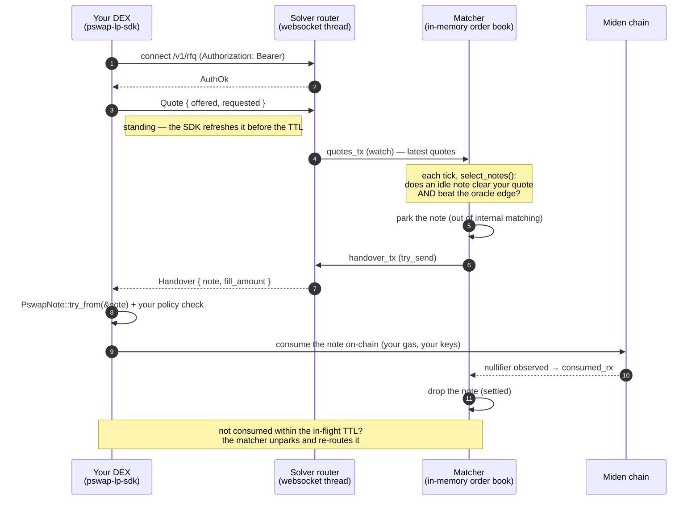

# pswap-lp-sdk

Rust client SDK for external DEXes (**"fillers"**) to fill Miden **PSWAP** orders
that the solver can't cross internally and routes out over its RFQ websocket.

You connect, declare the pairs you can fill, keep standing quotes live, and
receive **handovers** — decoded PSWAP notes you consume on-chain (on your own
gas) at the matched price.

The wire protocol is **miden's own binary serialization over WebSocket binary
frames**, so miden types (`AccountId`, `FungibleAsset`, `Note`) travel natively —
no JSON, no hex, no string prices.

> **Full integration guide:** [`docs/filler-integration.md`](../../docs/filler-integration.md)
> — protocol reference, quoting semantics, and an FAQ. This README is the quickstart.

## Integration in 3 steps

1. **Connect** — `LpClient::connect(url, token)` with the bearer token the operator issued you.
2. **Serve quotes** — `serve_quotes(pairs, refresh, price_fn)`: the SDK keeps a fresh quote live per pair (it calls your `price_fn` each tick).
3. **Consume handovers** — loop on `next_event()`; each `Handover` carries a `Note` you self-consume on-chain with your own client/gas.

## How the solver talks to your DEX



## Why this is a separate crate

Add **only** `pswap-lp-sdk`. You do **not** depend on the solver crate, its
`miden-client`, database, HTTP stack, or any internal module. It does use
`miden-protocol`/`miden-standards` (the binary protocol needs them, and you have
them anyway to consume the note). The protocol is defined once here and the
solver depends on *this* crate for it, so the two sides can never drift.

## Install

```toml
[dependencies]
pswap-lp-sdk = { git = "<this-repo>", package = "pswap-lp-sdk" }
```

## Quick start

```ignore
use std::time::Duration;
use pswap_lp_sdk::{LpClient, LpEvent, PairSpec};
use pswap_lp_sdk::consume::{consume_args, PswapNote};

#[tokio::main]
async fn main() -> anyhow::Result<()> {
    let mut client = LpClient::connect("ws://solver-host:8090/v1/rfq", "my-token").await?;

    // Keep a fresh quote live per pair, hands-free (the quote is the pair's
    // registration — no separate subscribe step). The SDK calls
    // your pricing fn each tick for the current (offered, requested) base-unit
    // amounts on the pair's faucets — so quotes never expire and never go stale.
    let _q = client.serve_quotes(
        vec![PairSpec { offered: imiden, requested: iusdt }],
        Duration::from_secs(10),                  // ~half the router's quote TTL
        |_pair| Some((1_000_000, 2_000_000)),     // your live price: give 1 iMIDEN, want 2 iUSDT
    );

    while let Some(ev) = client.next_event().await {
        match ev {
            LpEvent::Handover(h) => {
                let pswap = PswapNote::try_from(&h.note)?;      // what am I getting / paying?
                // ... your risk check against `pswap` (the note's fixed terms) ...
                let _args = consume_args(0, h.fill_amount)?;    // then self-consume on-chain
            }
            LpEvent::Error(e) => eprintln!("router error: {e}"),  // typed LpError
            LpEvent::Disconnected { reason } => break,            // SDK gave up (auth rejected)
            _ => {}                                               // AuthOk, Reconnecting/Reconnected, Ask
        }
    }
    Ok(())
}
```

## Protocol notes

- **Auth** — `Authorization: Bearer <token>` (the SDK sets this). A wrong token fails at the upgrade.
- **Quotes are standing** — `serve_quotes` keeps them fresh (keepalive + your live price each tick). A disconnect purges your quotes, but the connection auto-reconnects (backoff + re-auth) and `serve_quotes` resumes pushing. There's no subscribe step — **the quote is the registration** (its faucet ids imply the pair); re-post on `Reconnected` if you quote manually.
- **Amounts, not prices** — a quote is two `FungibleAsset`s (`offered`/`requested`); their ratio is the rate, like a PSWAP note. A handover carries the `note` (which enforces its own on-chain rate) plus `fill_amount`.
- **Handover = a decoded `Note`** — you self-consume on-chain; the solver never holds your keys or pays your gas.
