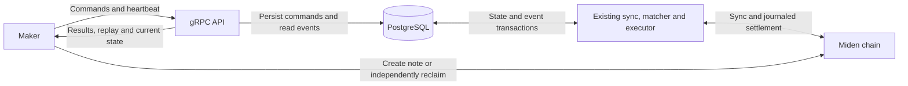
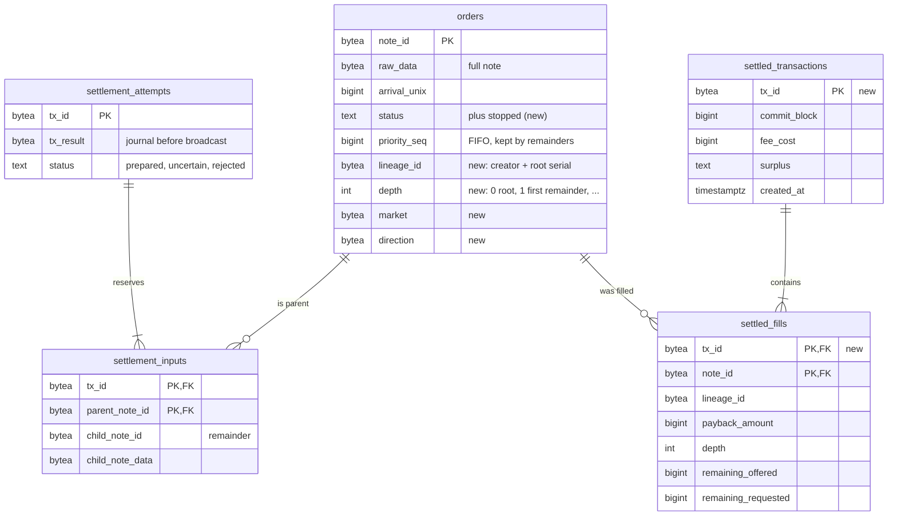
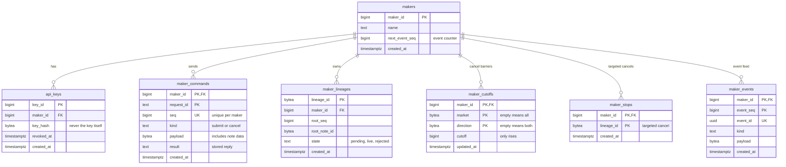

# 3. Market maker V1 gateway, order lifecycle and recovery

- **Status:** Proposed design. Product constraints identified as agreed below; open protocol and operating choices remain before implementation.
- **Date:** 2026-10-02
- **Revised:** 2026-10-02 — cancellation by cutoff and the `live_orders` view; maker intake and activation in parallel with ingest and settlement. Builds on PR #34.
- **Revised:** 2026-10-03 — lineage-keyed maker metadata; public notes accepted through the gateway; RFQ router skips maker orders; makers rebuild payback/remainder notes from fill details; no cancel stream event; events kept and timestamped (expiry later); restore detection deferred.
- **Deciders:** Vaibhav Jindal for maker-facing requirements; solver implementation review pending.
- **Related:** [ADR 0001](0001-external-liquidity-routing.md) for public external routing, [ADR 0002](0002-filler-sdk.md) for the filler interface.

## Context

Market makers create private PSWAP notes and submit them to Miden themselves. They need to tell this solver about a note without handing over spending keys, know when *this solver* has admitted the note to matching, stop future matching, learn about provisional and final fills, and recover the note data for any remainder. The solver is a facilitator: the maker retains its on-chain rights and can reclaim or arrange a trade without us.

The chain and the solver answer different questions. Miden client synchronization can verify that a note is committed or spent. It cannot reveal our private order intake, book eligibility, maker-scoped cancel cutoffs, local reservation or ambiguous settlement submission. Conversely, our off-chain cancellation does not revoke an on-chain note or reverse a transaction that may already have been broadcast. The API and its recovery contract must state exactly which of these facts each response means.

The inspected solver baseline stores business records in SQLite/Diesel, maintains an in-memory matching book, and submits settlements through an executor. [PR #34](https://github.com/inicio-labs/solver/pull/34) (merged) replaced SQLite with PostgreSQL: a single ownership-locked writer session, `write_book` (book updates published to the matcher in commit order), a settlement journal written before any broadcast, confirmation only by our transaction ID, and remainders that inherit their parent's FIFO slot. This ADR builds the maker gateway on that store; it does not claim the gateway itself has been implemented. The existing public external-liquidity router remains a separate path. Private maker orders require explicit routing classification.

The design favors a small number of components and readable Rust. The difficult work is not the transport itself; it is deciding when a request is durable, when an on-chain note may enter the book, which side wins a cancellation race, and how to recover a transaction that might have reached Miden.

## Decision

Adopt the following V1 contract as the working design. Sections that say *recommended* or *still to close* are proposals, not accepted production guarantees. Implement maker-facing behavior only after the open choices and failure tests below are resolved.

### Agreed scope

- Use gRPC with API keys over TLS. Commands, reads and heartbeats are unary calls; events use one server stream on the same client channel.
- TLS terminates at a proxy or load balancer in front of the solver, holding an automatically renewed certificate (for example a cloud load balancer with a managed certificate). The gateway listens only on a private address, in plain HTTP/2. The proxy must support gRPC streams, and its idle timeout must exceed the heartbeat interval so it never cuts the event stream.
- PostgreSQL is the authoritative business store for commands, cancellation cutoffs, orders, settlements, notes, accounting and events. Keep the existing in-memory book.
- Makers assign command sequences. A cancellation at sequence C stops matching root submissions with sequence < C, including delayed submissions and all their remainders.
- One request contains one command. No atomic replacement or cancel-and-submit.
- Keep the existing clearing/allocation policy. A maker order is a row in the same `orders` table as a public order, with the same FIFO priority, plus maker metadata: maker ID and root submission sequence. The metadata is stored once per PSWAP lineage, identified by the creator account plus the root note's full serial number, which any note in the lineage yields as `(s0, s1, s2, s3 − depth)`. The PSWAP script builds each remainder with serial `[s0, s1, s2, s3 + 1]` and `depth + 1`, so `s3 − depth` never changes along a lineage. Each remainder therefore inherits the metadata without copying. See *Lineage uniqueness* for what makes two different orders distinct. The note ID changes every round; the PSWAP `depth` is the order's version.
- The gateway accepts private PSWAP notes primarily, and public ones too. A note submitted through the gateway is a maker order whichever path inserts its order row (the maker-note watcher or public ingest), and every maker rule applies to it and its remainders.
- Record actual earned fees/surplus and settlement costs only after the relevant transaction is verified committed on-chain. A new maker fee schedule or revenue-distribution policy is outside V1.
- No business rate limits or live-order caps. Message sizes, concurrent work and memory still need finite bounds.
- No proof that the API submitter controls the note creator account. API attribution and on-chain reclaim authority are different.

Expiry details, cancel-on-disconnect/dead-man behavior and sequence-allocator failure recovery remain deferred. Do not silently implement defaults or introduce an emergency stop/resume subsystem.

### Small architecture



These are responsibilities within one solver deployment, not new microservices:

1. **API boundary:** authenticate, validate request shape, call a domain operation and map its result to gRPC. Stream committed events separately.
2. **Order operations:** submit, cancel, activate and reserve candidates for execution. Each operation owns its business rule and database transaction.
3. **Chain workers:** the existing ingest task keeps discovering public notes; a new maker-note watcher verifies private maker notes through a dedicated Miden SDK client (see *Intake and activation in parallel*); the matcher selects candidates; the executor reserves, submits and reconciles settlements.
4. **Store:** focused queries and transactions using the solver's database stack. Event reading is a small background task.

Reuse the existing module layout. Add a file when it has a clear responsibility; do not create a framework, service bus or generic repository abstraction for this gateway.

A channel or PostgreSQL notification only wakes a worker. The worker reads durable records, so a crash after commit but before notification loses no accepted work. Startup scans and periodic fallback reads recover missed notifications. The Miden client's own store may remain separate; note import/sync must be retryable from retained business records.

#### Simplicity rules for implementation

- Keep handlers thin and domain operations named for their work, such as `submit_order`, `cancel_scope`, `reserve_candidate` and `record_settled_transaction`. These are illustrative function names, not separate system roles.
- Use ordinary Rust structs/enums, explicit functions and short database transactions. Keep proof generation, network requests and socket delivery outside transactions.
- Validate immutable note data once at intake and convert it into validated domain types. Recheck changing facts—cancellation, reservation, chain freshness and spend status—at the decision points where they matter.
- Keep one shared eligibility rule for activation, the current-state read, restart and reservation: the `live_orders` view (see *Cancellation rule*). Enforce it against authoritative state when reserving; a stale cached answer is insufficient.
- Derive facts from their authoritative object where safe. Keep genuinely different identifiers explicit: command sequence, event sequence, order ID and current note ID are not interchangeable.
- Use one meaningful command result. Do not add queued/received/applied acknowledgements for every stage, or a durable event for routine worker retries.
- No separate broker, hand-written WAL, custom NTL transport, custom state-machine framework, active-active execution or event-sourcing rebuild of the entire application.
- Keep request IDs and event IDs. Removing them or merging event categories was not adopted.
- Prefer a small concrete implementation over abstractions for hypothetical future providers. Add a trait only at a real existing boundary or where it materially enables tests.

#### Rust libraries and macros

Use libraries to remove protocol and storage boilerplate while keeping financial transitions visible in ordinary code.

- **[Tonic](https://docs.rs/tonic/latest/tonic/) and [Prost](https://docs.rs/prost/latest/prost/):** define the protocol once in Protobuf; generate message types and clients/services with compatible [tonic-prost-build](https://docs.rs/tonic-prost-build/latest/tonic_prost_build/) tooling. Do not hand-maintain duplicate wire models. `miden-client` already brings tonic 0.14, prost 0.14, tonic-prost-build and protox (a pure-Rust Protobuf compiler) into the dependency tree, matching our axum 0.8 and hyper 1; use the same versions and compile the `.proto` with protox so neither developers nor CI need a system `protoc`.
- **[Tower](https://docs.rs/tower/latest/tower/):** reuse Tonic-compatible middleware where useful for bounded concurrency and authentication. For awaited credential checks, a shared async handler helper is sufficient initially; introduce a custom layer only if it reduces repetition. Tonic's [interceptor](https://docs.rs/tonic/latest/tonic/service/trait.Interceptor.html) is synchronous.
- **Existing Tokio:** use bounded channels (except the maker control lane; see *Cancellation rule*) and existing shutdown/task facilities. One maker-note watcher batches node checks instead of a sync operation per order.
- **Existing Diesel:** use its PostgreSQL backend, [row derives](https://docs.diesel.rs/master/diesel/prelude/index.html), schema macros and migration tooling. Reuse PR #34's `PgPool`, which runs blocking Diesel on worker threads behind async `read`, `write` and `write_book`; do not add diesel-async or SQLx alongside it.
- **Error and serialization derives:** use `#[derive(thiserror::Error)]` for distinct domain failures, one `error.rs` per module as PR #34 does; keep `anyhow` only at startup and thread-spawn boundaries. Use existing Serde derives where configuration or JSON actually needs them, not automatically on every Protobuf type.
- **Existing tests and diagnostics:** use `#[tokio::test]`, existing `proptest!` and focused fixtures for the failure rules below. Use existing tracing with explicit safe fields.

Macros should remove repetitive code, not conceal transaction boundaries, cancellation decisions or accounting. No custom procedural-macro DSL is needed. Avoid logging generated `Debug` output for private notes or credentials; tracing instrumentation must skip those inputs.

Generated messages still require domain validation. In particular, reject unsupported enum values and distinguish missing required business fields from Protobuf defaults. Do not let an unknown cancellation scope become cancel-all.

Pin mutually compatible library versions against the exact Miden dependencies used by the implementation. The inspected baseline already uses Tokio, Diesel, Serde, tracing and proptest; the PostgreSQL migration and new gateway dependencies still require implementation.

### Authentication and note ownership

An API key is a high-entropy bearer credential carried in gRPC authorization metadata over TLS. Store a verifier, support rotation/revocation, and derive a stable `maker_id` from the validated credential.

Onboarding in V1 is an operator action: the existing bearer-token admin API creates a maker, issues its API key (shown once; only its hash is stored) and revokes keys. Maker self-service rotation comes later.

Authorize every command, current-state read, lookup and event stream against that maker. Enforce revocation on already-open streams too. Revoking access does not implicitly cancel accepted orders.

The note's creator account determines its on-chain payment/reclaim behavior. It need not equal the API submitter, and V1 requires no creator-account control proof or allowlist. Possession of another party's private note data can still enable arranging a fill: protect note data, storage and backups, and keep payloads out of diagnostics and notification channels.

Off-chain cancellation only stops future selection by this solver. It cannot revoke a note on Miden or prevent an already admitted transaction from settling. The maker may consume/reclaim elsewhere; treat that as an expected lifecycle path.

Maker attribution is the routing classification: the RFQ router checks whether a book entry is a maker order and never routes one, private or public.

### Maker command and event contract

#### Commands and retries

State-changing operations are SubmitOrder and cancellation. One bulk CancelAll command covers every order of the authenticated maker or applies optional order-type, market and direction filters. The earlier cancel-by-order/note requirement remains a targeted CancelOrder command, which names the order by its lineage ID. A bulk type/market filter is not cancel-one. Each request contains only one command.

Each command carries a request ID and maker-assigned sequence:

- The request ID identifies one logical command. Retrying the same ID, sequence and canonical semantic payload returns its stored status/result.
- Reusing an ID or command sequence with conflicting contents returns an idempotency conflict.
- Sequences are unique per maker across credentials and reconnects. Missing lower numbers do not block cancellation.
- A new request ID or higher sequence cannot silently duplicate or revive the same cancelled note. Preserve network-qualified note/root identity independently of result cleanup.
- A lineage is attributed once. A later submit of any note in an attributed lineage, by the same or another maker, returns already registered (or the stored result for an exact retry).

Submit returns Accepted after its validated command and note data commit. Accepted does not mean Live. This retained intake is enough for retry/recovery; no mandatory separate AwaitingCommitment event or initial order row is required.

Cancel returns Applied after its cutoff and command result commit together. The response identifies scope/cutoff and explains that already reserved exposure may still settle. It provides bounded exposure details or a reference to a consistent paginated view, not an unbounded order list. Retrying the same request ID or querying command status returns the stored result if the response was lost.

Reads include a paginated current-state view, order/command status and settlement history. Heartbeats carry the recoverable event cursor. Server-time support accompanies any later agreed expiry contract.

Each command is independent: a successful cancellation remains applied if a subsequent submission fails. Database atomicity applies within each command, not across the two requests.

#### Durable events

The V1 feed is frozen at three events; V2 may extend it. Maker-initiated commands have durable replies; the stream reports solver-discovered order and settlement changes:

- **OrderStatus:** the order becomes Live, is rejected after an earlier Accepted response, or becomes unavailable because its note was verified spent elsewhere. Include order/version and reason. A confirmed remainder that becomes Live later uses this event; if the settlement result already reports it Live, do not repeat the transition.
- **SettlementPending:** one event per transaction once its recoverable transaction record is durable and broadcast can be attempted. Include batch/transaction ID, input order/notes and versions, intended fill amounts and clearing price. Candidate selection, proving attempts and retries do not each produce events.
- **SettlementResolved:** one event per transaction when verified committed or definitively voided. For commitment, include actual amounts, price, actual earned surplus/fees and settlement cost, resulting order status, and the fill details its maker needs to rebuild the payback and remainder notes (see *Settlement and remainder recovery*). For a voided attempt, include the resulting order status and no realized fill or revenue. Preserve unresolved exposure as Pending and show it in status queries/current-state reads; do not call a timeout voided.

SubmitOrder Accepted and Cancel Applied belong in their durable unary responses and request-ID status lookup; there is no stream event for either. A maker running several independent processes on one identity shares its cancel results internally or polls the current-state read, which shows active cutoffs. A committed outcome is published with the fill details its maker needs to rebuild its notes. Routine imports, sync ticks, socket delivery, worker retries and heartbeats do not produce maker events. Expiry/dead-man events exist only if those features are later selected. Command failures remain queryable/retryable through their stored command outcome.

Events carry maker-scoped event sequence, event ID, relevant request ID, order ID/version, state and time. Sequence defines order; timestamps do not. Keep scoped events meaningful even when there is no single order ID.

SettlementPending reports identify batch, settlement transaction, order/input version, intended filled amounts, clearing price and units. They do not recognize earned surplus, fees or settlement cost. SettlementResolved carries the verified outcome and actual accounting only after commitment. One clearing batch may contain multiple settlement transactions; report outcomes per transaction.

### Activation and cancellation

#### Lineage uniqueness

V1 assumes lineage IDs are unique: makers create notes with random serial numbers, which the SDK's own lineage tracking already requires. The primary key on `maker_lineages.lineage_id` still rejects a second claim of the same lineage as already registered. Handling deliberate or accidental collisions, including who may claim a public note, is deferred.

#### Activation flow

1. MM creates its PSWAP note (private, or public) and submits ExpectedNote plus its sync hint.
2. Validate the approved pinned script, network, creator field, asset IDs, integer amounts and full note identity. A PSWAP tag alone is not identity or proof. A note for a pair this solver does not clear is rejected, since nothing would ever match it.
3. Persist the accepted command and payload on the intake session (group commit), then acknowledge. The note is not imported into the ingest client, so public ingest never sees a private maker note. Public ingest may also discover a public maker note; both paths insert the same order row idempotently, and the lineage's maker metadata applies whichever inserts it.
4. MM submits note creation independently. Support both note-data-before-chain and chain-before-note-data arrival.
5. The maker-note watcher polls with a dedicated Miden SDK client. It looks up new notes by exact ID, imports committed notes with their proofs or registers absent notes as expected after the captured SDK cursor, and uses scoped SDK chain and nullifier sync to verify commitment and spend state.
6. In one core-writer commit, insert the order and check it against `live_orders` (and any enabled expiry) in the same transaction — Active, or Stopped below a cutoff — with its OrderStatus event and book update, before matching can use it.

Recommended simple meaning of Live: **durably eligible after chain verification**. Update the book after commit and recover missed cache updates from durable state. If Live must promise actual installation in the matcher, retain a matcher acknowledgement instead. This wording remains a decision to close before implementation.

Startup reconciliation completes before matching resumes. If authenticated sync exceeds the agreed freshness bound, pause activation/selection; keep cancellation available while durable storage is healthy.

Use supported Miden notification/sync capabilities. Reusing an NTL block-watcher pattern does not make public NTL part of our maker protocol; verify the exact SDK/node API during implementation.

#### Cancellation rule

For each maker/network/scope, store:

`cutoff = max(existing_cutoff, incoming_cancel_sequence)`

An order is stopped when its root submission sequence is below any applicable cutoff. The rule covers accepted pending notes, live orders, delayed submissions and every descendant remainder. Keep cutoffs independently of event retention.

Example: cancel-all 100 applies before delayed submit 90 arrives. Submit 90 is stopped. A delayed cancel 80 cannot lower the barrier. Submit 101 may become eligible normally. A remainder from submit 90 retains root sequence 90 and stays stopped.

**The cutoff is the authority; a cancel never rewrites order rows.** One shared rule decides whether an order can trade, as a PostgreSQL view, which costs no writes:

```sql
CREATE VIEW live_orders AS
SELECT o.*, m.maker_id, m.root_seq
FROM orders o
LEFT JOIN maker_lineages m ON m.lineage_id = o.lineage_id   -- NULL for public orders
WHERE o.status = 'active'
  AND NOT EXISTS (                -- no applicable cutoff above this order
      SELECT 1 FROM maker_cutoffs c
      WHERE c.maker_id = m.maker_id
        AND m.root_seq < c.cutoff
        AND (c.market    IS NULL OR c.market    = o.market)
        AND (c.direction IS NULL OR c.direction = o.direction));
```

Columns are illustrative; an order-type filter joins the same way once more than PSWAP exists. A targeted CancelOrder works the same way: it stores one stop row for the lineage and adds one more `NOT EXISTS` to this view, so it rewrites no order rows either. In this section, "below a cutoff" includes a targeted stop. An order without maker metadata matches no cutoff, so the view leaves public orders unchanged. Restart hydration, executor reservation, release after a failed settlement and `GetMakerState` read liveness only through this view; nothing tests `status = 'active'` directly for liveness.

A cancel is one short commit on the intake session (see *Intake and activation in parallel*): raise the cutoff under the maker control row lock, and store the Applied result with the exposure already reserved as of that commit. Its cost does not depend on how many orders it stops. After the commit the cutoff goes to the matcher on the maker control lane (below), and the matcher drops that maker's matching entries from its in-memory book at once.

The cutoff is checked only where a row is about to become live, inside writes that already happen. All of them publish through `write_book`, which passes every order the transaction activates through `live_orders` before commit: live orders go to the matcher with their maker tag, excluded maker orders are stored Stopped. This check needs no maker lock: a cancel that commits just after it only leaves the status column lagging, which the view already covers.

| Write that already happens | Below a cutoff |
|---|---|
| Activation of a (possibly delayed) submission | inserted Stopped, not Active |
| Confirmation inserting a remainder (it inherits the root sequence) | inserted Stopped |
| Release of inputs after a definitively voided settlement | set Stopped, not Active |

No sweep follows a cancel. Rows below a cutoff keep `status = 'active'` until a write that happens anyway changes them, usually the maker reclaiming the note, which the spend watcher records. A cancel therefore adds no work to the writer that ingest and settlement share, however large the book. Accepted costs: the status column lags, so liveness is always read through the view; and the active-order index keeps cancelled notes that are never reclaimed, which a metric watches. Add idle-time cleanup only if that ever matters.

Cutoffs only rise, and stops and lineage attributions are only added, so their order relative to book updates does not matter. After each intake commit the intake writer sends the matcher what it committed on its own **maker control lane**, separate from `book_tx`:

- **Three facts, never orders.** Cutoff raised (CancelAll), lineage stopped (CancelOrder) and lineage attributed (Submit: lineage to maker and root sequence). Orders entering or leaving the book (activations, remainders, spends, releases) still travel only through the core writer's `write_book` on `book_tx`, so PR #34's commit-order guarantee is unchanged. A cutoff sent on `book_tx` would wait behind its whole FIFO of order updates while the matcher kept picking the cancelled quotes, which right after a price move are the most attractive ones in the book; each such pick costs a proof and holds up the single executor.
- **Read first.** The matcher's select prefers the control lane over `book_tx` and the timer, and each tick drains the control lane before it applies queued book updates and clears. A cutoff that reached the matcher before a tick is therefore applied before that tick matches anything.
- **Unbounded, the one exception to bounded channels.** A full bounded lane would block the intake writer, and the next cancels with it. Each message is one already-committed command and is cheap to apply, and the matcher reads the lane first, so it only holds what arrives during one matching pass. A gauge reports its length.

Book entries built from the database already carry their maker tag. The matcher keeps every cutoff (few per maker, hydrated at startup), tags existing entries of an attributed lineage as maker orders (for in-memory cutoffs and RFQ exclusion), drops entries when a cutoff or stop arrives, and ignores any later Active update below a cutoff. It keeps a stop or attribution for a minute after it arrives, far longer than any earlier-committed book update can lag behind it, so memory stays bounded. These messages therefore need no commit-order lock. A lost message (a crash between commit and send) only makes the drop late: restart hydrates the facts, and reservation checks `live_orders` regardless.

A valid empty scope still installs its barrier for later arrivals. Counts, if returned, describe the as-of view of the cancel commit.

Bulk cancellation may filter by order type, market and direction; provided filters combine as an intersection. Market filters use network-specific asset IDs. BTC → ETH and ETH → BTC are different directions; cancelling both requires an explicit market-wide scope. Order type is separate from pair/direction. V1 accepts only PSWAP, so a PSWAP-only filter does not narrow the current order set unless combined with a market filter. Invalid or ambiguous filters must never broaden cancellation. Targeted cancellation (CancelOrder) names the order by its lineage ID (creator plus root serial). The maker knows it before submitting, so it also stops a submit that arrives later.

#### Where cancel meets matching

Reservation happens once, in the executor, after proving and before any possible broadcast: PR #34's `prepare_settlement_tx` commit. That transaction locks the input order rows, then the control rows of the makers that own them (in maker-ID order; read from the locked rows rather than from the candidate, because an attribution can arrive after the matcher picked it), checks every input against `live_orders`, then reserves the whole exact input notes and stores the transaction record. A cancel raises its cutoff under the same row lock, so the two serialize. Both take `FOR NO KEY UPDATE`: reservations come only from the single core writer, so a shared mode would gain nothing, and foreign-key checks (`KEY SHARE`) never wait on it:

- Cancel wins: the reservation fails, nothing is broadcast, and the inputs return to the matcher through the same view, so the stopped ones stay out. The proof is wasted, which is acceptable.
- Reservation wins: the cancel reply lists that settlement as in-flight exposure; whatever it leaves behind comes back Stopped.

Candidates the matcher handed over before it received the cutoff are caught by this check, so the matcher's in-memory drop is an optimization, not the guarantee. Reserving after proving also means a cancel that arrives while a proof is running still wins. A partial fill still reserves the **whole exact input note/version**, because consuming it creates a new remainder note; two candidates cannot reserve different portions of one input.

The executor receives approved frozen candidates. Our reservation does not lock the note on-chain; independent maker activity can still invalidate it.

### Intake and activation in parallel

Maker traffic must not slow public ingest or settlement, and a cancel must never wait behind submits or core writes. PR #34's ownership-locked core writer stays the only session that changes the book or settlements; maker intake gets its own path.

| Work | Where it runs | Database | Miden client |
|---|---|---|---|
| gRPC handlers: authenticate, decode, validate | gateway thread (own OS thread and multi-thread runtime, like the price API) | none | none |
| Intake writer: submits and cancels | one task on the gateway thread | dedicated **intake session** from the existing pool | none |
| Maker-note watcher: activation and spends | one local task on the gateway thread | core writer, one `write_book` per round | dedicated SDK client with a SQLite store |
| Public ingest | ingest thread, unchanged | core writer | ingest client |
| Executor | executor thread, unchanged | core writer | executor client |

**Handlers** run concurrently and do only CPU work: authenticate, decode, and validate the note once into domain types. They pass the validated command to the intake writer over bounded channels, with a separate small channel for cancels, and await its reply. A full channel returns UNAVAILABLE ("durable acceptance unavailable") instead of hanging.

**Intake writer (group commit).** One task owns the intake session. Each round it takes every waiting cancel first, then up to N waiting submits (default 500), and writes them in one transaction using statements that cannot fail per command (`INSERT … ON CONFLICT DO NOTHING RETURNING`), so one bad command never aborts the batch. It classifies each outcome from the returned rows (Accepted, retry of a stored result, idempotency conflict, note already registered), commits once, sends the committed cutoffs, stops and attributions on the maker control lane (see *Cancellation rule*), then replies to every handler, so a maker that sees Applied knows its cutoff is already queued at the matcher. Atomicity remains per command: if the transaction itself fails, none of its commands was acknowledged and each is retryable by request ID. Commands that arrive while a round commits form the next round, so batching adds no fixed wait: one fsync per batch gives high throughput on one session, and per-command latency is at most the running round plus one commit.

A separate session is safe because maker commands only append facts (commands, notes, lineage attributions, cutoffs) and never move orders or settlements; execution authority stays with the core writer. The pool opens the intake session only after it owns the database and closes it when the pool's fatal token fires. Cancel and reservation serialize through the maker control row lock, which works across sessions. Submits and cancels add no work to the core writer.

**Maker-note watcher.** One local task on the gateway thread, polling every `maker_watch_interval_ms` (default 1 s), uses a dedicated Miden SDK client and SQLite store:

1. Reconcile pending submissions and live maker orders from PostgreSQL. Look up notes entering the watch set by exact ID in bounded batches. Import found notes with their inclusion proofs; register absent notes as expected after the captured SDK cursor, then sync forward. Recheck notes entering the set after restart or an excluded interval, so historical commitments and spends are recovered without rescanning market history.
2. Sync through SDK StateSync with a custom note screener that accepts only authoritative maker note IDs. Build its input from PostgreSQL-requested notes, excluding unrelated or no-longer-watched SQLite records; only pending notes contribute discovery tags. The persisted cursor and scoped nullifier tracking determine whether each exact note is pending, committed or consumed. If distinct notes share one details commitment, an exact-ID node lookup handles that exception.
3. One `write_book` per round commits activations (Active, or Stopped below a cutoff, checked through `live_orders` in the same transaction), spent orders marked OnchainNullified, their OrderStatus events and the book update. A failed PostgreSQL write is retried from durable rows and the SDK's persisted note state.

Every path that retires consumed orders (watcher, ingest, executor release, startup reconciliation) reports Unavailable for the live maker orders among them in the same transaction, so the event does not depend on which path saw the spend first. An order reserved by our own settlement is not live, so its consumption is not reported as a spend elsewhere.

Maker notes are never imported into the ingest client, so public ingest is unchanged and no private note reaches the book without the gateway's checks. The executor already consumes notes unauthenticated from our stored copy, so settling a private note needs no client import. Pausing activation when the watcher falls behind the chain tip by more than a freshness bound is deferred; a failing watcher simply activates nothing, while cancels continue.

**Event delivery** also runs on the gateway thread: per-stream readers, woken in-process after any core-writer commit that inserted maker events, read through a capped read budget (like PR #34's public-read cap) so streams cannot starve pipeline reads. Only core-writer commits insert maker events, so each maker's contiguous event sequence comes from one per-maker counter row written by one session.

Lock order, which rules out deadlocks between the two sessions: order rows (by note ID), then maker control rows (by maker ID). The per-maker event counter lives on the control row, so appending an event takes the same lock last. A cancel takes only its maker's control row; reservation takes its input rows first, then their makers' control rows; activation and settlement write order rows first and lock control rows only to append events.

### Data model

PR #34's tables stay. The gateway adds four columns to `orders`, two settlement-history tables, and its own tables. Column lists are illustrative; the migration fixes exact types.

Core tables (PR #34 plus additions):



`sync_state` and `registered_tokens` are unchanged. `lineage_id` and `depth` are computed from the note by whichever path inserts the row. `settled_fills` holds what a maker needs to rebuild its payback and remainder notes; unlike `settlement_attempts`, the history tables are never deleted.

Gateway tables:



`maker_lineages` links to `orders` only through `lineage_id`, joined by `live_orders`; no foreign key, because either row may be written first.

| Step | Connection | Tables written |
|---|---|---|
| Maker submits a note | intake | `maker_commands`, `maker_lineages` (`pending`) |
| Maker cancels | intake | `maker_commands`, `maker_cutoffs`; a targeted cancel writes `maker_stops` |
| Watcher finds the note on chain | core writer | `orders`, `maker_lineages` (`live`), `maker_events` |
| Executor reserves a batch | core writer | `settlement_attempts`, `settlement_inputs` |
| Settlement confirmed | core writer | `settled_transactions`, `settled_fills`, remainder row in `orders`, `maker_events` |

### Settlement and remainder recovery

Keep this inside the existing executor/sync/startup paths. It is required so the gateway can report trustworthy outcomes and the fill details makers rebuild their notes from; it is not a second settlement service.

Before possible network submission, durably link the settlement to reserved inputs/versions, calculated fills and expected outputs. These are recovery data, not recognized revenue or costs. Persist the final transaction ID and proven transaction, or an equally sufficient SDK-backed recovery record, before broadcasting.

There are two recovery cases:

- **No transaction could have been broadcast:** release the interrupted reservation and recalculate under current policy. Reusing the old candidate/batch is unnecessary.
- **A transaction may have been broadcast:** keep its inputs reserved until the outcome is resolved. A timeout, SDK-local discarded/stale status, or an input observed unspent now does not prove it cannot land later.

Once that specific transaction's chain commitment is verified, one PostgreSQL transaction finalizes fills, remainder orders, lineage, actual earned surplus/fees, actual settlement cost and maker events. Use transaction-linked uniqueness to prevent duplicate application. If the executor dies after chain commitment but before this write, recover from the journal plus authenticated chain data and record the outcome once.

A stopped order and its in-flight settlement are separate facts:

- Late partial fill commits: report the fill details, from which the maker rebuilds its payback and remainder notes, but keep the remainder stopped.
- Late full fill commits: report the fill; no remainder exists.
- Attempt is definitively voided and input remains unspent: keep a stopped input stopped.
- Outcome remains unknown: keep the reservation and stop intent.

Without stop intent, the confirmed unspent remainder retains original order ID, root sequence and FIFO priority, advances note ID/version, and passes current eligibility checks before returning to the book. Apply the same rules across repeated partial fills and restart. Any future expiry feature must stop late remainders too.

If the maker consumes the note elsewhere, remove the verified spent input and reconcile competing solver transactions. Spent input alone proves neither our transaction's success nor an external fill's private amounts. Never manufacture a solver fill or fee from that observation.

Makers rebuild payback and remainder notes themselves; the solver never ships note payloads. Each SettlementResolved carries, per input, the payback amount and depth from the PSWAP attachment, the remaining offered and requested amounts, the solver's account ID, and the transaction ID and commit block. With its original note, the maker calls the pinned SDK's `PswapNote::payback_note` and `remainder_note` to rebuild both notes exactly. The attachment is on chain, so this also works with the solver offline; test that path end to end.

#### Accounting

Record exact asset amounts and identifiers, order/maker attribution where established, batch/transaction IDs and commit block/time. Keep explicit fees, gross surplus and on-chain costs separate. No earned surplus or settlement cost is accrued for a note while its transaction is pending, unknown or voided.

Store each order's actual input/payment/remainder flows and each batch's reconciled asset residuals after verified commitment. Record settlement cost for the committed transaction; attribute it to a particular note only if that attribution is unambiguous or an allocation rule is agreed. If per-order surplus allocation is undefined, retain unallocated batch revenue linked to its orders; do not invent a split or imply a new maker charge. Voided fills realize no trading revenue or note-attributed settlement cost.

PR #34's executor pays settlement fees from the solver account and keeps residual assets as surplus; V1 adds recording, not a new fee policy.

### Event delivery and recovery

The event table is the durable outbox. Insert business state and required event rows in the same transaction. Use a transactional per-maker counter, serialized through commit, to allocate a contiguous committed event sequence. A PostgreSQL sequence/identity alone does not give that guarantee.

One stream writer reads committed events in order. Delivery may repeat; applying a repeated event must not repeat a business effect. Notifications wake the reader; the table remains authoritative. If using LISTEN/NOTIFY, establish LISTEN before the startup scan and send only safe identifiers.

#### Reconnect and heartbeat

Replay means sending the maker the ordered events it missed. For example, if it can recover through event 19, reconnect with `after_seq = 19`; the solver sends retained events 20 onward and then continues live delivery. ReplayComplete names a fixed catch-up watermark. While idle, the stream sends a keep-alive carrying its cursor; each keep-alive re-checks the API key, so revoking a key ends its open streams within one interval (default 10 s). Replay paces itself to the subscriber through a bounded buffer; a subscriber that takes nothing for a whole keep-alive interval is disconnected with RESOURCE_EXHAUSTED and resumes from its cursor.

The unary Heartbeat carries `received_through_seq` and returns the server time and the maker's latest event sequence. It reports the maker's progress for lag monitoring; it does not authorize deleting events (V1 deletes none).

If event 20 is missing and 21 arrives, the MM pauses applying later feed events and requests replay after 19. A malformed event needs visible repair/version handling, not silent skipping or an infinite reconnect loop. The solver does not cancel orders merely because replay stalled. Unary cancellations remain available; the recommended maker workflow completes catch-up before new quoting.

#### Current solver view and retention

Use a simple read-only `GetMakerState` operation over existing PostgreSQL records, without a separate snapshot store or service. It shows accepted pending intake, Live orders, stopped orders with unresolved exposure, active maker/network/scope cancellation cutoffs, current order/note versions and chain-sync height. Paginate because there is no live-order cap. The maker can get on-chain note details through its Miden client; the value of this read is the solver's off-chain state.

Normal reconnect uses the maker's durably saved event cursor and replay, plus its stored command results. `GetMakerState` is a current view for checking what the solver believes, not a gapless historical snapshot or a new replay cursor. Pages may observe concurrent changes; the API must not claim they form one atomic past view. Independent maker command writers coordinate their cancellations or refresh this read. A current view does not replace settlement history; that is a separate paginated read over canonical records (below).

V1 deletes no events, so any cursor can be replayed. Every event row carries its creation timestamp (`created_at`), so a time-based expiry can be added later without touching existing rows. The event table is only the feed: canonical order, fill, settlement and accounting history (including the fill details makers rebuild notes from), submitted notes, cutoffs, lineage attributions and command results live in their own tables. A later expiry would therefore only need REPLAY_CURSOR_EXPIRED plus recovery from `GetMakerState` and the settlement-history read.

### Performance, durability and cost

Keep the matching book in memory and perform the final authoritative check when reserving a candidate. No database read on every matching comparison. Send events after commit; never wait for a maker socket or its acknowledgement inside matching/settlement.

Use bounded stream buffers. Disconnect a slow event consumer and let it replay from its recoverable cursor. Preserve cancellation capacity under load: cancels have their own channel, are written first in every intake round, and commit on a session separate from the core writer. Return a clear failure when durable acceptance is unavailable. These are resource protections, not business order quotas.

PostgreSQL transactions and WAL remove the need for a separate queue/WAL service, but still cost storage and commit latency. Start with indexed tables. Measure peak command load, event volume, sync delay, admission latency and recovery lag before quoting capacity or a monthly cost.

Use fsync and synchronous commits for ordinary restart durability with intact storage. If the promise also covers loss of primary storage without losing acknowledged cancellations, use synchronous durable replication and fail over only to a sufficiently caught-up copy. Do not silently weaken that promise when a required copy is unavailable.

Enforce one active execution authority across restarts/deployments. Loss of database or execution authority stops new signing/submission; already-broadcast transactions remain subject to reconciliation. Critical worker failure triggers coordinated recovery.

Backups do not substitute for synchronous replication. Archive the WAL continuously (PITR), so a restore replays PostgreSQL's journal to just before the failure instead of rolling back to the last backup. Detecting a restore that still lost acknowledged data is deferred; candidate checks are a maker cursor ahead of our event sequence, and solver transactions on chain that the database does not know. Test business DB, Miden client state and note recovery together.

The main costs remain application compute, database/storage/backups and any replication, node/prover services, egress and settlement fees. This is a small component count, not a claim of zero cost or guaranteed latency.

## Atomic boundaries and observable promises

The implementation should make these boundaries visible in ordinary domain functions and database transactions:

1. **Submit:** one PostgreSQL commit on the intake session stores the authenticated maker, request ID, maker sequence, canonical payload, exact note material, its lineage's maker attribution and the Accepted result. Several submits may share one group commit; each keeps its own atomic outcome. Only after that commit may the API return Accepted. No separate AwaitingCommitment event or initial order row is required.
2. **Cancel:** one commit on the intake session raises the scoped cutoff to the maximum and stores the durable Applied result with the exposure reserved as of that commit. No order row changes, no stream event and no sweep; the matcher receives the cutoff after the commit.
3. **Activate:** after the maker-note watcher verifies the exact note committed and unspent, one core-writer commit inserts the order (Active, or Stopped below a cutoff) with its OrderStatus event and publishes the book update in commit order. This assumes the recommended durable-eligibility meaning of Live.
4. **Reserve and prepare:** after proving and before any possible broadcast, one core-writer commit checks every input against `live_orders` under the makers' control locks, reserves each exact input note/version, and records enough final transaction and input linkage to reconcile the outcome, together with SettlementPending. Cancellation serializes on the same lock. If this commit fails, nothing was broadcast and the candidate is recalculated.
5. **Finalize:** after authenticated chain verification, one commit applies each committed transaction's actual fills, remainder orders, the fill details makers rebuild notes from, lineage, earned surplus/fees, settlement cost and SettlementResolved event. A definitive void has its own resolved outcome without realized order revenue. A transaction that might still land remains Pending. Remainders and released inputs below a cutoff are written Stopped.

Each event insert shares the business transaction that produced it. A PostgreSQL notification or in-process channel only wakes a reader; it is not an additional durability layer. Submit and cancel commit on the intake session; activation, reserve-and-prepare and finalize commit on the core writer. Each adds ordinary commit latency. Chain commitment and sync add separate latency before Live and final settlement. No exact millisecond promise is made without measuring the selected deployment.

## Alternatives considered

- **Public NTL as the maker gateway.** Its public P2P note-transport role does not provide maker identity, commands, scoped off-chain cancellation, solver execution state and replay. Reuse compatible block-notification/sync machinery, but keep the authenticated maker interface specific to this solver.
- **WebSocket plus a separate command API.** A single gRPC API surface with unary commands and one event stream gives generated clients and one transport/security configuration. One client channel is not a promise of one physical connection.
- **mTLS, creator-account proof and signatures on every command.** They add account or certificate coupling the facilitator contract does not require. Use high-entropy API keys over TLS, maker-scoped authorization and key rotation. A maker spending key never belongs in the gateway.
- **A broker, hand-written WAL or durable in-memory channel.** PostgreSQL already provides atomic business records, an outbox table and crash recovery. Bounded channels and notifications are wake-up hints only.
- **Server-assigned cancellation sequence or synchronous order sweep.** A maker-assigned prefix cutoff can stop delayed submissions with lower maker sequence and all descendant remainders. Persisting one barrier avoids an unbounded acknowledgement transaction.
- **Rewriting order rows on cancel, synchronously or by a background sweep.** The cost grows with the book and occupies the writer that ingest and settlement share. The cutoff plus the `live_orders` view gives the same guarantee with one constant-size commit.
- **Importing maker notes into the ingest client.** Ingest would turn them into ordinary orders without maker attribution, cutoffs or routing class, and every import would contend for the ingest client. The watcher instead uses its own SDK client and store.
- **A stream event per cancel.** It repeats the unary reply for a single-process maker; a maker with several processes on one identity polls `GetMakerState` instead.
- **Copying maker metadata onto each remainder row.** Keying it by the PSWAP lineage gives the same inheritance with no copy, and makes a public note found by ingest first and the gateway second (or the reverse) a maker order without a conversion step or a race.
- **Event cleanup in V1.** Cursor-acknowledged cleanup adds per-session authority and retention floors; a TTL needs a recovery path for expired cursors. V1 keeps every event, timestamped, and adds expiry only when volume requires it.
- **TLS inside the solver (rustls in tonic).** We would own certificate files, renewal and reloads. Kept as the fallback for a single host without a proxy.
- **Atomic replace or multi-command batch.** V1 uses one command per request; cancelling one order and submitting a new note are separate outcomes. This avoids a premature atomic-readiness contract for a replacement note.
- **Full recovery-grade snapshot.** Ordinary replay covers missed solver events; a small GetMakerState read shows current solver state. A gapless historical snapshot across unbounded, concurrently changing pages would require a stronger protocol and is not part of this V1 design.
- **A stream event for every acknowledgement and worker stage.** Accepted and Applied already have stored command results. Push solver-discovered order and transaction transitions; retain routine import/sync/proving attempts in internal diagnostics.

## Consequences and boundaries

- The maker can independently consume or reclaim its current note. The solver can stop only its own future matching. A late cancel may leave a previously reserved fill in flight; the result must disclose that exposure and stop all future remainder matching.
- PostgreSQL becomes the business authority. A process crash after a committed command or settlement must replay/reconcile from durable records. The SDK's own store is reconciled from the business journal rather than treated as the maker command log.
- A short database commit is on submit, cancel, activation, reserve-and-prepare and each settlement resolution. Event rows do not require a second commit. Maker submits and cancels commit on their own session and add no work to the core writer; activations cost one core-writer commit per block. The matcher does not read PostgreSQL on every price comparison or wait for a maker socket.
- There is no cancel stream event. Several processes sharing one maker identity share cancel results or poll `GetMakerState`.
- A public maker note may be inserted by public ingest or by the watcher; whichever does, the lineage's maker metadata applies to it and its remainders.
- Order rows below a cutoff keep `status = 'active'` until their note is reclaimed. Liveness must always be read through `live_orders`; reading the status column alone is a bug.
- The current-state read is an ordinary paginated PostgreSQL query. Its pages may see concurrent changes and must not masquerade as one atomic historical snapshot. It does not recreate deleted fill history.
- V1 keeps every event, so any cursor can be replayed; storage grows with event volume until an expiry is added.
- PostgreSQL fsync/synchronous commit protects acknowledged records against ordinary process restart with intact storage. Primary storage loss without acknowledged-data loss requires an appropriate synchronous replica and controlled failover; backup alone is insufficient.
- Submitted NoteFiles demand maker-scoped authorization, restricted logging and protected storage/backups. The RFQ router never receives a maker order.
- This ADR does not change clearing-price or allocation policy and does not introduce a maker fee schedule. It records actual earned value and cost only when the corresponding transaction is verified committed.

## Delivery sequence and acceptance tests

Correctness comes from these tested rules, not the choice of gRPC or macros. Each implementation PR contains its own relevant tests.

1. **Protocol and PostgreSQL foundation.** Freeze the contract and durable transaction boundaries. Test retry conflicts, duplicate notes, same-note resubmission after cancel, cross-maker isolation, rollback, interrupted commit/notification, and a group-commit batch in which one command conflicts. Test concurrent event writers for committed ordering and rollback gaps.
2. **Authenticated gateway and recovery.** Add unary operations, event streaming, heartbeat and the maker-filtered current-state read. Test key rotation/revocation including open streams, disconnect after send, duplicate replay, missing/malformed events, cancellation cutoffs and reserved exposure in the read, and replay from any earlier cursor. Do not present independently read pages as one atomic snapshot.
3. **Private note activation.** Add validation and the maker-note watcher (dedicated SDK note import and chain sync, one activation commit per round). Test wrong script/network, malformed creator without account-control proof, tag collisions, both arrival orders, spent-before-activation, cancel-before-commit, interrupted cache update, stale sync, that public ingest never activates a private maker note, that a public maker note ends as a maker order whether ingest or the gateway sees it first, a second submit of an attributed lineage, and the RFQ router skipping maker orders.
4. **Cancellation and reservation.** Add scoped monotone cutoffs and whole-note reservations. Test cancel/reservation races, cancel 100 then 80, delayed submit 90, empty scope then delayed submit, market/direction isolation, targeted scope, inherited remainder sequence, no cancel stream event, lost cancel reply recovered by retry/status, cutoff visible in the current-state read and crash after cancel ACK. Also test the cutoff reaching the matcher before and after an activation's book update, reservation failing for a candidate handed over before the cutoff, inputs of a voided settlement staying Stopped, a cancel never updating order rows, unchanged cancel latency with 100,000 live orders, and a submit flood not delaying cancels or ingest commits.
5. **Executor recovery and reporting.** Add journal/reconciliation, transaction-specific Pending/Resolved reports, fill details and accounting only after verified settlement. Test chain-success-before-DB-write crash, timeout after node acceptance, definitive failure, external consumption while proving/submitting, two partial-fill candidates using one input, all late-cancel outcomes, repeated partial fills, rounding/accounting, the maker rebuilding payback and remainder notes from reported fill details, and maker reclaim with the solver offline.
6. **Release rehearsal.** Exercise the complete pipeline under peak load, slow clients, database failure, restore and stale execution authority. Verify privacy and recovery procedures; measure latency. Enable production maker fills only after the complete path passes.

These are proposed reviewable changes, not six independent production releases. Combine a step only when it remains easy to review. Create/push PRs only with the user's per-action approval.

## Open decisions and deferred work

Before implementation of the corresponding feature, agree:

- Intake round size and queue capacities (configurable, defaults 500, 4096 and 1024), and the maker-note watcher's polling fallback and freshness bound. Measure before fixing them.
- Live means durable eligibility (recommended for simplicity) or confirmed matcher installation.
- When to add event expiry (rows carry `created_at`). Command results, cutoffs, lineage attributions and canonical history are kept indefinitely in V1.
- Supported network/script versions, sync freshness bound, deployment failure coverage and workload targets.

Expiry/clock details, dead-man behavior, sequence-allocator failure recovery, rollback detection after a restore, and lineage-collision handling (including who may claim a public note) remain deferred. Existing clearing/allocation and the agreed late-cancel/remainder rules are unchanged.

## Evidence and limits

This is a reviewed design, not an implementation audit or runtime verification. Source observations refer to the baseline reviewed on 27 September 2026; check the actual implementation branch and pinned dependencies before coding.

- [Solver executor](../../crates/solver/src/executor/executor.rs): the inspected baseline discarded its returned transaction ID and could return inputs to Active after exhausted RPC retries. PR #34 replaced this with a journal written before broadcast and confirmation only by transaction ID.
- [Business database](../../crates/solver/src/db/db.rs) and [manifest](../../crates/solver/Cargo.toml): the baseline uses SQLite/Diesel; PostgreSQL is the selected target. Reuse any completed migration work.
- [PSWAP script](https://github.com/0xMiden/protocol/blob/next/crates/miden-standards/asm/standards/notes/pswap.masm) and [SDK lineage source](https://github.com/0xMiden/rust-sdk/blob/next/crates/rust-client/src/pswap/lineage.rs): verify facilities against the exact pinned release; these links track upstream branches.
- The pinned `miden-client` 0.17.0-rc.2 imports expected note details, synchronizes notes and nullifiers through `StateSync`, and persists its cursor and note state in `miden-client-sqlite-store`. The maker-note watcher uses this client, with exact-ID lookup when notes enter the watch set and for a shared details commitment.
- PostgreSQL [transactions](https://www.postgresql.org/docs/current/tutorial-transactions.html), [locking](https://www.postgresql.org/docs/current/explicit-locking.html), [sequence behavior](https://www.postgresql.org/docs/current/functions-sequence.html), [durability settings](https://www.postgresql.org/docs/current/runtime-config-wal.html), [LISTEN startup](https://www.postgresql.org/docs/current/sql-listen.html), [NOTIFY](https://www.postgresql.org/docs/current/sql-notify.html) and [PITR](https://www.postgresql.org/docs/current/continuous-archiving.html).
- gRPC [RPC types and stream ordering](https://grpc.io/docs/what-is-grpc/core-concepts/) and [authentication](https://grpc.io/docs/guides/auth/). One client channel is not a promise of exactly one physical connection. Rust references are beside their proposed uses above.
