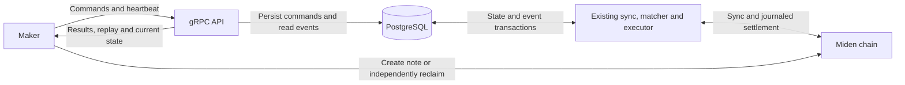

# 3. Market maker V1 gateway, order lifecycle and recovery

- **Status:** Proposed design. Product constraints identified as agreed below; open protocol and operating choices remain before implementation.
- **Date:** 2026-10-02
- **Deciders:** Vaibhav Jindal for maker-facing requirements; solver implementation review pending.
- **Related:** [ADR 0001](0001-external-liquidity-routing.md) for public external routing, [ADR 0002](0002-filler-sdk.md) for the filler interface.

## Context

Market makers create private PSWAP notes and submit them to Miden themselves. They need to tell this solver about a note without handing over spending keys, know when *this solver* has admitted the note to matching, stop future matching, learn about provisional and final fills, and recover the note data for any remainder. The solver is a facilitator: the maker retains its on-chain rights and can reclaim or arrange a trade without us.

The chain and the solver answer different questions. Miden client synchronization can verify that a note is committed or spent. It cannot reveal our private order intake, book eligibility, maker-scoped cancel cutoffs, local reservation or ambiguous settlement submission. Conversely, our off-chain cancellation does not revoke an on-chain note or reverse a transaction that may already have been broadcast. The API and its recovery contract must state exactly which of these facts each response means.

The inspected solver baseline stores business records in SQLite/Diesel, maintains an in-memory matching book, and submits settlements through an executor. This ADR proposes a PostgreSQL business store, maker gateway and executor recovery protocol; it does not claim those changes have been implemented. The existing public external-liquidity router remains a separate path. Private maker orders require explicit routing classification.

The design favors a small number of components and readable Rust. The difficult work is not the transport itself; it is deciding when a request is durable, when an on-chain note may enter the book, which side wins a cancellation race, and how to recover a transaction that might have reached Miden.

## Decision

Adopt the following V1 contract as the working design. Sections that say *recommended* or *still to close* are proposals, not accepted production guarantees. Implement maker-facing behavior only after the open choices and failure tests below are resolved.

### Agreed scope

- Use gRPC with API keys over TLS. Commands, reads and heartbeats are unary calls; events use one server stream on the same client channel.
- PostgreSQL is the authoritative business store for commands, cancellation cutoffs, orders, settlements, notes, accounting and events. Keep the existing in-memory book.
- Makers assign command sequences. A cancellation at sequence C stops matching root submissions with sequence < C, including delayed submissions and all their remainders.
- One request contains one command. No atomic replacement or cancel-and-submit.
- Keep the existing clearing/allocation policy. Confirmed remainders retain the original order ID, root sequence and FIFO priority; their note ID/version changes.
- Record actual earned fees/surplus and settlement costs only after the relevant transaction is verified committed on-chain. A new maker fee schedule or revenue-distribution policy is outside V1.
- No business rate limits or live-order caps. Message sizes, concurrent work and memory still need finite bounds.
- No proof that the API submitter controls the note creator account. API attribution and on-chain reclaim authority are different.

Expiry details, cancel-on-disconnect/dead-man behavior and sequence-allocator failure recovery remain deferred. Do not silently implement defaults or introduce an emergency stop/resume subsystem.

### Small architecture

These are responsibilities within one solver deployment, not new microservices:

1. **API boundary:** authenticate, validate request shape, call a domain operation and map its result to gRPC. Stream committed events separately.
2. **Order operations:** submit, cancel, activate and reserve candidates for execution. Each operation owns its business rule and database transaction.
3. **Existing chain workers:** one shared Miden sync task verifies notes; the matcher selects/reserves candidates; the executor owns settlement submission and reconciliation.
4. **Store:** focused queries and transactions using the solver's database stack. Event reading and cleanup are small background tasks.

Reuse the existing module layout. Add a file when it has a clear responsibility; do not create a framework, service bus or generic repository abstraction for this gateway.

A channel or PostgreSQL notification only wakes a worker. The worker reads durable records, so a crash after commit but before notification loses no accepted work. Startup scans and periodic fallback reads recover missed notifications. The Miden client's own store may remain separate; note import/sync must be retryable from retained business records.

#### Simplicity rules for implementation

- Keep handlers thin and domain operations named for their work, such as `submit_order`, `cancel_scope`, `reserve_candidate` and `record_settled_transaction`. These are illustrative function names, not separate system roles.
- Use ordinary Rust structs/enums, explicit functions and short database transactions. Keep proof generation, network requests and socket delivery outside transactions.
- Validate immutable note data once at intake and convert it into validated domain types. Recheck changing facts—cancellation, reservation, chain freshness and spend status—at the decision points where they matter.
- Keep one shared eligibility rule for activation, the current-state read, restart and reservation. Enforce it against authoritative state when reserving; a stale cached answer is insufficient.
- Derive facts from their authoritative object where safe. Keep genuinely different identifiers explicit: command sequence, event sequence, order ID and current note ID are not interchangeable.
- Use one meaningful command result. Do not add queued/received/applied acknowledgements for every stage, or a durable event for routine worker retries.
- No separate broker, hand-written WAL, custom NTL transport, custom state-machine framework, active-active execution or event-sourcing rebuild of the entire application.
- Keep request IDs and event IDs. Removing them or merging event categories was not adopted.
- Prefer a small concrete implementation over abstractions for hypothetical future providers. Add a trait only at a real existing boundary or where it materially enables tests.

#### Rust libraries and macros

Use libraries to remove protocol and storage boilerplate while keeping financial transitions visible in ordinary code.

- **[Tonic](https://docs.rs/tonic/latest/tonic/) and [Prost](https://docs.rs/prost/latest/prost/):** define the protocol once in Protobuf; generate message types and clients/services with compatible [tonic-prost-build](https://docs.rs/tonic-prost-build/latest/tonic_prost_build/) tooling. Do not hand-maintain duplicate wire models.
- **[Tower](https://docs.rs/tower/latest/tower/):** reuse Tonic-compatible middleware where useful for bounded concurrency and authentication. For awaited credential checks, a shared async handler helper is sufficient initially; introduce a custom layer only if it reduces repetition. Tonic's [interceptor](https://docs.rs/tonic/latest/tonic/service/trait.Interceptor.html) is synchronous.
- **Existing Tokio:** use bounded channels and existing shutdown/task facilities. One shared sync task avoids a sync operation per order.
- **Existing Diesel:** use its PostgreSQL backend, [row derives](https://docs.diesel.rs/master/diesel/prelude/index.html), schema macros and migration tooling. Select one nonblocking integration for database calls; [diesel-async](https://docs.rs/diesel-async/latest/diesel_async/) is an option. Reuse the migration's chosen stack instead of adding SQLx alongside it.
- **Error and serialization derives:** use `#[derive(thiserror::Error)]` for distinct domain failures if adding [thiserror](https://docs.rs/thiserror/latest/thiserror/) reduces boilerplate; retain existing `anyhow` for internal context. Use existing Serde derives where configuration or JSON actually needs them, not automatically on every Protobuf type.
- **Existing tests and diagnostics:** use `#[tokio::test]`, existing `proptest!` and focused fixtures for the failure rules below. Use existing tracing with explicit safe fields.

Macros should remove repetitive code, not conceal transaction boundaries, cancellation decisions or accounting. No custom procedural-macro DSL is needed. Avoid logging generated `Debug` output for private notes or credentials; tracing instrumentation must skip those inputs.

Generated messages still require domain validation. In particular, reject unsupported enum values and distinguish missing required business fields from Protobuf defaults. Do not let an unknown cancellation scope become cancel-all.

Pin mutually compatible library versions against the exact Miden dependencies used by the implementation. The inspected baseline already uses Tokio, Diesel, Serde, tracing and proptest; the PostgreSQL migration and new gateway dependencies still require implementation.

### Authentication and note ownership

An API key is a high-entropy bearer credential carried in gRPC authorization metadata over TLS. Store a verifier, support rotation/revocation, and derive a stable `maker_id` from the validated credential.

Authorize every command, current-state read, lookup, event stream and private-note download against that maker. Enforce revocation on already-open streams too. Revoking access does not implicitly cancel accepted orders.

The note's creator account determines its on-chain payment/reclaim behavior. It need not equal the API submitter, and V1 requires no creator-account control proof or allowlist. Possession of another party's private note data can still enable arranging a fill: protect note data, storage and backups, and keep payloads out of diagnostics and notification channels.

Off-chain cancellation only stops future selection by this solver. It cannot revoke a note on Miden or prevent an already admitted transaction from settling. The maker may consume/reclaim elsewhere; treat that as an expected lifecycle path.

Every order has explicit public/private routing classification. Private maker notes must not silently enter external RFQ routing.

### Maker command and event contract

#### Commands and retries

State-changing operations are SubmitOrder and cancellation. One bulk CancelAll command covers every order of the authenticated maker or applies optional order-type, market and direction filters. The earlier cancel-by-order/note requirement remains a targeted CancelOrder command; its exact identity encoding still needs agreement. A bulk type/market filter is not cancel-one. Each request contains only one command.

Each command carries a request ID and maker-assigned sequence:

- The request ID identifies one logical command. Retrying the same ID, sequence and canonical semantic payload returns its stored status/result.
- Reusing an ID or command sequence with conflicting contents returns an idempotency conflict.
- Sequences are unique per maker across credentials and reconnects. Missing lower numbers do not block cancellation.
- A new request ID or higher sequence cannot silently duplicate or revive the same cancelled note. Preserve network-qualified note/root identity independently of result cleanup.

Submit returns Accepted after its validated command and private note data commit. Accepted does not mean Live. This retained intake is enough for retry/recovery; no mandatory separate AwaitingCommitment event or initial order row is required.

Cancel returns Applied after its cutoff and command result commit together. The response identifies scope/cutoff and explains that already reserved exposure may still settle. It provides bounded exposure details or a reference to a consistent paginated view, not an unbounded order list. Retrying the same request ID or querying command status returns the stored result if the response was lost.

Reads include a paginated current-state view, order/command status, settlement history and private-note retrieval. Heartbeats carry the recoverable event cursor. Server-time support accompanies any later agreed expiry contract.

Each command is independent: a successful cancellation remains applied if a subsequent submission fails. Database atomicity applies within each command, not across the two requests.

#### Durable events

Recommended minimal V1 feed, pending maker agreement. Maker-initiated commands have durable replies; the stream reports solver-discovered order and settlement changes:

- **OrderStatus:** the order becomes Live, is rejected after an earlier Accepted response, or becomes unavailable because its note was verified spent elsewhere. Include order/version and reason. A confirmed remainder that becomes Live later uses this event; if the settlement result already reports it Live, do not repeat the transition.
- **SettlementPending:** one event per transaction once its recoverable transaction record is durable and broadcast can be attempted. Include batch/transaction ID, input order/notes and versions, intended fill amounts and clearing price. Candidate selection, proving attempts and retries do not each produce events.
- **SettlementResolved:** one event per transaction when verified committed or definitively voided. For commitment, include actual amounts, price, actual earned surplus/fees and settlement cost, resulting order status, and the payment/remainder note data or a stable authorized retrieval reference. For a voided attempt, include the resulting order status and no realized fill or revenue. Preserve unresolved exposure as Pending and show it in status queries/current-state reads; do not call a timeout voided.

SubmitOrder Accepted and Cancel Applied belong in their durable unary responses and request-ID status lookup; duplicate stream events add no new information for the caller. The maker can inspect active cancellation cutoffs through the current-state read. If several independent maker processes use the same identity, they must share their command outcomes or refresh that read; without a cancel event, another process is not notified immediately by our stream. A committed outcome should be published with its recovery notes durably available. Routine imports, sync ticks, socket delivery, worker retries and heartbeats do not produce maker events. Expiry/dead-man events exist only if those features are later selected. Command failures remain queryable/retryable through their stored command outcome.

Events carry maker-scoped event sequence, event ID, relevant request ID, order ID/version, state and time. Sequence defines order; timestamps do not. Keep scoped events meaningful even when there is no single order ID.

SettlementPending reports identify batch, settlement transaction, order/input version, intended filled amounts, clearing price and units. They do not recognize earned surplus, fees or settlement cost. SettlementResolved carries the verified outcome and actual accounting only after commitment. One clearing batch may contain multiple settlement transactions; report outcomes per transaction.

### Activation and cancellation

#### Activation flow

1. MM creates its private PSWAP note and submits ExpectedNote plus its sync hint.
2. Validate the approved pinned script, network, creator field, asset IDs, integer amounts and full note identity. A PSWAP tag alone is not identity or proof.
3. Persist accepted command and payload, acknowledge, then import into the Miden client idempotently. Recover interrupted imports from those records.
4. MM submits note creation independently. Support both note-data-before-chain and chain-before-note-data arrival.
5. A committed-block notification wakes shared client synchronization; periodic polling is the fallback. Verify the exact note as committed and unspent against authenticated chain state.
6. Recheck effective cancellation and any enabled expiry, then persist eligibility and its event before matching can use it.

Recommended simple meaning of Live: **durably eligible after chain verification**. Update the book after commit and recover missed cache updates from durable state. If Live must promise actual installation in the matcher, retain a matcher acknowledgement instead. This wording remains a decision to close before implementation.

Startup reconciliation completes before matching resumes. If authenticated sync exceeds the agreed freshness bound, pause activation/selection; keep cancellation available while durable storage is healthy.

Use supported Miden notification/sync capabilities. Reusing an NTL block-watcher pattern does not make public NTL part of our maker protocol; verify the exact SDK/node API during implementation.

#### Cancellation rule

For each maker/network/scope, store:

`cutoff = max(existing_cutoff, incoming_cancel_sequence)`

An order is stopped when its root submission sequence is below any applicable cutoff. The rule covers accepted pending notes, live orders, delayed submissions and every descendant remainder. Keep cutoffs independently of event retention.

Example: cancel-all 100 applies before delayed submit 90 arrives. Submit 90 is stopped. A delayed cancel 80 cannot lower the barrier. Submit 101 may become eligible normally. A remainder from submit 90 retains root sequence 90 and stays stopped.

A valid empty scope still installs its barrier for later arrivals. ACK need not wait for a row-by-row sweep; remove stale book entries asynchronously and derive effective state from the cutoff. Counts, if returned, describe a specific as-of view.

Bulk cancellation may filter by order type, market and direction; provided filters combine as an intersection. Market filters use network-specific asset IDs. BTC → ETH and ETH → BTC are different directions; cancelling both requires an explicit market-wide scope. Order type is separate from pair/direction. V1 accepts only PSWAP, so a PSWAP-only filter does not narrow the current order set unless combined with a market filter. Invalid or ambiguous filters must never broaden cancellation. For targeted cancellation, use a stable root order/note identity, including before a delayed submit arrives; exact encoding remains open.

#### Where cancel meets matching

Immediately before handing a candidate to the executor, the matcher checks authoritative eligibility and durably reserves its inputs. This is a solver-side reservation, not a credit or on-chain lock. Cancellation and reservation serialize against the same maker control state in their transactions, with consistent lock order for multi-maker candidates.

- Cancel wins: recalculate the candidate in the matcher.
- Reservation wins: disclose the in-flight exposure and stop all future remainder matching.

An earlier unprotected cutoff read is insufficient. A partial fill still reserves the **whole exact input note/version**, because consuming it creates a new remainder note. Two candidates cannot reserve different portions of that input independently.

The executor receives approved frozen candidates. Our reservation does not lock the note on-chain; independent maker activity can still invalidate it.

### Settlement and remainder recovery

Keep this inside the existing executor/sync/startup paths. It is required so the gateway can report trustworthy outcomes and provide recovery notes; it is not a second settlement service.

Before possible network submission, durably link the settlement to reserved inputs/versions, calculated fills and expected outputs. These are recovery data, not recognized revenue or costs. Persist the final transaction ID and proven transaction, or an equally sufficient SDK-backed recovery record, before broadcasting.

There are two recovery cases:

- **No transaction could have been broadcast:** release the interrupted reservation and recalculate under current policy. Reusing the old candidate/batch is unnecessary.
- **A transaction may have been broadcast:** keep its inputs reserved until the outcome is resolved. A timeout, SDK-local discarded/stale status, or an input observed unspent now does not prove it cannot land later.

Once that specific transaction's chain commitment is verified, one PostgreSQL transaction finalizes fills, notes, lineage, actual earned surplus/fees, actual settlement cost and maker events. Use transaction-linked uniqueness to prevent duplicate application. If the executor dies after chain commitment but before this write, recover from the journal plus authenticated chain data and record the outcome once.

A stopped order and its in-flight settlement are separate facts:

- Late partial fill commits: return/store payment and remainder notes, but keep the remainder stopped.
- Late full fill commits: report the fill; no remainder exists.
- Attempt is definitively voided and input remains unspent: keep a stopped input stopped.
- Outcome remains unknown: keep the reservation and stop intent.

Without stop intent, the confirmed unspent remainder retains original order ID, root sequence and FIFO priority, advances note ID/version, and passes current eligibility checks before returning to the book. Apply the same rules across repeated partial fills and restart. Any future expiry feature must stop late remainders too.

If the maker consumes the note elsewhere, remove the verified spent input and reconcile competing solver transactions. Spent input alone proves neither our transaction's success nor an external fill's private amounts. Never manufacture a solver fill or fee from that observation.

Reuse the pinned SDK's lineage/reconstruction facilities through our own order-to-note map. Test that the maker can recover and reclaim with the solver offline using retained original note/client state and authenticated chain data. Gateway-delivered remainder notes provide an additional recovery route.

#### Accounting

Record exact asset amounts and identifiers, order/maker attribution where established, batch/transaction IDs and commit block/time. Keep explicit fees, gross surplus and on-chain costs separate. No earned surplus or settlement cost is accrued for a note while its transaction is pending, unknown or voided.

Store each order's actual input/payment/remainder flows and each batch's reconciled asset residuals after verified commitment. Record settlement cost for the committed transaction; attribute it to a particular note only if that attribution is unambiguous or an allocation rule is agreed. If per-order surplus allocation is undefined, retain unallocated batch revenue linked to its orders; do not invent a split or imply a new maker charge. Voided fills realize no trading revenue or note-attributed settlement cost.

The inspected executor pays settlement fees from the solver account and captures residual assets as surplus. Confirm this against the implementation branch; V1 adds recording, not a new fee policy.

### Event delivery and recovery

The event table is the durable outbox. Insert business state and required event rows in the same transaction. Use a transactional per-maker counter, serialized through commit, to allocate a contiguous committed event sequence. A PostgreSQL sequence/identity alone does not give that guarantee.

One stream writer reads committed events in order. Delivery may repeat; applying a repeated event must not repeat a business effect. Notifications wake the reader; the table remains authoritative. If using LISTEN/NOTIFY, establish LISTEN before the startup scan and send only safe identifiers.

#### Reconnect and heartbeat

Replay means sending the maker the ordered events it missed. For example, if it can recover through event 19, reconnect with `after_event_sequence = 19`; the solver sends retained events 20 onward and then continues live delivery. ReplayComplete names a fixed catch-up watermark.

Heartbeat carries `received_through_event_sequence`. For cleanup, it means **the maker can recover through this point without those event rows**. A particular inbox implementation is optional; persisting resulting state plus its cursor is sufficient. Receipt into RAM is not.

Accept monotone cleanup cursors only from the current authenticated event session, no higher than that session's sent events or an explicitly issued recovery baseline. Replacing a session invalidates the old session's cleanup authority. Batch persistence of cumulative cursor progress; delete only through the persisted cursor.

If event 20 is missing and 21 arrives, the MM pauses applying later feed events and requests replay after 19. A malformed event needs visible repair/version handling, not silent skipping or an infinite reconnect loop. The solver does not cancel orders merely because replay stalled. Unary cancellations remain available; the recommended maker workflow completes catch-up before new quoting.

#### Current solver view and retention

Use a simple read-only `GetMakerState` operation over existing PostgreSQL records, without a separate snapshot store or service. It shows accepted pending intake, Live orders, stopped orders with unresolved exposure, active maker/network/scope cancellation cutoffs, current order/note versions, relevant recovery-note references and chain-sync height. Paginate because there is no live-order cap. The maker can get on-chain note details through its Miden client; the value of this read is the solver's off-chain state.

Normal reconnect uses the maker's durably saved event cursor and replay, plus its stored command results. `GetMakerState` is a current view for checking what the solver believes, not a gapless historical snapshot or a new replay cursor. Pages may observe concurrent changes; the API must not claim they form one atomic past view. Independent maker command writers coordinate their cancellations or refresh this read. A current view cannot replace lost settlement history; if replay history is unavailable, return the explicit replay-gap response and use the separately agreed recovery procedure.

Clean up an eligible contiguous event prefix in bounded indexed batches after the recoverable cursor and grace period. Persist the retention floor with deletion and protect active replay readers. Start without partitioning; never drop a partition containing another maker's retained history.

Keep canonical order/fill/accounting history, original and still-relevant payment/remainder notes, cutoff barriers and retry identities independently of event cleanup. Retain retry results or reject retries beyond a published window; pruning cannot turn an old retry into a fresh order.

If history expires, explicitly return REPLAY_CURSOR_EXPIRED and a complete recovery procedure. Retain unacknowledged history unless a published archival/reconstruction policy makes that interval and its relevant notes recoverable. An arbitrary time-based deletion is unsafe.

### Performance, durability and cost

Keep the matching book in memory and perform the final authoritative check when reserving a candidate. No database read on every matching comparison. Send events after commit; never wait for a maker socket or its acknowledgement inside matching/settlement.

Use bounded stream buffers. Disconnect a slow event consumer and let it replay from its recoverable cursor. Preserve cancellation capacity under load; return a clear failure when durable acceptance is unavailable. These are resource protections, not business order quotas.

PostgreSQL transactions and WAL remove the need for a separate queue/WAL service, but still cost storage and commit latency. Start with indexed tables and batched cleanup. Measure peak command load, event volume, sync delay, admission latency and recovery lag before quoting capacity or a monthly cost.

Use fsync and synchronous commits for ordinary restart durability with intact storage. If the promise also covers loss of primary storage without losing acknowledged cancellations, use synchronous durable replication and fail over only to a sufficiently caught-up copy. Do not silently weaken that promise when a required copy is unavailable.

Enforce one active execution authority across restarts/deployments. Loss of database or execution authority stops new signing/submission; already-broadcast transactions remain subject to reconciliation. Critical worker failure triggers coordinated recovery.

Backups/PITR do not substitute for synchronous replication. Restoring an old backup must not silently revive cancelled orders or reuse old event progress: detect rollback and require an explicit recovery epoch/reconciliation before readiness. Test business DB, Miden client state and note recovery together.

The main costs remain application compute, database/storage/backups and any replication, node/prover services, egress and settlement fees. This is a small component count, not a claim of zero cost or guaranteed latency.

## Atomic boundaries and observable promises

The implementation should make these boundaries visible in ordinary domain functions and database transactions:

1. **Submit:** one PostgreSQL commit stores the authenticated maker, request ID, maker sequence, canonical payload, exact private note material and Accepted result. Only after that commit may the API return Accepted. No separate AwaitingCommitment event or initial order row is required.
2. **Cancel:** one commit stores the maximum applicable scoped cutoff and durable Applied result. The command reply states the scope, sequence and any already reserved exposure. There is no required per-order bulk-cancel sweep or maker event.
3. **Activate:** after shared Miden sync verifies the exact note committed and unspent, one commit makes the order durably eligible and records its OrderStatus event. Book-cache installation follows and is recovered on restart. This assumes the recommended durable-eligibility meaning of Live.
4. **Reserve:** the matcher rechecks effective eligibility and locks the relevant maker control state; one commit reserves every exact input note/version in the approved candidate. Cancellation uses the same serialization point. Proof generation and network I/O occur outside this transaction.
5. **Prepare transaction:** before a possible broadcast, one commit records enough final transaction and input linkage to reconcile the outcome, together with SettlementPending when that event is emitted. The candidate can be discarded only when the protocol proves no broadcast could have happened.
6. **Finalize:** after authenticated chain verification, one commit applies each committed transaction's actual fills, output notes, lineage, earned surplus/fees, settlement cost and SettlementResolved event. A definitive void has its own resolved outcome without realized order revenue. A transaction that might still land remains Pending.
7. **Event cleanup:** the maker's cumulative cursor is persisted independently of its heartbeat packet; cleanup removes only a contiguous prefix that the maker says it can recover without, subject to the agreed retention policy. It never removes command deduplication, cutoffs, live order data or still-relevant recovery notes.

Each event insert shares the business transaction that produced it. A PostgreSQL notification or in-process channel only wakes a reader; it is not an additional durability layer. The first, second, fourth, fifth and sixth boundaries add ordinary database commit latency. Chain commitment and sync add separate latency before Live and final settlement. No exact millisecond promise is made without measuring the selected deployment.

## Alternatives considered

- **Public NTL as the maker gateway.** Its public P2P note-transport role does not provide maker identity, commands, scoped off-chain cancellation, solver execution state and replay. Reuse compatible block-notification/sync machinery, but keep the authenticated maker interface specific to this solver.
- **WebSocket plus a separate command API.** A single gRPC API surface with unary commands and one event stream gives generated clients and one transport/security configuration. One client channel is not a promise of one physical connection.
- **mTLS, creator-account proof and signatures on every command.** They add account or certificate coupling the facilitator contract does not require. Use high-entropy API keys over TLS, maker-scoped authorization and key rotation. A maker spending key never belongs in the gateway.
- **A broker, hand-written WAL or durable in-memory channel.** PostgreSQL already provides atomic business records, an outbox table and crash recovery. Bounded channels and notifications are wake-up hints only.
- **Server-assigned cancellation sequence or synchronous order sweep.** A maker-assigned prefix cutoff can stop delayed submissions with lower maker sequence and all descendant remainders. Persisting one barrier avoids an unbounded acknowledgement transaction.
- **Atomic replace or multi-command batch.** V1 uses one command per request; cancelling one order and submitting a new note are separate outcomes. This avoids a premature atomic-readiness contract for a replacement note.
- **Full recovery-grade snapshot.** Ordinary replay covers missed solver events; a small GetMakerState read shows current solver state. A gapless historical snapshot across unbounded, concurrently changing pages would require a stronger protocol and is not part of this V1 design.
- **A stream event for every acknowledgement and worker stage.** Accepted and Applied already have stored command results. Push solver-discovered order and transaction transitions; retain routine import/sync/proving attempts in internal diagnostics.

## Consequences and boundaries

- The maker can independently consume or reclaim its current note. The solver can stop only its own future matching. A late cancel may leave a previously reserved fill in flight; the result must disclose that exposure and stop all future remainder matching.
- PostgreSQL becomes the business authority. A process crash after a committed command or settlement must replay/reconcile from durable records. The SDK's own store is reconciled from the business journal rather than treated as the maker command log.
- A short database commit is on submit, cancel, candidate reservation and each settlement transition. Event rows do not require a second commit. The matcher does not read PostgreSQL on every price comparison or wait for a maker socket.
- The minimal feed does not push CancelApplied. Multiple independent maker command writers sharing one identity must coordinate their cancellations or refresh GetMakerState; otherwise they do not get immediate cross-session cancellation notification. If that guarantee is required, add one scoped cancel event per command, never one per affected order.
- The current-state read is an ordinary paginated PostgreSQL query. Its pages may see concurrent changes and must not masquerade as one atomic historical snapshot. It does not recreate deleted fill history.
- If the maker acknowledges a recoverable event cursor and later loses the state/backups that made it recoverable, Miden client can recover on-chain note facts but cannot reconstruct deleted off-chain cancellation or reservation history. Finalize the replay horizon and recovery procedure before event pruning is enabled.
- PostgreSQL fsync/synchronous commit protects acknowledged records against ordinary process restart with intact storage. Primary storage loss without acknowledged-data loss requires an appropriate synchronous replica and controlled failover; backup alone is insufficient.
- Private NoteFiles and remainder data demand maker-scoped authorization, restricted logging and protected storage/backups. Public external routing cannot receive private maker notes by default.
- This ADR does not change clearing-price or allocation policy and does not introduce a maker fee schedule. It records actual earned value and cost only when the corresponding transaction is verified committed.

## Delivery sequence and acceptance tests

Correctness comes from these tested rules, not the choice of gRPC or macros. Each implementation PR contains its own relevant tests.

1. **Protocol and PostgreSQL foundation.** Freeze the contract and durable transaction boundaries. Test retry conflicts, duplicate notes, same-note resubmission after cancel, cross-maker isolation, rollback and interrupted commit/notification. Test concurrent event writers for committed ordering and rollback gaps.
2. **Authenticated gateway and recovery.** Add unary operations, event streaming, heartbeat and the maker-filtered current-state read. Test key rotation/revocation including open streams, disconnect after send, duplicate replay, missing/malformed events, stale session cursors, cursors beyond sent data, cancellation cutoffs and reserved exposure in the read, and replay during cleanup. Do not present independently read pages as one atomic snapshot.
3. **Private note activation.** Add validation, retryable import and shared sync wake-up/fallback. Test wrong script/network, malformed creator without account-control proof, tag collisions, both arrival orders, spent-before-activation, cancel-before-commit, interrupted cache update and stale sync.
4. **Cancellation and matcher reservation.** Add scoped monotone cutoffs and whole-note reservations. Test cancel/reservation races, cancel 100 then 80, delayed submit 90, empty scope then delayed submit, market/direction isolation, targeted scope, inherited remainder sequence, no per-order bulk-cancel events, lost cancel reply recovered by retry/status, cutoff visible in the current-state read and crash after cancel ACK.
5. **Executor recovery and reporting.** Add journal/reconciliation, transaction-specific Pending/Resolved reports, notes and accounting only after verified settlement. Test chain-success-before-DB-write crash, timeout after node acceptance, definitive failure, external consumption while proving/submitting, two partial-fill candidates using one input, all late-cancel outcomes, repeated partial fills, rounding/accounting and maker reclaim with the solver offline.
6. **Release rehearsal.** Exercise the complete pipeline under peak load, slow clients, database failure, restore and stale execution authority. Verify privacy and recovery procedures; measure latency. Enable production maker fills only after the complete path passes.

These are proposed reviewable changes, not six independent production releases. Combine a step only when it remains easy to review. Create/push PRs only with the user's per-action approval.

## Open decisions and deferred work

Before implementation of the corresponding feature, agree:

- Whether to adopt the recommended minimal event feed above. Omitting a cancel event assumes maker command writers coordinate their own cancels or refresh the current-state read; otherwise a single scoped cancel event may be needed for immediate cross-session notification.
- Live means durable eligibility (recommended for simplicity) or confirmed matcher installation.
- Exact identity encoding for the earlier single-order/note cancellation requirement; bulk filters are maker-wide with optional order type, market and direction.
- Replay grace/horizon, command-result retention and the complete expired-cursor recovery procedure.
- Supported network/script versions, sync freshness bound, deployment failure coverage and workload targets.

Expiry/clock details, dead-man behavior and sequence-allocator failure recovery remain deferred. Existing clearing/allocation and the agreed late-cancel/remainder rules are unchanged.

## Evidence and limits

This is a reviewed design, not an implementation audit or runtime verification. Source observations refer to the baseline reviewed on 27 September 2026; check the actual implementation branch and pinned dependencies before coding.

- [Solver executor](../../crates/solver/src/executor/executor.rs): the inspected submission loop discards its returned transaction ID and can return inputs to Active after exhausted RPC retries. Replace that ambiguous-submission assumption wherever it remains.
- [Business database](../../crates/solver/src/db/db.rs) and [manifest](../../crates/solver/Cargo.toml): the baseline uses SQLite/Diesel; PostgreSQL is the selected target. Reuse any completed migration work.
- [PSWAP script](https://github.com/0xMiden/protocol/blob/next/crates/miden-standards/asm/standards/notes/pswap.masm) and [SDK lineage source](https://github.com/0xMiden/rust-sdk/blob/next/crates/rust-client/src/pswap/lineage.rs): verify facilities against the exact pinned release; these links track upstream branches.
- PostgreSQL [transactions](https://www.postgresql.org/docs/current/tutorial-transactions.html), [locking](https://www.postgresql.org/docs/current/explicit-locking.html), [sequence behavior](https://www.postgresql.org/docs/current/functions-sequence.html), [durability settings](https://www.postgresql.org/docs/current/runtime-config-wal.html), [LISTEN startup](https://www.postgresql.org/docs/current/sql-listen.html), [NOTIFY](https://www.postgresql.org/docs/current/sql-notify.html) and [PITR](https://www.postgresql.org/docs/current/continuous-archiving.html).
- gRPC [RPC types and stream ordering](https://grpc.io/docs/what-is-grpc/core-concepts/) and [authentication](https://grpc.io/docs/guides/auth/). One client channel is not a promise of exactly one physical connection. Rust references are beside their proposed uses above.
