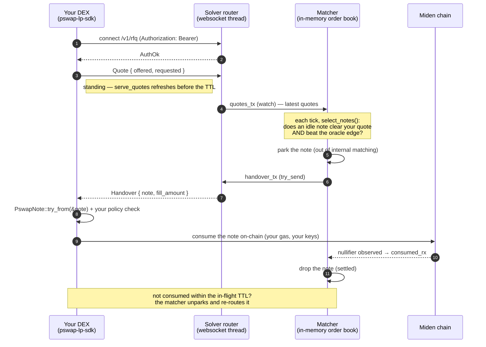

# PSWAP Liquidity Integration Guide

**Who this is for:** an external DEX / liquidity provider (LP) integrating with a Miden PSWAP
solver to receive and fill order flow the solver can't cross internally. *(You'll see "filler"
and "LP" used interchangeably — same thing: you.)*

**What you'll build:** a small service that keeps a standing quote live over one websocket and
consumes the notes the solver hands you, on-chain, with your own miden-client.
**SDK:** [`pswap-lp-sdk`](../crates/lp-sdk) (Rust) · **Transport:** one websocket
(miden-binary frames) · **Auth:** a bearer token the operator issues you.

**Start here:** skim §1 (mental model) and the **mirror warning in §4** (the one thing that
loses money if you get it wrong), then copy the complete example in §7 and adapt it. The SDK's
rustdoc (`cargo doc -p pswap-lp-sdk --open`) is the type-level API reference; this guide covers
the semantics you can't read off the types.

**Using an AI coding agent?** Drop [`partner-integration-CLAUDE.md`](./partner-integration-CLAUDE.md)
into your repo as `CLAUDE.md` (or `AGENTS.md`) — it's a condensed, rules-first version of this
guide written for an agent to generate correct integration code first-try.

**Contents:** 1 Mental model · 2 Install · 3 Connect · 4 Quote (+ orientation) · 5 Handovers &
consume · 6 Operational reference · 7 Complete example · 8 Testing · 9 Events/errors/glossary ·
10 Troubleshooting · 11 Pre-launch checklist.

---

## 1. Mental model

The solver runs an internal order book of PSWAP notes (on-chain swap orders). When
it can't cross an order against another user — e.g. an `IMIDEN→IUSDT` order with no
opposing `IUSDT→IMIDEN` — that note is **idle liquidity**, and it offers it to you.

Three facts make this simpler than a normal RFQ/AMM integration:

1. **Terms are fixed on-chain.** A PSWAP note already encodes its rate (offer `X`,
   request `Y`). You fill it *at that rate or better for the maker, never worse*. So
   there is **no price negotiation** — your "quote" just declares *how much* you'll
   take and *at what rate you stop being interested*.
2. **A "handover" is a note, not custody.** The solver sends you the decoded `Note`.
   You consume it **on-chain, on your own gas, with your own keys**. The solver never
   holds your funds and never signs for you.
3. **Standing quotes, not request/response.** You keep a quote live and refresh it
   before it expires; you are *not* asked per-order. The solver matches its idle notes
   against your standing quote and pushes you the ones that clear it. (The SDK's
   `serve_quotes` handles the refresh for you.)

### How the solver talks to your DEX



If you never consume a handed-over note, nothing breaks: after the in-flight TTL the
solver reactivates it and matches it elsewhere.

---

## 2. Install

```toml
[dependencies]
pswap-lp-sdk = { git = "<solver-repo-url>", package = "pswap-lp-sdk" }
tokio = { version = "1", features = ["rt-multi-thread", "macros"] }
anyhow = "1"
```

The SDK pulls `miden-protocol` / `miden-standards` (the binary protocol carries miden
types natively). It does **not** pull the solver crate or `miden-client` — you bring
your own client for the consume transaction, so nothing conflicts with your stack.

---

## 3. Connect

```rust
use pswap_lp_sdk::{LpClient, LpEvent};

let mut client = LpClient::connect("ws://solver-host:8090/v1/rfq", "your-token").await?;
assert!(matches!(client.next_event().await, Some(LpEvent::AuthOk)));
```

- The SDK sends `Authorization: Bearer <token>` on the upgrade. A **wrong/missing token
  fails the connection** (HTTP 401) — `connect` returns `Err`, no session opens.
- On success the **first event is always `AuthOk`**. The connection then **auto-reconnects**:
  a transient drop surfaces as `Reconnecting` then `Reconnected` (the SDK re-authenticates
  for you), and the event stream only ends (`next_event` → `None`) when
  you drop the client. A terminal `Disconnected { reason }` is emitted only if the SDK
  gives up — today that means the token was rejected on reconnect.
- Default port **8090**, path **`/v1/rfq`**. Tokens are bearer secrets — treat them like
  API keys; don't share or log them.

---

## 4. Quote

The one-call, hands-free path is `serve_quotes` — keep a fresh quote live per pair.
There's no subscribe step: **the quote is the registration** (its faucet ids imply the
pair).

```rust
use std::time::Duration;
use pswap_lp_sdk::PairSpec;

let _q = client.serve_quotes(
    vec![PairSpec { offered: imiden, requested: iusdt }],   // AccountIds, (offered, requested)
    Duration::from_secs(10),                                // ~half the router's quote TTL
    |_pair| Some((1_000_000, 2_000_000)),                   // your live price (base units)
);
```

The SDK calls your pricing fn **every tick** for the current amounts and re-sends the
quote — so it never expires (keepalive) **and** never goes stale-by-omission (it always
pushes what your fn returns *now*). Return `None` to skip a pair this tick. Drop the
returned `QuoteTask` to detach, or `abort()` to stop.

For manual control you can also `client.quote(offered, requested, valid_for_ms)` with
`FungibleAsset`s directly, or send from a cloned `client.sender()`.

### What a quote means (base units, not a human price)

A quote is two amounts, from **your** side: **`offered`** (base units of the token you
*give*) and **`requested`** (base units of the token you *want*).

- **Their ratio is your rate** — the worst price you'll accept. The solver only hands
  you notes whose fixed on-chain rate is at least this generous to you.
- **The amounts are your max size** — the solver packs notes up to them.

> **Work in base units — the token's on-chain units, exactly like a PSWAP note.** Do
> **not** compute a "human price per whole token" or pre-scale by decimals — you did
> that in the old string-price protocol; you don't now. A quote is structurally a PSWAP
> counter-order: "I give `offered` for `requested`." The solver compares base-unit
> ratios directly (and applies each token's decimals only for its oracle off-market
> check — see [external-liquidity-routing.md](external-liquidity-routing.md)).

`PairSpec { offered, requested }` is your side (give / want); its reverse is a distinct
pair. Quoting a pair *is* the registration — no separate step.

> **Mirror warning — read twice.** A quote's `offered` is what **you give**; a handed-over
> note's `offered_asset()` is what **you receive** (§5) — the same word, opposite sides. A
> note you fill is the mirror of your quote: its offered asset is your quote's `requested`
> token, its requested asset is your quote's `offered` token. Swapping the two silently
> quotes the **wrong side of the market** — the single most expensive integration mistake.

**Worked example** — you want to *buy iMIDEN, paying with iUSDT*, up to 2,000,000 iUSDT, at
no worse than 2 iUSDT per iMIDEN:

```rust
// You GIVE iUSDT and WANT iMIDEN, so:
client.quote(
    FungibleAsset::new(iusdt,  2_000_000)?,   // offered  = what you GIVE  (up to 2,000,000 iUSDT)
    FungibleAsset::new(imiden, 1_000_000)?,   // requested = what you WANT (at least 1,000,000 iMIDEN)
    None,                                     // valid_for_ms: None → capped at the router's TTL
)?;
```

The solver then hands you notes that **offer iMIDEN and request iUSDT** — you consume them
to *receive* iMIDEN and *pay* iUSDT. (Quote `offered`/`requested` are always your side; the
`imiden`/`iusdt` here are the faucet `AccountId`s the operator gives you — see §2.)

---

## 5. Receive handovers & consume

```rust
use pswap_lp_sdk::consume::{consume_args, PswapNote};

while let Some(ev) = client.next_event().await {
    match ev {
        LpEvent::Handover(h) => {
            // h.note        : Note — the PSWAP note to consume (decoded)
            // h.fill_amount : u64  — requested-token base units to fill
            let pswap = PswapNote::try_from(&h.note)?;   // what you receive / pay
            // pswap.offered_asset()               — you RECEIVE this
            // pswap.storage().requested_asset()   — you PAY this (pro-rata for a partial fill)
            // pswap.storage().creator_account_id()— maker the requested asset settles back to

            // Your policy check: is the note's fixed rate good for you, given live prices
            // and inventory? You decide — the rate is fixed on-chain.

            let args = consume_args(0, h.fill_amount)?;  // (account_fill, note_fill) → Word
            // ... feed h.note + args into YOUR miden-client transaction (below) ...
        }
        LpEvent::Error(e) => eprintln!("router rejected a message: {e}"),   // typed LpError
        LpEvent::Reconnecting { attempt } => eprintln!("link lost; retrying (attempt {attempt})"),
        LpEvent::Disconnected { reason } => { eprintln!("SDK stopped: {reason}"); break } // gave up (§6)
        _ => {}   // AuthOk, Reconnected, Ask — safe to ignore (or log)
    }
}
```

> The full set of `LpEvent` variants and what to do with each is in [§9](#9-reference-events-errors-glossary).

- **The note carries the rate.** A PSWAP note enforces its own fixed rate on-chain, so
  `h.note` + `h.fill_amount` fully specify the fill — there is no separate price field.
  Read the terms off `PswapNote` and decide with your own live price. (If the overfill
  protocol later makes the binding fill rate differ from the note's intrinsic rate, an
  echoed price will be re-added then.)
- **`consume_args(account_fill, note_fill)`** builds the note args for a fill.
  `note_fill` is requested-token base units from the note (partial fills allowed —
  `fill_amount` may be below the note's requested amount); `account_fill` is the
  account-side amount (`0` for a pure note-side fill).

### Self-consume on-chain (your code, your client)

The SDK stops at the note + args — running the transaction is **yours** (your keystore,
your gas). This uses **your own `miden-client`**, not the SDK. The shape (same call the
solver's own executor uses) is:

```rust
use miden_client::transaction::TransactionRequestBuilder;

// `args` is the Word from `consume_args(0, h.fill_amount)?` above.
let request = TransactionRequestBuilder::new()
    .input_notes([(h.note.clone(), Some(args))])   // (Note, Option<NoteArgs>); NoteArgs = Word
    .build()?;

// `my_account_id` is YOUR filling account; `client` is YOUR authenticated miden-client.
client.submit_new_transaction(my_account_id, request).await?;
```

- The note's payback (the requested asset) settles to the **note's creator**; the offered
  asset lands in **your** account.
- Once your consume confirms on-chain, the solver's ingest sees the **nullifier** and drops
  the note — you send **no message back**; the handover is settled by the chain, not by an
  ack.
- **Idempotency:** treat consumption as at-least-once. Dedupe by the note's id (`h.note.id()`)
  and never submit two transactions for the same note id concurrently — the second will fail
  (the note is already nullified), wasting gas. See [§6](#6-operational-reference).
- **Gas & failure:** if your submit fails (RPC, insufficient gas, note already consumed by
  someone else), just drop it — the note either settled elsewhere or the solver will re-route
  it after its in-flight TTL. Do **not** retry blindly against an already-nullified note.

### If you don't fill

A handover is an *offer*, not an obligation. Ignore it and after `router_inflight_ttl_ms`
(default 30 s) the solver reactivates the note and routes it elsewhere. Repeatedly taking
handovers and not consuming them is visible to the operator and grounds for de-listing.

---

## 6. Operational reference

**Reconnect is automatic.** The SDK reconnects with capped backoff and re-authenticates on
its own — you just handle `Reconnecting` / `Reconnected`. Standing quotes do **not** survive
a drop, but `serve_quotes` resumes on the next tick. If you quote **manually**, re-post on
`Reconnected` (the quote is the registration). The SDK stops only when the token is rejected
(terminal `Disconnected { reason }` → the event stream ends).

**Idempotency.** Treat both handovers and consumption as at-least-once:
- The **same note id can be handed to you more than once** (e.g. after its in-flight window
  lapses). Dedupe by `h.note.id()`; don't submit two txs for one note id.
- A note you didn't take can be routed to **another** LP. If your consume races and loses,
  your tx just fails (note already nullified) — drop it, don't retry.

**Parameters** (operator-configurable — confirm the exact values with your operator):

| Thing | Typical default | Notes |
|---|---|---|
| Endpoint | `ws://<host>:8090/v1/rfq` | `wss://` in production |
| Quote TTL | ~20 s | a quote not refreshed within the TTL is dropped |
| Refresh cadence | ~½ the TTL | `serve_quotes(pairs, Duration::from_secs(10), …)` |
| In-flight TTL | 30 s | unconsumed handover → note reactivated & re-routed |
| Max inbound message | 16 KiB | quotes are tiny; not a concern |

**Tokens.** The operator issues you a **bearer token** out-of-band (it's your identity + your
allow-list). Treat it like an API key: never log or commit it; load it from your secrets
store. Rotation is operator-driven — on a rotated/revoked token the next `connect` (or a
reconnect) fails with `LpError::AuthRejected`.

**Connections.** One socket serves as many pairs as you like. Multiple connections with the
same token also work and are routed independently — handy for HA (run two, dedupe handovers
by note id).

**Observability — what to log/alert on:**
- `Reconnecting` bursts / `Disconnected` → link or auth problem (page on `Disconnected`).
- `Error(_)` → you sent something the router rejected (usually a bad quote) — alert; it's a bug.
- handovers received vs consumed (a growing gap = your consume path is failing → **de-listing risk**).
- your consume tx success rate + latency.

**De-listing.** Repeatedly taking handovers and not consuming them is visible to the operator
and is grounds for de-listing. If you can't fill right now, **widen or stop quoting** rather
than take handovers you'll drop.

---

## 7. Complete example

A single-file skeleton — the parts marked `// YOU:` are your business logic.

```rust
use std::time::Duration;
use anyhow::Result;
use miden_client::transaction::TransactionRequestBuilder;
use miden_protocol::account::AccountId;
use miden_protocol::asset::FungibleAsset;
use pswap_lp_sdk::consume::{consume_args, PswapNote};
use pswap_lp_sdk::{LpClient, LpEvent, PairSpec};

#[tokio::main]
async fn main() -> Result<()> {
    // Config the operator gives you (load the token from your secrets store):
    let url   = "ws://solver-host:8090/v1/rfq";
    let token = std::env::var("PSWAP_TOKEN")?;
    let imiden = AccountId::from_hex("0x…")?; // faucet AccountIds from the operator
    let iusdt  = AccountId::from_hex("0x…")?;
    let my_account_id = AccountId::from_hex("0x…")?; // YOUR filling account

    // 1) Connect (auto-reconnects from here on).
    let mut client = LpClient::connect(url, &token).await?;

    // 2) Keep a fresh quote live, hands-free. `price` returns your CURRENT
    //    (give_amount, want_amount) in base units — offered = give, requested = want.
    let _quotes = client.serve_quotes(
        vec![PairSpec { offered: iusdt, requested: imiden }], // give iUSDT, want iMIDEN
        Duration::from_secs(10),
        move |_pair| Some(your_live_price()), // YOU: your live quote, or None to skip this tick
    );

    // 3) Handle events. Handovers are notes YOU consume on-chain.
    while let Some(ev) = client.next_event().await {
        match ev {
            LpEvent::Handover(h) => {
                let pswap = PswapNote::try_from(&h.note)?;      // what you receive / pay
                if !accept(&pswap, h.fill_amount) {             // YOU: risk check; the rate is fixed
                    continue;
                }
                let args = consume_args(0, h.fill_amount)?;     // (account_fill, note_fill)
                let request = TransactionRequestBuilder::new()
                    .input_notes([(h.note.clone(), Some(args))])
                    .build()?;
                // YOU: your authenticated miden-client. Failure? log + drop (don't retry a nullified note).
                if let Err(e) = your_client_submit(my_account_id, request).await {
                    tracing::warn!(note = ?h.note.id(), error = %e, "consume failed; skipping");
                }
            }
            LpEvent::Reconnecting { attempt } => tracing::warn!(attempt, "link lost; retrying"),
            LpEvent::Reconnected => {} // re-post here only if you quote manually (serve_quotes self-heals)
            LpEvent::Error(e) => tracing::warn!(error = %e, "router rejected a message"),
            LpEvent::Disconnected { reason } => { tracing::error!(%reason, "SDK gave up"); break }
            LpEvent::AuthOk | LpEvent::Ask { .. } => {}
        }
    }
    Ok(())
}
```

---

## 8. Testing before production

The SDK is transport-only, so you can validate most of your integration without a live
solver:

1. **Unit-test the parts that matter in isolation** — your pricing fn and your `accept(...)`
   risk check are pure functions; test them directly (esp. the offered/requested orientation
   — assert your quote gives the token you intend to give).
2. **Local protocol test.** The SDK's own tests spin up an in-process mock websocket router
   (`mock_router` in `client.rs`) that speaks the binary protocol — copy it to drive
   `LpClient` end-to-end (connect → quote → inject a `Handover` → assert your handler runs)
   with no solver and no chain.
3. **Testnet dry-run.** Ask the operator for a **testnet** endpoint, token, and funded faucet
   ids. First run with `accept(…) = false` and just **log** the handovers you receive — this
   proves connectivity, auth, and that your quote is oriented correctly (you should get notes
   offering the token you asked for). Then flip `accept` on and do **one real fill on
   testnet**, and check which asset actually landed in your account before touching mainnet.
4. **Chaos check.** Kill the network mid-run; confirm you see `Reconnecting`→`Reconnected` and
   quoting resumes on its own (the SDK is designed to never crash on a dropped link).

---

## 9. Reference: events, errors, glossary

**`LpEvent` (from `next_event()`) — handle these:**

| Variant | Meaning | What to do |
|---|---|---|
| `AuthOk` | Handshake accepted (first event). | Nothing (or log "connected"). |
| `Handover(h)` | A note to fill: `h.note`, `h.fill_amount`. | Risk-check, then consume on-chain. |
| `Reconnecting { attempt }` | Link dropped; SDK is retrying (reason is logged). | Log/metric. Nothing else. |
| `Reconnected` | Link back; pairs still registered. | Re-post **only** if you quote manually. |
| `Error(LpError)` | The router rejected a message you sent. | Log/alert — it's a bug in what you sent. |
| `Disconnected { reason }` | **Terminal.** SDK gave up (e.g. token rejected). | Alert; the stream ends after this. |
| `Ask { pairs }` | Reserved (future pull mode). | Ignore today. |

**`LpError` (typed, from `connect`/`quote`/`send` and inside `Error`/logs):**

| Variant | When |
|---|---|
| `AuthRejected` | Bad/rotated token (HTTP 401 at upgrade). Terminal — fix the token. |
| `Transport(String)` | Socket/connect/read/write failure. The SDK reconnects. |
| `Closed(String)` | You called `quote` after dropping the client. |
| `InvalidQuote(String)` | Your quote was rejected locally (e.g. a zero amount) before it hit the wire. |
| `Protocol { code, msg }` | The router rejected a message you sent. |
| `Consume(String)` | `consume_args(...)` failed to build the on-chain note args. |

**Wire protocol** (binary; the SDK encodes/decodes it — you never touch the wire): miden
`Serializable`/`Deserializable` over WebSocket **binary** frames at `GET /v1/rfq`.
`ClientMsg::Quote { offered, requested, valid_for_ms }` up; `ServerMsg::{AuthOk, Handover
{ note, fill_amount }, Error { code, msg }, Ask { pairs }}` down. `AccountId`/`FungibleAsset`
/`Note` travel as native miden types.

**Glossary:**
- **Note (PSWAP note):** an on-chain swap order. Encodes offered/requested assets and a fixed
  rate. Consuming it executes the swap.
- **Handover:** the solver offering you a note to consume. Not custody, not an obligation.
- **Quote:** your standing counter-order — *give up to `offered`, want `requested`*.
- **Faucet:** the account that issues a token; a token is identified by its faucet `AccountId`.
- **Base units:** a token's smallest on-chain unit (like wei). Always quote in base units.
- **Maker / creator:** who created the note; the requested asset settles back to them.
- **Nullifier:** the on-chain marker that a note was consumed (prevents double-spend).

---

## 10. Troubleshooting

| Symptom | Likely cause | Fix |
|---|---|---|
| `connect` returns `Err(AuthRejected)` | Bad/expired token, or wrong URL/port | Re-check the token + endpoint with the operator. |
| Immediate `Disconnected { reason: "…auth…" }` | Token rejected on (re)connect | Same as above — the SDK won't retry a bad token. |
| `Reconnecting` loops forever | Router down / network / TLS | Check the endpoint is up; `wss://` needs TLS reachable. The SDK keeps retrying with backoff. |
| Quote live, **no handovers** | Rate not clearing, or no idle notes on that pair yet | Normal if your rate is tight. Widen the rate; confirm the pair is active with the operator. |
| Handovers arrive **for the wrong direction** | Orientation swapped | You mixed up `offered`/`requested`. `offered` = what you GIVE (see §4). |
| `LpEvent::Error` on every quote | Zero/invalid amount, or unpriced pair | Check your `price` fn returns non-zero base-unit amounts on valid faucets. |
| Consume tx fails "already consumed / nullified" | The note was filled elsewhere, or you double-submitted | Drop it; dedupe by `h.note.id()`; never submit twice for one note. |
| Received asset is not what you expected | Orientation / decimals confusion | The note's `offered_asset()` is what you receive (§5). Work in base units only. |
| `serve_quotes` seems to stop | You dropped the `QuoteTask` handle **and** the client, or `price` panicked | Keep the `QuoteTask`; keep `price` cheap and non-panicking. |

---

## 11. Pre-launch checklist

- [ ] Token loaded from a secret (never logged/committed); tested against **testnet** first.
- [ ] Faucet `AccountId`s for every pair confirmed with the operator.
- [ ] Quote orientation verified with **one real testnet fill** — the right asset landed in
      your account.
- [ ] `price` fn returns **base-unit** amounts, non-zero, and is cheap/non-blocking.
- [ ] You handle **every** `LpEvent` arm (esp. `Handover`, `Reconnecting`, `Disconnected`).
- [ ] Consume path is **idempotent**: dedupe by `note.id()`, never double-submit, drop on
      "already nullified".
- [ ] Handover-received vs consumed metric wired up (de-listing guard).
- [ ] Alerts on `Disconnected` and on a growing received-vs-consumed gap.
- [ ] Refresh cadence ≈ ½ the operator's quote TTL.
- [ ] Chaos-tested a mid-run network drop (auto-reconnect confirmed).

---

See also: [external-liquidity-routing.md](external-liquidity-routing.md) (solver-side
architecture, export math, config, runbook) and the crate rustdoc
(`cargo doc -p pswap-lp-sdk --open`).
