# Market Maker Integration Guide

**Inicio Solver · Maker Gateway V1** · 5 October 2026

This guide shows you how to connect your trading system to the Inicio solver. You send orders and cancels over gRPC, and you receive an event feed that tells you when each order goes live, when it is reserved for a settlement and when it fills.

Generate your client from the `gateway.proto` file delivered with this guide (package `solver.maker.v1`, service `MakerGateway`; also on GitHub: [`gateway.proto`](https://github.com/inicio-labs/solver/blob/vaibhav/mm-gateway-store/crates/solver/proto/maker/v1/gateway.proto)). The proto is the complete field reference. This guide explains how to use it.

> **Notation.** JSON examples use protobuf JSON: `bytes` fields are Base64 and 64-bit integers are strings. Endpoints, API keys, note bytes, faucet IDs and times are placeholders; use the values for your environment. Enum values are shortened in the text: `LIVE` means `ORDER_STATE_LIVE`, `FULLY_FILLED` means `RESULTING_STATUS_FULLY_FILLED`, and so on.

## Contents

1. [The APIs at a glance](#1-the-apis-at-a-glance)
2. [Key terms](#2-key-terms)
3. [How an order flows](#3-how-an-order-flows)
4. [Before you start](#4-before-you-start)
5. [Connecting](#5-connecting)
6. [Command identity: request ID and sequence](#6-command-identity-request-id-and-sequence)
7. [The APIs, one by one](#7-the-apis-one-by-one)
   - [SubmitOrder](#71-submitorder) · [CancelOrder](#72-cancelorder) · [CancelAll](#73-cancelall) · [GetCommand](#74-getcommand) · [ListActiveMakerOrders](#75-listactivemakerorders) · [Heartbeat](#76-heartbeat) · [StreamEvents](#77-streamevents)
8. [Events: what you receive and when](#8-events-what-you-receive-and-when)
9. [Keep-alive messages](#9-keep-alive-messages)
10. [Settlement accounting](#10-settlement-accounting)
11. [Order expiry](#11-order-expiry)
12. [Errors and what to do](#12-errors-and-what-to-do)
13. [Checklist before going live](#13-checklist-before-going-live)
14. [Reference](#14-reference)

---

## 1. The APIs at a glance

There are seven calls in three groups. Every call carries your API key as gRPC metadata: `authorization: Bearer <API_KEY>`.

| Group | API | What it does | You send | You get back |
|---|---|---|---|---|
| **Commands**<br/>change state, safe to retry | [`SubmitOrder`](#71-submitorder) | Registers a PSWAP note as your order. | header, note bytes, optional expiry | `CommandReply`: `accepted` or `already_registered` |
| | [`CancelOrder`](#72-cancelorder) | Cancels one order and all of its future remainders. | header, `lineage_id` | `CommandReply`: `stopped` |
| | [`CancelAll`](#73-cancelall) | Cancels all your older orders in a scope: everything, one market, or one direction. | header, optional `market` or `direction` | `CommandReply`: `applied` |
| | [`GetCommand`](#74-getcommand) | Returns the stored reply of a command you sent earlier. | `request_id` | `CommandReply` with `replayed = true`, or `NOT_FOUND` |
| **Reads** | [`ListActiveMakerOrders`](#75-listactivemakerorders) | Pages through your orders that can currently be matched. | `page_token`, `page_size` | `orders`, `next_page_token` |
| | [`Heartbeat`](#76-heartbeat) | Returns the server time and your newest event number. | `received_through_seq` | `server_time_unix_ms`, `latest_seq` |
| **Event feed** | [`StreamEvents`](#77-streamevents) | Streams your events: a replay from your saved cursor, then live events as they happen. | `after_seq` | a stream of `event`, `replay_complete` and `keep_alive` messages |

The full gRPC method path is `/solver.maker.v1.MakerGateway/<Method>`, for example `/solver.maker.v1.MakerGateway/SubmitOrder`.

The feed carries three kinds of event. [Section 8](#8-events-what-you-receive-and-when) shows exactly when each one is sent.

| Event | Meaning |
|---|---|
| `OrderStatus` | Your submitted order went `LIVE`, was `REJECTED`, or became `UNAVAILABLE` because its note was spent outside the solver. |
| `SettlementPending` | We reserved your order for a settlement transaction. Nothing is filled yet. |
| `SettlementResolved` | That transaction committed on chain (a fill) or was voided (no fill). |

---

## 2. Key terms

**How it works in three sentences.** You lock the tokens you offer in a PSWAP note on the Miden chain and tell us about it with `SubmitOrder`. When we match it, our settlement transaction consumes your note and creates a payback note with the tokens you were paid, plus a remainder note if part of your order is left. You collect the payback with your own account, and the remainder keeps trading as the same order.

| Term | Meaning |
|---|---|
| Note | An object on the Miden chain that holds tokens, with a script that decides who can consume it. Your order is a note. |
| PSWAP note | A partially fillable swap note. It offers an amount of one token for an amount of another. Each fill takes part of the offer, pays you at your price, and leaves the rest in a new note. |
| Private / public note | Only a commitment to a private note is on chain; its contents stay with you. A public note's contents are visible to everyone. |
| Faucet, faucet ID | The account that issues a token. Its 15-byte faucet ID identifies the token. |
| Commit | A note or transaction is included in a block. |
| Consume | A transaction uses a note as an input and spends it. A note can be consumed only once. |
| Settlement | Our transaction that consumes matched notes and creates the payback and remainder notes. |
| Consumer | The solver account that consumes your note in a settlement. |
| Payback note | The note a fill creates for you, holding the tokens you were paid. You consume it with your account to receive them. |
| Remainder note | After a partial fill, the note holding what is left of your order. It is still your order. |
| Depth | How many fills a note has been through: 0 for your original note, 1 for the first remainder, and so on. |
| Lineage ID | One ID for an order across its original note and all its remainders. You cancel by it ([7.2](#lineage-id)). |
| Live | The solver may match the order. Your note can be consumed on chain from the moment it is committed, whether or not it is live. |
| Reserved, settling | Chosen for a settlement transaction that may fill it. |
| Reclaim | Your own account consumes your order note and takes back whatever is still in it. |
| Command sequence, event sequence | You number your commands (`seq` in the command header). We number your events (`seq` on each event). They are separate counters. |
| Cursor | The event sequence of the last event you have applied and saved. |

---

## 3. How an order flows

This is the normal life of one order, from submit to fill.

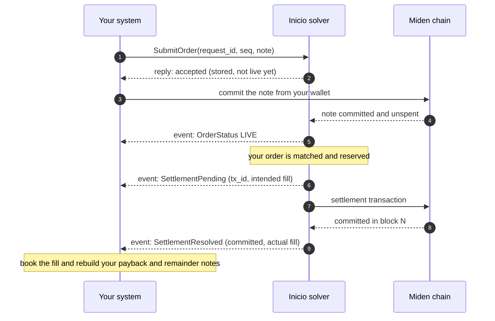

- Steps 1 and 3 can happen in either order. Your note may already be on chain when you submit it, or it may arrive later.
- After step 2 the order is stored, but it isn't live and isn't filled.
- Book a fill only at the last step, `SettlementResolved` with `committed = true`.
- If only part of the order filled, the remainder trades on as the same order (the same lineage) and repeats steps 6 to 9.
- You can cancel at any point with `CancelOrder` or `CancelAll`.

---

## 4. Before you start

### What you get from us

| Item | What it's for |
|---|---|
| gRPC host, port and network access | Connect over HTTP/2 through the TLS endpoint we give you. |
| API key | Send `authorization: Bearer <API_KEY>` on every call. You can have more than one key. All keys of one maker share the same orders and the same event feed. |
| Miden network and node endpoint | Create and commit your notes on the same chain as the solver. |
| Supported token pairs, with each token's faucet ID and decimals | Amounts are integer token units. Orders for other pairs are rejected. |
| Solver account ID | The account that consumes your notes. You need it to rebuild your output notes ([section 10](#10-settlement-accounting)). |
| A test environment | Run the checklist in [section 13](#13-checklist-before-going-live) before trading. |

### Compatible Miden SDK versions

- `miden-client` 0.17.0-rc.2
- `miden-protocol` and `miden-standards` 0.17.0-rc.6

Your note serialization and PSWAP behaviour must match these versions. Check with us before you upgrade.

### Two rules that make everything else simple

1. **Save each command before you send it.** Give every command a request ID and a sequence number, and store them with the command. For a submit, also store the note and its lineage ID: events name your orders by lineage, not by request ID. If a reply is lost, send exactly the same command again. See [section 6](#6-command-identity-request-id-and-sequence).
2. **Save your event cursor together with each event's effect.** Process events in order, and in the same database transaction store both the event's effect on your books and its sequence number. After any disconnect, reconnect from that number. See [StreamEvents](#77-streamevents).

---

## 5. Connecting

Open two gRPC channels: one for commands and reads, and one for the event stream. On a shared connection, a stream you are slow to read can hold up your other calls, and you never want an urgent cancel stuck behind it. Keep both channels open; finishing a unary call doesn't require closing a channel.

- Set a deadline on each unary call. A few seconds is typical.
- Don't set a deadline on `StreamEvents`. It is meant to stay open for as long as you run.
- Turn on gRPC keepalive pings on both channels, so your client notices a dead connection. Ping every 30 seconds or less often; confirm the allowed interval with us.
- Connections and streams will end from time to time: network failures, server restarts and deploys, proxy timeouts, a revoked key, or a client that stops reading. Reconnect with backoff and reopen the stream from your saved cursor. Nothing is lost.
- There is no cancel-on-disconnect. Your orders stay live while you are disconnected; use expiries and cancels to limit them.

Pseudocode:

```text
commands = MakerGatewayClient(connect(tls_endpoint, keepalive_pings = on))
events   = MakerGatewayClient(connect(tls_endpoint, keepalive_pings = on))
auth    = {"authorization": "Bearer " + api_key}

# Commands: save first, then send
command = build_submit(request_id, seq, note_bytes, expiry)
journal.save(command)
reply = commands.SubmitOrder(command, metadata = auth, deadline = 5s)
apply_reply_once(reply)

# Events: follow your feed from your saved cursor
stream = events.StreamEvents({after_seq: journal.cursor()}, metadata = auth)
process_events(stream)        # see 7.7
```

Rust, with a client generated from `gateway.proto` by `tonic-build` (add your TLS configuration to the endpoint):

```rust
use std::time::Duration;
use tonic::metadata::MetadataValue;
use tonic::transport::Channel;
use tonic::Request;

async fn channel() -> Result<Channel, tonic::transport::Error> {
    Channel::from_static("https://maker-gateway.example:443")
        .http2_keep_alive_interval(Duration::from_secs(30))
        .keep_alive_while_idle(true)
        .connect()
        .await
}
let mut commands = MakerGatewayClient::new(channel().await?);
let mut events = MakerGatewayClient::new(channel().await?);

/// Attach the API key to a request.
fn signed<T>(api_key: &str, message: T) -> Request<T> {
    let mut request = Request::new(message);
    let value = MetadataValue::try_from(format!("Bearer {api_key}")).expect("ASCII key");
    request.metadata_mut().insert("authorization", value);
    request
}
```

---

## 6. Command identity: request ID and sequence

`SubmitOrder`, `CancelOrder` and `CancelAll` are commands. Each carries a header:

```json
"header": {"requestId": "mm-quote-100", "seq": "100"}
```

| Field | Rules |
|---|---|
| `request_id` | Names one command. 1 to 128 bytes. Use a UUID or other printable ASCII, and never include a NUL character. |
| `seq` | Your sequence number. Unique per maker across all three commands, and across all your keys and processes. From 1 to 2^63 − 1. |

Both must survive restarts, so store them before you send.

**How to allocate sequences.** The sequence also decides what a `CancelAll` covers ([7.3](#73-cancelall)): a cancel stops every order in its scope whose submit sequence is lower. So:

- Take each sequence from **one counter shared by all your processes**, at the moment you send the command.
- Gaps are fine, and the order in which commands reach us doesn't matter.
- Don't give each process its own block of numbers. If process B sends `CancelAll` with sequence 2001, every later submit from process A using 1000–1999 is cancelled on arrival.
- A submit whose sequence is already below a cutoff in its scope still gets `accepted`, but it never goes live and no event follows.

**What counts as the same command.** A retry must match the stored command exactly:

| Command | Compared |
|---|---|
| `SubmitOrder` | The note bytes and the expiry (present or absent, and its value). |
| `CancelOrder` | The lineage ID. |
| `CancelAll` | The scope. Market faucets in either order count as the same market; `orderType` isn't compared. |

The sequence and the kind of command must match too. Which API key you use doesn't matter.

A request rejected with `INVALID_ARGUMENT` or `UNAUTHENTICATED` stores nothing. Fix it and send it again; you may keep the same request ID and sequence. We keep command replies for as long as V1 runs, so a retry or `GetCommand` works at any later time.

### Retrying a command

If you get no reply (a timeout, `UNAVAILABLE` or a dropped connection), you don't know whether the command was stored. Send **exactly the same command** again: the same request ID, sequence, note and expiry. Never give a command a new request ID just because a reply was lost. Retry with exponential backoff and jitter.

| You receive | It means |
|---|---|
| A reply with `replayed = false` | Your command was stored just now. |
| A reply with `replayed = true` | It was stored earlier, and this is the original reply, unchanged. Apply it idempotently by request ID: you may or may not have seen it before. For a cancel, its `settling` is the count at the time of the original command. |
| `ALREADY_EXISTS` | That request ID or sequence was already used for a different command. Check your journal. Never treat this as success. |

Instead of resending, you can ask for the stored reply with [`GetCommand`](#74-getcommand).

### After a restart

For each command in your journal without a reply, either resend it unchanged, or, for a submit you no longer want, send `CancelOrder` for its lineage. That cancel stops the order even if the lost submit reaches us later. Never reuse the abandoned command's request ID or sequence for something else.

---

## 7. The APIs, one by one

### 7.1 SubmitOrder

**Registers a PSWAP note as your order.** Use it for every new quote: create the note with your Miden wallet, then submit its bytes here.

```json
{
  "header": {"requestId": "mm-quote-100", "seq": "100"},
  "note": "<BASE64_CANONICAL_NOTE_BYTES>",
  "expiresAtUnixMs": "<UNIX_MILLISECONDS>"
}
```

| Field | Notes |
|---|---|
| `note` | The canonical serialization of a Miden `Note`. Not a `NoteFile`, a note ID or a transaction. A PSWAP note for one of our supported pairs; we recommend a private note (see below). |
| `expires_at_unix_ms` | Optional. Omit it for no expiry. The solver applies it off-chain; the note itself never expires on chain. See [section 11](#11-order-expiry). |

This call doesn't fund or publish your note. You create, fund and commit it on chain with your own wallet. We watch the chain for that exact note, committed and unspent, and then make the order live. The note can already be on chain when you submit, or it can arrive later. Chain or RPC delays can postpone activation.

If the note never commits (for example, your wallet's transaction failed), the order stays accepted, with no event, and isn't listed by `ListActiveMakerOrders`. Your journal is the only record of it. Set an expiry, or cancel it by its lineage if you give up on the note.

| Reply | What to do |
|---|---|
| `accepted` | Stored. The order is **not live and not filled** yet. You get `OrderStatus LIVE` once we see the note on chain, unless a cancel covers it first. |
| `already_registered` | An earlier submit already registered this order's lineage. If that was yours (for example, the same note under another request ID), nothing changes. If another maker registered it first, the order is theirs: they receive its events and can cancel it. With a private note, that can only happen if someone else has your note's bytes. |

Keep the original `Note` for every order. You need it to rebuild your output notes after a fill ([section 10](#10-settlement-accounting)).

#### Private or public order notes

We accept both, and we recommend **private** notes for market makers.

- **Private:** your order's terms stay off chain until it fills. Events for each order arrive in a fixed order: `LIVE` first, then the settlement events.
- **Public:** the terms are visible to everyone. We can match a public note as soon as we see it on chain, which can be before we have verified your submit. So `SettlementPending` can arrive before `LIVE`, and if the order fills before we verify it, you may never receive `LIVE`. Your settlement events are still complete.

#### Payback note type

When you create the order note you choose the type of the payback notes it will create for you (`payback_note_type` below). It's your choice:

- **Public paybacks:** your wallet finds each payback by syncing, and you consume it like any incoming note. Simplest.
- **Private paybacks:** the payback's contents aren't on chain, so you rebuild each one from its `SettlementResolved` event and consume it from those details ([section 10](#10-settlement-accounting)). Less visible, more work.

Rust, creating a private PSWAP note with the Miden client and getting the bytes to submit:

```rust
use miden_client::note::NoteType;
use miden_client::transaction::{PswapTransactionData, TransactionRequestBuilder};
use miden_protocol::asset::FungibleAsset;
use miden_protocol::crypto::utils::Serializable;

// `client` is your miden-client instance and `my_account` your funded Miden
// account. `eth_faucet` and `usdc_faucet` are the faucet IDs we give you.
// Offer 1,000 units of ETH for 2,500,000 units of USDC (integer token units).
let offered = FungibleAsset::new(eth_faucet, 1_000)?;
let requested = FungibleAsset::new(usdc_faucet, 2_500_000)?;
let request = TransactionRequestBuilder::new().build_pswap_create(
    &PswapTransactionData::new(my_account, offered, requested),
    NoteType::Private,      // the order note (recommended)
    payback_note_type,      // NoteType::Public or NoteType::Private, see above
    None,                   // no extra attachment on the order note
    client.rng(),
)?;
let note = request.expected_output_own_notes()[0].clone();

// Commit the note on chain from your account, then submit its bytes.
client.submit_new_transaction(my_account, request).await?;
let note_bytes = note.to_bytes();   // SubmitOrderRequest.note; also store it
```

### 7.2 CancelOrder

**Cancels one order, including every future remainder of it.** The cancel can arrive before the order's submit, and it is permanent.

```json
{
  "header": {"requestId": "mm-cancel-101", "seq": "101"},
  "lineageId": "<BASE64_LINEAGE_ID>"
}
```

Reply: `stopped { settling }`. The wire name is `stopped`; it means the order is cancelled. `settling` is 1 if the order was already reserved by a settlement and may still fill, otherwise 0 ([what a cancel does and doesn't do](#what-a-cancel-does-and-doesnt-do)).

#### Lineage ID

A note ID names one version of an order. Each partial fill creates a remainder note with a new note ID. The **lineage ID** stays the same for the original order and all of its remainders, so it is what you cancel by. It is 47 bytes:

| Bytes | Content |
|---|---|
| 15 | Creator account ID, read from the PSWAP note's storage. It is the account that receives the paybacks; use it rather than the note's sender field. |
| 8 | `serial[0]`, big-endian u64 |
| 8 | `serial[1]`, big-endian u64 |
| 8 | `serial[2]`, big-endian u64 |
| 8 | `serial[3] − depth`, computed with Miden field arithmetic, big-endian u64 |

Each fill creates the remainder with `serial[3]` one higher and the depth one higher, so `serial[3] − depth` is the same for every note of an order. Your original note has depth 0. Compute the lineage ID once from your original note and store it with the submit.

```rust
use miden_protocol::Felt;
use miden_protocol::crypto::utils::Serializable;
use miden_standards::note::PswapNote;

fn lineage_id(pswap: &PswapNote) -> Vec<u8> {
    let depth = pswap.parent_depth();
    let serial = pswap.serial_number();
    let root_s3 = serial[3] - Felt::from(depth);
    let mut id = pswap.storage().creator_account_id().to_bytes();
    for element in [serial[0], serial[1], serial[2], root_s3] {
        id.extend_from_slice(&element.as_canonical_u64().to_be_bytes());
    }
    id
}
```

### 7.3 CancelAll

**Cancels every one of your orders in a scope whose submit sequence is lower than this command's sequence.** That includes older submits that only arrive after the cancel.

| Scope | What to send |
|---|---|
| All your orders | Omit `market` and `direction`. `orderType` may be `ORDER_TYPE_UNSPECIFIED` or `ORDER_TYPE_PSWAP`. |
| Both directions of one market | `market.faucetA` and `market.faucetB`, in either order. |
| One direction (one offered/requested pair) | `direction.offeredFaucet` and `direction.requestedFaucet`. |
| Market and direction together | Allowed when both name the same token pair; the filters intersect. Different pairs are rejected. |

```json
{
  "header": {"requestId": "cancel-eth-for-usdc", "seq": "102"},
  "orderType": "ORDER_TYPE_PSWAP",
  "direction": {
    "offeredFaucet": "<BASE64_ETH_FAUCET_ID>",
    "requestedFaucet": "<BASE64_USDC_FAUCET_ID>"
  }
}
```

Faucet IDs are the canonical 15-byte faucet IDs in Base64, not the strings "ETH" and "USDC". Only your own orders are affected.

Reply: `applied { cutoff, settling }`. `cutoff` is the barrier now in force for this scope: the highest cancel sequence you have sent for it. `settling` is explained below.

#### How the sequence barrier works

`CancelAll` with sequence 102 sets a **cutoff of 102** in its scope. Every order in that scope whose submit sequence is below 102 is cancelled, now and in future. Cutoffs only rise. A market-wide cancel covers both directions.

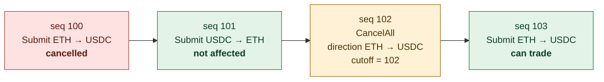

*Your commands in sequence order, left to right.*

| Order | Effect of the cancel with sequence 102 |
|---|---|
| seq 100, offers ETH for USDC | Cancelled: 100 is below 102 and the direction matches. |
| seq 101, offers USDC for ETH | Not affected by this directional cancel. |
| A later remainder of seq 100 | Cancelled too. A remainder keeps its root submit sequence, 100. |
| seq 99, offers ETH for USDC, arriving after the cancel | Cancelled as soon as it arrives. Its reply is still `accepted`, but it never goes live and no event follows. |
| seq 103, offers ETH for USDC | Can trade: 103 is above the cutoff. |

To cancel **both** directions instead, send `CancelAll` with `market.faucetA = ETH` and `market.faucetB = USDC` and no `direction`. Give it its own request ID and a new sequence, for example 104: it cancels every ETH/USDC order in either direction with a submit sequence below 104, including seq 101 and 103 above. Don't resend sequence 102 with a different scope; that returns `ALREADY_EXISTS`.

#### What a cancel does and doesn't do

This applies to both `CancelOrder` and `CancelAll`.

- **It stops new matches.** Once you have the reply, no new settlement reserves any order the cancel covers.
- **It doesn't stop a settlement already in flight.** `settling` counts your covered orders that were already reserved and may still fill. It is a count of orders, not a token amount. Their `SettlementPending` events may already be in your feed or still on the way; keep following them to their `SettlementResolved`.
- **It doesn't touch your note on chain.** Your funds stay in the note until it is consumed or you reclaim it ([section 10](#10-settlement-accounting)). A public note can still be consumed by anyone else; a private note only by someone who has its details. Even `settling = 0` doesn't mean your funds are back.
- **It produces no event of its own.** Record the cancel reply and its scope in your own state. An order cancelled before it went live never gets a `LIVE` event. A later `SettlementResolved` can report an order's result as `CANCELLED`.

#### Replacing a cancelled or expired quote

A cancel is permanent for that order, and a new command can't undo it or extend its expiry. Submitting the same note again under a new request ID returns `already_registered`. Changing the expiry under the original request ID returns `ALREADY_EXISTS`.

To refresh a quote, create and commit a **new** note with a new serial number (so it has a new lineage), then submit it with a new request ID and a higher sequence, for example 105 after cancel 104.

### 7.4 GetCommand

**Returns the stored reply of a command you sent earlier**, found by its request ID. Use it when a reply was lost and you'd rather check than resend.

```json
{"requestId": "mm-quote-100"}
```

| Reply | Meaning |
|---|---|
| The stored `CommandReply`, with `replayed = true` | The command was stored. Apply its reply idempotently. |
| `NOT_FOUND` | Nothing is stored under that request ID right now. This doesn't prove that an earlier request still in flight won't be stored. If you still want the command, resend the original, identical command. |

`GetCommand` has no command header and uses no sequence. Replies are kept for as long as V1 runs.

### 7.5 ListActiveMakerOrders

**Pages through your orders that can currently be matched**, as recorded in our database.

```json
{"pageSize": 500, "pageToken": ""}
```

- Send an empty `pageToken` for the first page.
- Pass each `next_page_token` back unchanged, until you get an empty one.
- `pageSize` 0 means the default of 500. The maximum is 1000; larger values are capped.
- A full last page can be followed by one empty page.
- Treat the page token as opaque.

Each entry:

| Field | Meaning |
|---|---|
| `note_id` | The current version of the order. After a partial fill, this is the remainder note. |
| `lineage_id` | The order across all its versions ([7.2](#lineage-id)). |
| `root_seq`, `request_id` | The submit that registered the order. |
| `depth` | 0 for the original note, plus one for each partial fill. |
| `expires_at_unix_ms` | The expiry you set, if any. |

This is a database view, not a promise that an order will be matched:

- **Left out:** orders not yet live, cancelled orders, orders reserved by a settlement, filled orders and spent notes.
- **Can still appear:** an order already chosen for a settlement, until the reservation is written; and orders past their expiry, because expiry is applied when matching. Filter expiry yourself ([section 11](#11-order-expiry)).
- **Not a snapshot:** each page is read separately, so orders can change between pages.
- Don't infer a fill from an order disappearing. Fills come from events.

### 7.6 Heartbeat

**You tell us the last event you processed; we return the server time and your newest event number.**

```json
{"receivedThroughSeq": "41"}
```

```json
{"serverTimeUnixMs": "1791198898051", "latestSeq": "43"}
```

Use it to:

- **Measure your lag:** `latestSeq` minus your cursor is how many events you haven't applied yet.
- **Check your clock:** compare `serverTimeUnixMs` with your clock; expiry is judged by ours ([section 11](#11-order-expiry)).
- **Monitor:** an alert if your lag keeps growing.

We log the `receivedThroughSeq` you send so we can see your lag on our side; it changes nothing else. `Heartbeat` doesn't acknowledge, delete or replay events, and it doesn't move your cursor. Calling it every 30 to 60 seconds is plenty. It is unrelated to the [keep-alive messages](#9-keep-alive-messages) on the event stream.

### 7.7 StreamEvents

**Opens your event feed.** You get every event after `after_seq`, then a `replay_complete` marker, then new events as they happen.

```json
{"afterSeq": "41"}
```

Send the sequence of the last event you **applied and saved**. Send `0` the first time, to get your whole feed. Event sequences are a separate counter from your command sequences; never use a command sequence as the cursor.

The stream carries three kinds of message:

| Message | What it is | What to do |
|---|---|---|
| `event` | One of your events, with its `seq`. | Apply it, and save its `seq` in the same transaction. |
| `replay_complete` | Sent once per stream: every event up to `through_seq` has now been sent, and later events are live. | Optional: mark yourself as caught up. It is not a snapshot of your orders. |
| `keep_alive` | A "still here" message sent when there is nothing else to send. | Skip it in your order logic. See [section 9](#9-keep-alive-messages). |

Every event (`MakerEvent`) has `seq`, `event_id` (a unique ID, useful in your logs), `created_at_unix_ms`, the `lineage_id` of the order it concerns (always set for the three V1 events) and a `body`. Sequences are contiguous for each maker and define the order; timestamps don't. All of your API keys see the same feed.

The V1 feed has exactly three event bodies. If you ever receive one your client doesn't know, stop and contact us rather than skipping it.

#### Processing loop

```text
cursor = load_saved_cursor()
for message in StreamEvents(after_seq = cursor):
    if message is event:
        if event.seq <= cursor: continue          # safeguard: already applied
        if event.seq != cursor + 1:               # never expected; be safe
            reconnect_from(cursor); break
        transaction:
            apply_event_once(event)
            save_cursor(event.seq)
        cursor = event.seq
    # replay_complete and keep_alive: nothing to apply
# the stream ended or failed: reconnect from cursor
```

The same loop in Rust:

```rust
use proto::stream_message::Message;

let mut stream = events
    .stream_events(signed(&api_key, proto::StreamEventsRequest { after_seq: cursor }))
    .await?
    .into_inner();
while let Some(message) = stream.message().await? {
    match message.message {
        Some(Message::Event(event)) => {
            if event.seq <= cursor {
                continue;
            }
            if event.seq != cursor + 1 {
                break; // reconnect from `cursor`
            }
            books.apply_and_save_cursor(&event)?; // one transaction
            cursor = event.seq;
        }
        Some(Message::ReplayComplete(_)) | Some(Message::KeepAlive(_)) | None => {}
    }
}
// The stream ended or failed: reconnect from `cursor` with backoff.
```

#### Rules

- **After any disconnect, reconnect from your saved cursor.** Events we sent but you hadn't saved arrive again. We never send an event at or below the `after_seq` you give, so the `seq <= cursor` check is only a safeguard.
- **Never set your cursor from a `keep_alive` or from `Heartbeat.latestSeq`.** They say what we sent or stored, not what you applied.
- **Check your cursor against ours.** If your saved cursor is higher than `Heartbeat.latestSeq`, stop: you are pointed at the wrong environment, or our server was restored. We would send nothing until our numbering passed yours, so you would silently miss events. Contact us before resuming.
- **One reader per maker.** If several of your processes read the feed, let one of them own the cursor, or save it with a compare-and-set, so no event is applied twice.
- **Keep reading.** We hold a limited number of unread messages for you (about 256). If you stop reading for a whole keep-alive interval, we close the stream with `RESOURCE_EXHAUSTED` and the message `event consumer too slow; reconnect from your last cursor`. Reconnect at once from your cursor.
- **Don't open more streams than you need.** The gateway limits open streams. An extra one is refused with `RESOURCE_EXHAUSTED` and the message `too many event subscriptions`; close the streams you don't need and retry with backoff.
- **A revoked key ends the stream** with `UNAUTHENTICATED` within about one keep-alive interval.
- We keep every event in V1, so you can always replay from any earlier cursor.

---

## 8. Events: what you receive and when

### Order lifecycle

Each arrow is labelled with the event you receive when it happens. "No event" means you learn it from your own command reply.

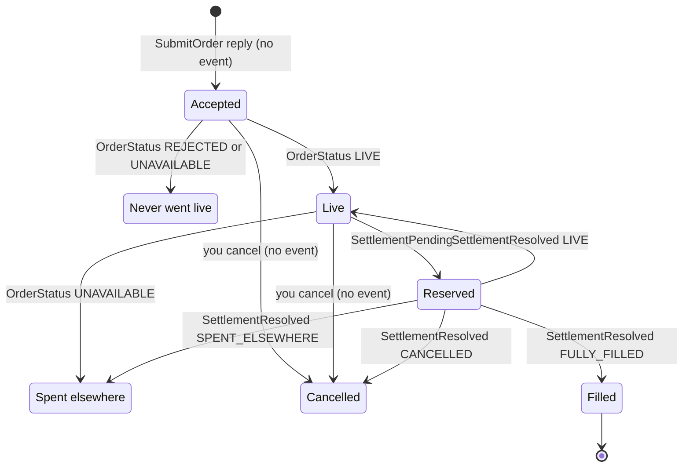

| Arrow | What happened |
|---|---|
| Accepted → Live | We found your exact note committed and unspent on chain, and no cancel covers it. |
| Accepted → Never went live | The note on chain differs from what you sent (`REJECTED`), or it was spent before it went live (`UNAVAILABLE`). |
| Live → Reserved | We matched your order and reserved it for a settlement transaction. |
| Live → Spent elsewhere | The note was spent outside the solver, for example you reclaimed it, or someone else consumed a public note. |
| Reserved → Filled | The transaction committed and nothing is left. |
| Reserved → Live | The transaction committed a partial fill and your remainder (a new note) is live, or the transaction was voided and your order is back. |
| Reserved → Cancelled | Your cancel covers the remainder or the returned order. |
| Reserved → Spent elsewhere | The transaction was voided and your note was spent elsewhere, or the remainder of a committed fill was consumed outside the solver. |
| Accepted or Live → Cancelled | Your `CancelOrder` or `CancelAll` covers the order. |

A partial fill doesn't have its own state: it is a committed `SettlementResolved` whose result is `LIVE`, `CANCELLED` or `SPENT_ELSEWHERE`. **Book every `SettlementResolved` with `committed = true`, whatever its result.**

Cancelled and Spent elsewhere end the order for the solver, but your tokens can still be in a note ([where your funds are](#where-your-funds-are)). An order that reaches its expiry stays as it is, with no event; we just stop matching it ([section 11](#11-order-expiry)).

For a private note, the events for one order always arrive in this order: `LIVE` first, then for each settlement attempt a `SettlementPending` followed by its `SettlementResolved`. For a public note, settlement events can come before `LIVE` ([7.1](#private-or-public-order-notes)).

### Each event, and when it is sent

#### `OrderStatus` · `LIVE`

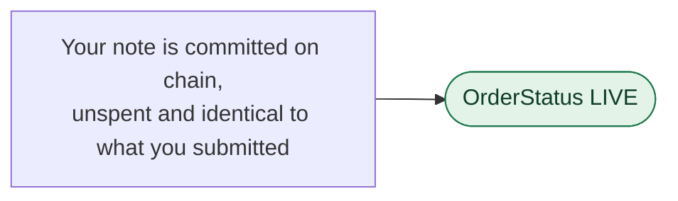

- **Sent:** once per order, when we verify your submitted note on chain and no cancel covers it.
- **Carries:** `note_id`, `depth` (0), `state = LIVE`, and the order's `lineage_id` on the event.
- **Not sent:** for remainders after a partial fill (`SettlementResolved` reports those), or for an order you cancelled before it went live.
- **You do:** mark the order live. It can now be matched. Expiry or a later cancel can still stop it.

#### `OrderStatus` · `REJECTED`

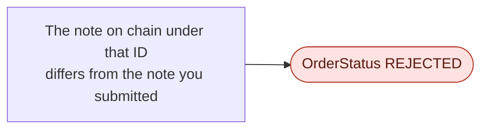

- **Sent:** once, instead of `LIVE`. Reason: `committed note differs from the submitted note`.
- **You do:** treat it as no order. Nothing was filled. Check how you serialize the note.

#### `OrderStatus` · `UNAVAILABLE`

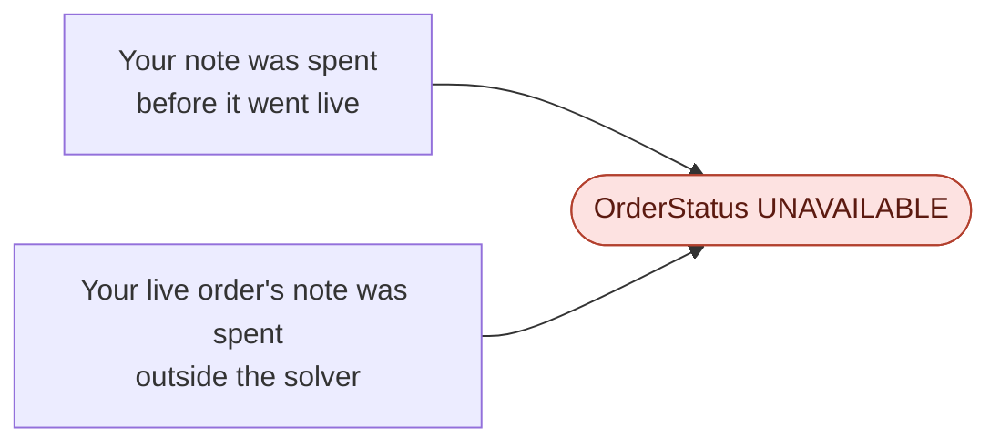

- **Sent:** when the note is spent by anything other than our settlement. The reason says which case: `note spent before it became live` or `note spent outside this solver`.
- **Typical causes:** you reclaimed the note, or someone else consumed a public note.
- **Not sent:** for an order you had already cancelled. Once you cancel, a spend of its note produces no event.
- **You do:** retire the order. It is not a solver fill, so don't book it as one; check the chain for what happened.

#### `SettlementPending`

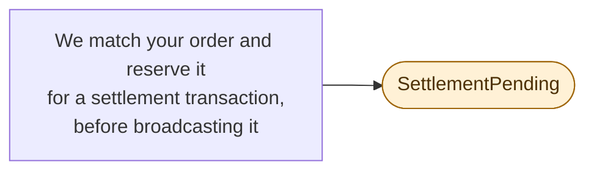

- **Sent:** once for each of your orders in the transaction, when the reservation is written, before the transaction is broadcast.
- **Carries:** `tx_id` and `fill`, the **intended** fill (an `InputFill`, [section 10](#10-settlement-accounting)).
- **You do:** count the order as exposure in flight. Don't book anything yet; wait for the `SettlementResolved` with the same `tx_id`. For one `tx_id`, the committed fill is the same as the fill announced here. A cancel sent now can't stop this settlement; its reply counts the order in `settling`.

#### `SettlementResolved` · committed

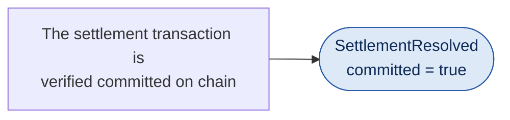

- **Sent:** once for each of your orders in the transaction, after we verify it committed.
- **Carries:** `tx_id`, `committed = true`, `commit_block`, `consumer_account_id`, the **actual** `fill`, and `result` (where the order stands now).
- **You do:** book the fill once, rebuild your payback and remainder notes, and apply the result ([section 10](#10-settlement-accounting)).

#### `SettlementResolved` · voided

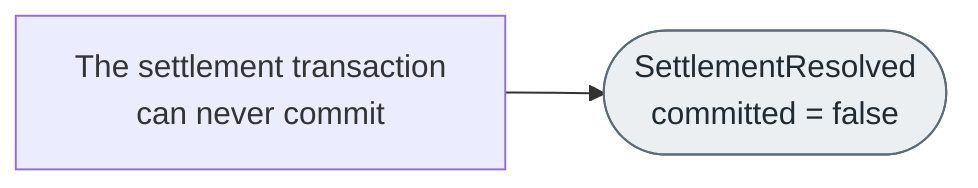

- **Sent:** once for each of your orders in the transaction, when we know it will never commit (for example, its validity window passed before it was included in a block).
- **Carries:** `tx_id`, `committed = false` and `result`. There is no `fill`: nothing was filled.
- **You do:** release the exposure. `result` says whether your order is back (`LIVE`), cancelled (`CANCELLED`) or was spent elsewhere (`SPENT_ELSEWHERE`).

### What never produces an event

- Replies to your commands: `accepted`, `already_registered`, `applied`, `stopped`. Keep them in your own records.
- A cancel itself, from `CancelOrder` or `CancelAll`. A later `SettlementResolved` can still report an order's result as `CANCELLED`.
- A spend of a note whose order you had already cancelled.
- An order reaching its expiry.
- Changes in `ListActiveMakerOrders`.
- `keep_alive` and `replay_complete`. These are stream messages, not events: they have no `seq` and are never replayed.

---

## 9. Keep-alive messages

### What it is

A small message we send on your `StreamEvents` stream when there is nothing else to send:

```json
{"keepAlive": {"cursor": "42", "serverTimeUnixMs": "1791198898051"}}
```

| Field | Meaning |
|---|---|
| `cursor` | The `seq` of the last event sent on this stream, or your `after_seq` if none has been sent yet. |
| `server_time_unix_ms` | Our clock when the message was sent. |

It is not an event. It never changes an order, it isn't stored, and it has no `seq`.

### When it is sent

About every 10 seconds while the stream has no events to deliver. The interval is a server setting; confirm it for your environment. While events are flowing you receive events instead.

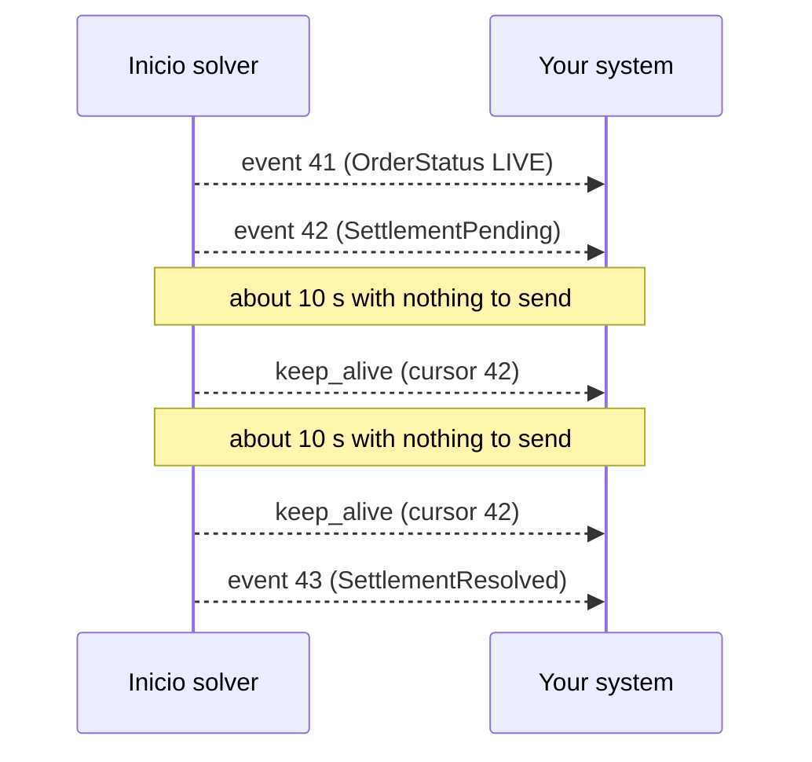

### Why we send it

Your stream passes through several network devices: firewalls and NAT gateways on your side, and our TLS proxy and load balancer on ours. Most of them close a connection that carries no data for a while, often after about 60 seconds. Without the keep-alive, a stream with no trading activity would be cut again and again.

Your gRPC keepalive pings keep the part between your client and our proxy open, including your own firewalls and NAT. They stop at our proxy. The keep-alive covers the rest: it is real data travelling from our server all the way to your client, so no device on the path sees an idle stream.

On our side, the same timer also does two checks on every open stream:

- **Your API key is checked again.** If the key was revoked, the stream ends with `UNAUTHENTICATED` within about one interval.
- **We check that you are still reading.** If you haven't read anything for a whole interval, we close the stream with `RESOURCE_EXHAUSTED` (`event consumer too slow; reconnect from your last cursor`). Reconnect from your cursor.

### What to do with it

- **Skip it in your order logic.** It never means anything changed.
- **Don't save its `cursor` as your cursor.** It tells you what we sent, not what you applied.
- **Use it as a sign of life.** If nothing at all arrives (no event and no keep-alive) for about three keep-alive intervals (about 30 seconds), treat the connection as dead and reconnect from your saved cursor.
- **Optionally watch the clock:** `server_time_unix_ms` shows our clock. `Heartbeat` gives you the same.

### How it differs from similar things

| | Who sends it, and where | What it's for |
|---|---|---|
| `keep_alive` message | Our server, to you, on the event stream | Keeps quiet streams open end to end, and shows the stream is alive. |
| `Heartbeat` call | You, to us, as a separate call | Your lag (`latest_seq`) and our server time. |
| gRPC keepalive pings | Your gRPC library, to the first proxy | Lets your client notice a dead connection. Turn them on ([section 5](#5-connecting)). |
| `replay_complete` message | Our server, to you, once per stream | Marks the end of the replay; later events are live. |

---

## 10. Settlement accounting

### Book a fill only when it is committed

`SettlementPending` carries the **intended** fill. Don't book profit, inventory or a payback from it. If you cancel while a settlement is pending, that cancel's reply counts the order in `settling`.

When `SettlementResolved` arrives with `committed = true`, record its `tx_id`, `commit_block`, `consumer_account_id` and `fill` exactly once, whatever its `result`. For one `tx_id`, this fill is the same as the one announced in `SettlementPending`. One transaction can fill several of your orders; each gets its own event.

When it arrives with `committed = false`, nothing was filled in that transaction and there is no `fill`. Read `result` to see where the order stands.

### The fill (`InputFill`)

| Field | Meaning |
|---|---|
| `note_id` | The note that was consumed: this version of your order. |
| `depth` | The fill round: the consumed note's depth plus one, which is also the depth of the remainder it creates. Note the difference: `OrderStatus.depth` and `ActiveMakerOrder.depth` are a note's own depth. |
| `payback_amount` | Units of the requested token paid to you (the payback note's amount). |
| `offered_paid` | Units of the offered token taken out of your order. |
| `remaining_offered`, `remaining_requested` | Units left in the remainder note. Both are 0 after a full fill. |
| `remainder_note_id` | The remainder note's ID. Empty after a full fill. |

All amounts are integer token units.

### Rebuilding your payback and remainder notes

The output notes are deterministic. With the input note (your submitted note for the first fill, the rebuilt remainder after that), the solver account (`consumer_account_id`) and the fill, the Miden standards SDK rebuilds them exactly.

```text
pswap    = PswapNote(original_note)
order_id = pswap.order_id()

payback = pswap.payback_note(
    consumer,
    PswapNoteAttachment(payback_amount, order_id, depth))

if remainder_note_id is not empty:
    remainder = pswap.remainder_note(
        consumer,
        PswapNoteAttachment(offered_paid, order_id, depth),
        remaining_offered,
        remaining_requested)
    check remainder.id() == remainder_note_id
```

```rust
use miden_protocol::account::AccountId;
use miden_protocol::asset::AssetAmount;
use miden_protocol::crypto::utils::{Deserializable, Serializable};
use miden_protocol::note::Note;
use miden_standards::note::{PswapNote, PswapNoteAttachment};
use proto::event_body::Kind;

// From one committed SettlementResolved event.
let Some(Kind::SettlementResolved(resolved)) = event.body.and_then(|body| body.kind) else {
    return Ok(());
};
let fill = resolved.fill.as_ref().expect("a committed result carries its fill");
let consumer = AccountId::read_from_bytes(&resolved.consumer_account_id)?;
// The note that was consumed: look it up in your store by `fill.note_id`.
let original_note = Note::read_from_bytes(&stored_note_bytes(&fill.note_id)?)?;

let pswap = PswapNote::try_from(&original_note)?;
let attachment = |amount: u64| -> anyhow::Result<PswapNoteAttachment> {
    Ok(PswapNoteAttachment::new(AssetAmount::new(amount)?, pswap.order_id(), fill.depth))
};
let payback = pswap.payback_note(consumer, &attachment(fill.payback_amount)?)?;
if !fill.remainder_note_id.is_empty() {
    let remainder = pswap.remainder_note(
        consumer,
        &attachment(fill.offered_paid)?,
        AssetAmount::new(fill.remaining_offered)?,
        AssetAmount::new(fill.remaining_requested)?,
    )?;
    assert_eq!(remainder.id().to_bytes(), fill.remainder_note_id);
    // Store `remainder`: it is the input note for this order's next fill.
}
```

### Getting paid

Each committed fill creates a payback note addressed to your account, holding `payback_amount` of the requested token. The tokens reach your account when you consume that note:

- **Public paybacks:** sync your wallet. The payback arrives as an incoming note; consume it.
- **Private paybacks:** rebuild it as above, then consume it from those details:

```rust
use miden_client::transaction::TransactionRequestBuilder;

let request = TransactionRequestBuilder::new()
    .input_notes(vec![(payback, None)])
    .build()?;
client.submit_new_transaction(my_account, request).await?;
```

An event isn't an inclusion proof. The network checks the note when it processes your transaction.

### Where your funds are

| Your order | Where your tokens are |
|---|---|
| Accepted, live or reserved | In your order note on chain. |
| Cancelled or expired | Still in your order note, until it is consumed or you reclaim it. |
| After a committed fill | The tokens you were paid are in the payback note until you consume it. What's left of your offer is in the remainder note, which is still your order. |
| After a voided settlement | Unchanged: in the note the result refers to. |
| Spent elsewhere | Wherever that transaction sent them. Check the chain. |

### Taking your funds back

When your own account consumes your order note, the PSWAP script returns what's left in it to you. This is called reclaiming. For an order that has been partly filled, reclaim the latest remainder (rebuild it first).

```rust
let request = TransactionRequestBuilder::new().build_consume_notes(vec![order_note])?;
client.submit_new_transaction(my_account, request).await?;
```

Do it in this order:

1. Cancel the order.
2. Wait until every order counted in the cancel's `settling` has its `SettlementResolved`.
3. Reclaim the note the last result refers to: your original note, or the latest remainder.

If you reclaim while a settlement is still pending, only one of the two transactions can consume the note. If ours wins, you get the fill and your reclaim fails. If yours wins, our settlement is voided: you get `SettlementResolved` with `committed = false`, and its result is `SPENT_ELSEWHERE` or `CANCELLED`.

### Applying the result (`InputResult`)

`result.note_id` is always the consumed input note, even when the status describes the remainder. After a committed partial fill, find the remainder through `fill.remainder_note_id`, not `result.note_id`.

| `result.status` | After a committed transaction | After a voided transaction |
|---|---|---|
| `FULLY_FILLED` | Nothing is left. The order is done. | (not used) |
| `LIVE` | The remainder is live and can be matched again. | Your order is back and can be matched again. |
| `CANCELLED` | The remainder is cancelled; we won't match it. | Your order is cancelled; we won't match it. |
| `SPENT_ELSEWHERE` | The remainder was consumed outside the solver. | Your note was consumed outside the solver. |

A `LIVE` order is still subject to its expiry. After a partial fill, use the rebuilt remainder as the original note for the next fill. The lineage, root submit sequence and expiry stay the same.

---

## 11. Order expiry

**Expiry is a solver rule, not a Miden protocol feature.** A PSWAP note has no expiry on chain. The solver applies the expiry you set off-chain, when it chooses which orders to match. On chain, your note stays spendable until it is consumed or you reclaim it, before or after your expiry time.

### Setting it

`SubmitOrder.expires_at_unix_ms` is optional. Omit it for an order with no expiry.

- It is a Unix time in **milliseconds**, not seconds and not a duration.
- It must be positive and at most 2^63 − 1.
- The first accepted submit of an order fixes it. Remainders keep the same expiry.
- Sending the same request ID with a different expiry returns `ALREADY_EXISTS`.

### What the solver does with it

As your expiry approaches, the solver stops choosing your order for new matches. A match it chose before then still goes ahead: proving, reservation and settlement can finish after your expiry time.

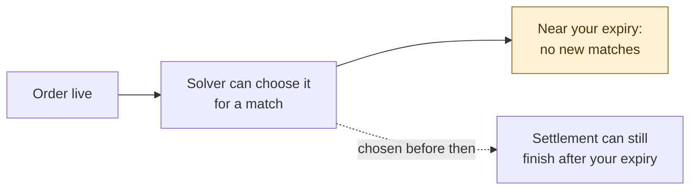

| Situation | What happens |
|---|---|
| Your expiry is still ahead | The solver can match the order as usual. |
| A match was already chosen when your expiry passes | Its settlement continues and may finish after your expiry. |
| The order comes back after your expiry (a voided settlement, or a remainder) | The solver doesn't match it again. |
| You submit an order whose expiry has already passed | It is accepted and stored, but never matched. |
| Your expiry has passed and someone outside the solver consumes your note | That can happen, because the note has no expiry on chain. [Reclaim it](#taking-your-funds-back) if you want your funds back. |

- There is no expiry event.
- Expired orders can still appear in `ListActiveMakerOrders`; filter them yourself.
- The solver judges expiry by its own clock. Use `Heartbeat` to see the offset from yours.
- The solver never returns funds at expiry. To get them back, [reclaim the note](#taking-your-funds-back).

---

## 12. Errors and what to do

| gRPC status | Typical cause | What to do |
|---|---|---|
| `INVALID_ARGUMENT` | Missing header; request ID empty or longer than 128 bytes; sequence 0 or above 2^63 − 1; note bytes not a canonical Miden note or not a PSWAP order; a pair we don't trade; bad expiry; lineage ID not 47 bytes; bad faucet ID; market and direction naming different pairs; bad page token. | Fix the request. Don't retry it unchanged. Nothing was stored, so you may keep the same request ID and sequence. |
| `UNAUTHENTICATED` | API key missing, unknown or revoked. | Fix the key. Nothing was stored; keep your command identities as they are. |
| `ALREADY_EXISTS` | The request ID or sequence was used for a different command. | Resolve it from your journal. Never treat it as success. |
| `UNAVAILABLE`, or your deadline expires | We may or may not have stored the command. | Resend the identical command, or call `GetCommand`. Use backoff. |
| `NOT_FOUND` (from `GetCommand`) | Nothing is stored under that request ID right now. | Resend the original command if you still want it. |
| `RESOURCE_EXHAUSTED` (on `StreamEvents`) | `too many event subscriptions`: too many open streams. | Close streams you don't need; retry with backoff. |
| `RESOURCE_EXHAUSTED` (on `StreamEvents`) | `event consumer too slow; reconnect from your last cursor`: you stopped reading. | Reconnect at once from your cursor, and keep reading. |
| `INTERNAL` | An unexpected server error. | Keep your state, reconnect with backoff, and contact us if it persists. |

Requests larger than 64 KiB are rejected. A PSWAP note is a few kilobytes.

---

## 13. Checklist before going live

Run each of these against our test environment:

- [ ] Submit a note that is already committed, and one that is committed later. Both go `LIVE`, and your command records stay intact.
- [ ] Lose a reply on purpose and resend the identical command; you get `replayed = true`. Change the note, sequence or expiry under the same request ID and confirm `ALREADY_EXISTS`.
- [ ] Cancel one order, one direction and a whole market. Send an older submit after a `CancelAll` and confirm it never goes live.
- [ ] Send a cancel while one of your orders has a settlement pending. The cancel can't stop that settlement: check that the reply counts the order in `settling`, then handle both outcomes. If it commits, book the fill (any remainder comes back `CANCELLED`). If it is voided, the order comes back `CANCELLED`.
- [ ] Test orders with no expiry, an expiry a few seconds away, an expiry that passes while a settlement is pending, and a remainder that comes back after its expiry.
- [ ] Disconnect after receiving an event but before saving your cursor. Reconnect and confirm the fill is not booked twice.
- [ ] Stay connected through a quiet period of several minutes and confirm keep-alives arrive and the stream stays open.
- [ ] Rebuild the payback and remainder notes from a committed fill and match the remainder's note ID.
- [ ] Consume a payback note, and reclaim a cancelled order's note; check that your balances match your books.
- [ ] Page through more than 500 active orders, including an empty last page and orders changing while you page.
- [ ] Revoke a key. New calls fail and open streams close; your other key keeps working.

---

## 14. Reference

### Identifiers

| ID | Size | Notes |
|---|---|---|
| Account and faucet IDs | 15 bytes | Canonical encoding. |
| Note ID | 32 bytes | One version of an order. |
| Lineage ID | 47 bytes | An order and all of its remainders ([7.2](#lineage-id)). |
| PSWAP order ID | One field element | Read from the note with `PswapNote::order_id()`; used to rebuild payback and remainder notes. |
| Transaction ID | 32 bytes | |

Keep raw bytes in your systems. Don't parse display strings.

### Limits

| Limit | Value |
|---|---|
| Request size | 64 KiB |
| `ListActiveMakerOrders` page size | 500 by default, 1000 at most |
| Keep-alive interval | About 10 s (server setting; confirm for your environment) |
| `request_id` | 1 to 128 bytes |
| `seq` | 1 to 2^63 − 1 |

### Files

- [`gateway.proto`](https://github.com/inicio-labs/solver/blob/vaibhav/mm-gateway-store/crates/solver/proto/maker/v1/gateway.proto): the complete field and enum reference. Save a copy with your generated client; the file on GitHub can change.
- Keep this guide, the proto and the environment details we give you together in your integration repository.
