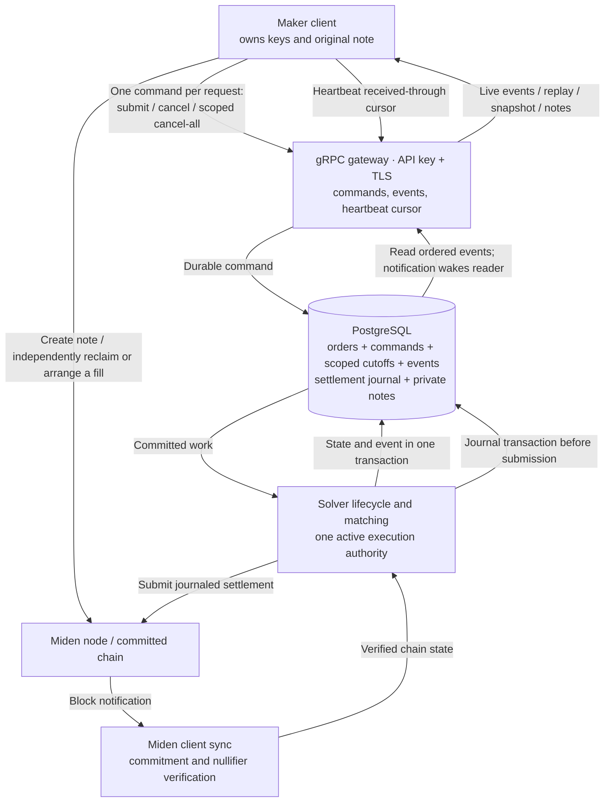
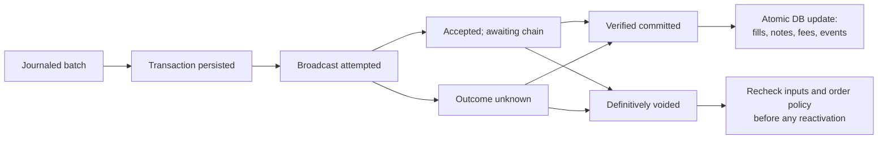

# Market-maker V1: implementation plan and safety contract

Status: design under review, with the confirmed decisions below; implementation is not authorized by this document.
Source baseline reviewed on 27 September 2026; gateway library/dependency review completed on 1 October 2026.
Design updated on 2 October 2026 to incorporate the requested simplicity, correctness and Rust-library recommendations, together with the subsequent facilitator and maker-sequence decisions.

Confirmed by the user on 27 September 2026:

- PostgreSQL will be the authoritative solver business database for V1, including maker commands, order state, events, settlements and accounting.
- A late settlement must respect cancellation and expiry: it cannot automatically reactivate the remaining quantity of a stopped order.
- A heartbeat cursor used for event deletion means the maker can recover through that sequence; receipt into volatile memory is insufficient. A particular MM inbox implementation is not required.

Additional decisions confirmed by the user on 28 September 2026:

- Cancel by market/pair, including the specific direction BTC → ETH.
- A late cancel durably stops any future remainder while reporting the frozen/in-flight exposure that may still settle.
- V1 records actual fees/surplus earned from trader/MM fills; decisions about future pricing, distribution or use of that revenue are deferred.
- One request contains one command. Atomic cancel-and-submit is excluded from V1, superseding the earlier proposal to add it. Database transactions still keep each command's state changes, result and events consistent.
- Cancel-on-disconnect/dead-man behavior remains undecided. Do not assume or enable a default before that policy is agreed.

Subsequent decisions incorporated on 2 October 2026:

- The solver is a facilitator. The MM retains independent on-chain reclaim and trading rights. API identity and PSWAP creator identity are separate; V1 requires neither creator-account control proof nor a creator-account allowlist.
- Use a gRPC maker API with API keys over TLS. Commands, snapshots and heartbeats use unary RPCs; maker events use a server-streaming RPC on the same client channel.
- The maker assigns command sequence numbers. A cancellation at sequence C stops roots with submission sequence < C within its scope, including delayed submissions. Every remainder inherits its root sequence.
- Sequence-allocator failure recovery and a separate emergency stop/resume protocol are deferred.
- Incorporate the review's points 1 (simplicity), 2 (correctness) and 5 (Rust libraries). The separate proposals to remove request IDs/event IDs or consolidate event types are not adopted by this update.
- The simpler book-admission path is documented with its condition: it requires defining Live as durable eligibility. The final Live wording remains a protocol choice to close before implementation.

## Assessment

The proposed gateway, PostgreSQL journal and replay stream are a reasonable, cost-conscious V1. They can protect against duplicate requests, lost connections and ordinary process crashes. They do not, by themselves, establish that the current solver is ready for maker funds. Settlement recovery, cancellation races, private-note recovery and database failover must be implemented and tested together.

The maker owns the funds and retains its signing keys. The solver controls when it attempts fills and holds private note data. Those powers create execution, privacy and availability obligations even when the note script limits how funds may move.

## 1. What protects the maker's money

Use the approved, pinned PSWAP script. Its fill path creates a payment to the note's creator and a remainder on partial fills. Its creator branch permits reclaim. The gateway must verify the script, asset IDs, integer amounts, creator account, network and full note identity. A matching tag or claimed order ID alone proves none of these.

Derive the API maker_id from its validated credential and bind solver-side orders, events and private-note access to that identity. The note's creator determines its on-chain payback/reclaim behavior; do not require the API submitter to prove control of that account or appear on a creator-account allowlist. Registration in our service establishes attribution, not proof of economic ownership. A party with another user's private NoteFile may be able to arrange a fill, so protect that data even though the solver does not hold the maker's spending key. Authorize every lookup, cancel, snapshot, replay and note download. Keep private payloads out of logs and notification channels, and encrypt their storage and backups.

There are two distinct cancellation promises:

- Solver cancellation prevents future selection by this solver once the cancellation takes effect.
- On-chain reclaim consumes the current note through the maker's account. Another party with the note data may still fill it before reclaim commits. An off-chain expiry cannot revoke an already submitted transaction.

Independent maker activity is an expected lifecycle path. If the MM reclaims or trades a note elsewhere, remove the verified spent input from our book and reconcile any competing solver transaction. Consumption alone does not establish an external fill's private amounts or prove that our transaction committed. Report only verified facts and attribute revenue only to our own verified settlements. Preserve explicit public/private routing classification; private maker notes must not silently enter external RFQ routing.

The pinned Miden client includes PSWAP lineage tracking, deterministic payback/remainder reconstruction and cancel-by-order support. Reuse those facilities. A launch test must demonstrate that a maker can recover its current remainder and reclaim with the solver offline, using its retained original note/client state and authenticated chain data. Returning remainder NoteFiles through the gateway is useful redundancy; independent recovery is the stronger protection.

## 2. Minimal architecture

These are logical components, not separate microservices. V1 can use one application deployment, PostgreSQL and the existing Miden client stores. There is no separate message broker or public NTL dependency in the maker transport path.

The source baseline inspected for this plan uses a SQLite/Diesel business database. PostgreSQL is the selected V1 business store; use the actual PostgreSQL backend chosen by the solver migration when implementation begins. Migrate business state and maker-facing delivery/replay together; recording every internal matcher action is unnecessary. Each business transition and its required command result, fills, settlement updates and events must share one PostgreSQL transaction boundary. Preserve the in-memory book, atomic database outcomes and coordinated startup reconciliation. The Miden SDK's own store may remain separate: imports and sync are retryable operations reconciled from our journal. Deployment/failover topology remains to be specified.

### 2.1. Simplicity: avoid unnecessary machinery

- **One meaningful result per command.** Submit returns Accepted only after command and note data are durable; Live arrives later. Cancel returns Applied only after its scoped cutoff is durable and states the boundary for any already frozen exposure. Avoid separate queued, received and applied acknowledgements for every request. A durable state event may repeat the direct result so reconnect recovery remains complete.
- **Ordinary gRPC calls plus one event stream.** Use unary RPCs for commands, snapshots and heartbeats, and a server-streaming RPC for events. These share one client channel; do not promise a fixed physical connection count. Avoid a custom bidirectional command envelope that reimplements request/response coordination. gRPC ordering is within a stream; concurrent unary RPCs still need our application-level cancellation and deduplication rules.
- **A durable cutoff instead of a synchronous sweep.** Commit the scoped cutoff, command result and cancellation event together. Apply the cutoff to effective order state and asynchronously remove stale book entries. Do not enumerate every affected order before acknowledging the cutoff; provide bounded, consistently paginated exposure details when needed.
- **A simpler book-admission path, conditional on Live semantics.** Recommended V1 meaning: Live is durable eligibility for matching after chain verification. Commit that state and its event, then update the in-memory book; reconcile interrupted updates before matching resumes. This permits brief cache-admission lag. If Live instead promises actual installation in the matcher, retain an acknowledgement before reporting it. Do not add a stage/ack/commit/release handshake unless that stronger promise is selected.
- **One active solver authority.** Start with one application deployment and an enforceable single-active-executor rule. Avoid active-active execution or custom consensus. Database durability and failover must match the promised failure coverage; backups alone cannot guarantee zero acknowledged-data loss after primary storage loss.
- **Reuse transport and storage.** Use PostgreSQL's transactions/WAL and durable event rows. No separate broker, custom WAL, custom maker NTL transport or mTLS is required for V1. Reuse useful Miden node-notification/sync facilities behind this gateway. Sequence-loss emergency handling stays deferred. No business rate quotas or live-order caps are introduced; finite messages/buffers and cancellation capacity remain necessary.

### 2.2. Rust libraries selected for the plan

- [Tonic](https://docs.rs/tonic/latest/tonic/): the gRPC server/client, unary and streaming RPCs, TLS, deadlines and message-size limits. Use generated services and select a release compatible with the solver's pinned Miden dependencies.
- [Prost and tonic-prost-build](https://docs.rs/tonic-prost-build/latest/tonic_prost_build/): Protobuf messages and generated Rust services/clients. The same schema supports maker clients in other languages. Match the code-generation crates to the selected Tonic release.
- [Tower](https://docs.rs/tower/latest/tower/): authentication and bounded-concurrency middleware integrated with Tonic. Tonic's [Interceptor](https://docs.rs/tonic/latest/tonic/service/trait.Interceptor.html) is synchronous; use an async Tower layer or handler helper when credential verification needs awaited database work.
- [Tokio](https://docs.rs/tokio/latest/tokio/): the existing async runtime and bounded in-process channels. Channels notify and connect tasks; PostgreSQL provides durable recovery.
- Diesel and, where appropriate, [diesel-async](https://docs.rs/diesel-async/latest/diesel_async/): reuse the solver's chosen PostgreSQL backend and transaction boundary. The inspected solver already uses Diesel. [SQLx](https://docs.rs/sqlx/latest/sqlx/) is an alternative if the database migration selects it; do not add a second database stack solely for the maker gateway.
- [Cloudflare Pingora](https://github.com/cloudflare/pingora) is a framework for programmable proxies, including gRPC proxying. It is not required for this V1 maker service; consider it only if a custom edge proxy becomes a concrete requirement.

API keys are high-entropy bearer credentials, distinct from Miden spending keys. Send them in gRPC authorization metadata over TLS; store verifiers, support rotation/revocation and keep maker_id stable across credential changes. Authorize every operation and enforce revocation on already-open streams. Key revocation changes access; it does not silently cancel accepted orders. The libraries above supply transport and infrastructure, while note activation, scoped cancellation, settlement recovery and durable event replay remain solver logic.

## 3. Command and event contract

State-changing commands are SubmitOrder and scoped cancellation. CancelAll covers the authenticated maker or an explicit pair/direction. The original CancelOrder requirement can use a specific root order/note identity as its scope; a prefix cutoff alone does not provide cancel-one. One request contains exactly one command, with its request ID, maker-assigned command sequence and durable outcome. AtomicCancelAndSubmit, replace, multi-command request batches and an emergency block/resume protocol are excluded from this V1 plan. Read/session operations include event-stream connect/replay, snapshot, order/command status, settlement history, private-note retrieval, server time and heartbeat.

- A maker-scoped request ID identifies one logical command. Same ID and same canonical payload returns the stored status/result; a changed payload returns an idempotency conflict.
- **Maker sequence and scoped cutoff.** Each state-changing command has a unique maker-assigned sequence that persists across reconnects and credentials. Retries retain the same request ID, sequence and semantic payload; conflicting reuse is rejected. A cancellation command at sequence C stops matching roots with submission sequence < C in its scope, including a submission that arrives afterward. Missing lower sequence numbers do not stall cancellation. Remainders inherit the root submission sequence; it is distinct from new command sequences and outbound event sequences. Recovery from failure of the maker's sequence allocator is deferred.
- Return one durable command outcome: Accepted for persisted note intake, or Applied for a committed cancellation cutoff. Later lifecycle events describe activation and settlement. An Accepted submission need not be live, and an Applied cancel need not have eliminated already frozen exposure.
- The original note commitment is unique within its network. A new request ID or higher command sequence must not silently create a fresh live order for the same cancelled note. Retain its root identity independently of request-result pruning. Gateway order IDs and note lineage identifiers are mapped explicitly, not treated as interchangeable globally unique values. Any future intentional reactivation policy requires explicit semantics.
- Events carry maker-scoped event sequence, event ID, request ID when applicable, order ID/version, state and time. Sequence determines order; time is descriptive.
- A transactional per-maker counter allocates event sequence numbers in the same transaction as the event insert. Serialize event allocation through commit; a PostgreSQL sequence/identity alone can leave gaps and does not establish commit order. One stream writer sends committed events in order. A replacement event session invalidates the previous session's cleanup-cursor authority; reconnecting does not reset maker identity, command sequences or cancellations. Unary commands remain authenticated independently of event replay.

The durable feed includes live, rejected after acceptance, cancelled, stop requested while settlement is in flight, externally consumed, provisional fill, unresolved submission when materially relevant, committed settlement, voided settlement and scoped cancel outcome. An accepted pending note is already recoverable from its command and retained payload; no separate AwaitingCommitment event or mandatory initial order row is required. A stop-requested event reports protected future quantity and identifies or references the still-reserved settlement/exposure; it does not claim that the in-flight fill was cancelled. Externally consumed is refined only when its cause is verified and must not invent a solver fill or fee. Command failures remain durably queryable/retryable even when returned directly instead of as separate feed events. Expiry/dead-man events belong only to the corresponding feature if selected. Internal import attempts, every sync and routine worker retries do not require maker events.

Cancellation and subsequent submission are separate requests and can have different outcomes. If CancelOrder succeeds but a later SubmitOrder fails, cancellation remains applied. No rollback or automatic restoration links the requests. Each individual command still records its state changes, result and required events in one PostgreSQL transaction; the gateway publishes committed outcomes in order.

Fill reports include batch and settlement IDs, input note/order version, exact amounts, clearing price with its units, provisional fees/surplus and transaction ID when available. Settlement updates report final amounts and provide payment/remainder note data associated with the submitted order to its authorized API maker. The note script still determines the on-chain recipient and reclaim authority. Internal worker and sync activity stays out of this feed.

## 4. Safe order activation and cancellation

1. Validate and durably accept ExpectedNote plus its sync hint; return the receipt.
2. Import into the Miden client idempotently. Keep failed/pending imports recoverable from the command journal.
3. The maker submits note creation independently. Handle both data-before-chain and chain-before-data arrival.
4. Use committed-block notifications to wake a shared sync actor, with periodic polling as fallback. A notification or PSWAP tag alone never activates an order.
5. Reload the exact authenticated note record and require a committed, unspent note at the latest verified tip. Recheck cancellation and any enabled expiry, then persist eligibility and the required event. Under the recommended durable-eligibility meaning of Live, update the book cache after commit and recover interrupted delivery from durable state. If actual matcher installation is chosen as the Live promise, retain a matcher acknowledgement before reporting it. In either case, selection cannot precede the durable eligible transition. Revalidate eligibility when freezing a candidate so a stale cache cannot override cancellation. Reconcile startup state before matching resumes. If chain sync is too old for the configured freshness bound, pause new activation/selection while preserving cancellation and recovery where durable storage remains available.

The maker sequence cutoff determines which order lineages a cancellation covers. Separately, durable matcher freeze determines whether a covered order was already admitted to an in-flight fill. Freeze and cancellation must serialize against the same maker control state within their database transactions. A cutoff read followed by a later unprotected freeze is insufficient. If cancellation wins, the matcher recalculates without that order. If freeze wins, report the in-flight exposure and stop the future remainder. Keep proving, network calls and socket delivery outside these transactions; acquire multi-maker control locks in a consistent order.

Freeze reserves the entire exact input note/version, including when the intended fill is partial. PSWAP consumption creates a new remainder note, so two concurrent transactions cannot independently reserve different portions of the same input. The executor receives only approved frozen candidates. Chain state can still change through independent MM activity after our check; local freeze does not lock the note on Miden.

Confirmed late-cancel policy: a late cancel cannot stop the frozen fill, but durably marks the entire order lineage to stop any remaining quantity. Persist this stop intent, the command result and the maker event together. The response reports that future quantity is stopped and separately identifies the in-flight exposure that may still settle. Keep its reservation and settlement tracking until the outcome is conclusive; do not report the whole exposure as already cancelled.

For a stopped lineage, if a partial fill commits, store and send the payment/remainder notes, mark the remaining quantity cancelled off-chain and never admit that remainder to matching. If the fill is full, there is no remainder to cancel. If the attempt is definitively voided and the original input remains unspent, the original remaining quantity stays cancelled rather than being reactivated. An unknown outcome stays reserved with stop intent intact. Apply the same rule after restart and to every descendant remainder of a scope-cancelled order. A lineage without stop intent follows normal remainder admission after settlement. On-chain reclaim is still performed by the maker.

Cancel-all atomically records its command result, maker/network/scope cutoff and cancellation event. Maintain `stored_cutoff = max(stored_cutoff, incoming_cutoff)` so an older retry cannot lower it. An order is stopped when its root submission sequence is below any applicable cutoff. The barrier covers accepted pending notes, live orders, late-arriving submissions and all descendant remainders within the scope. Persist barriers independently of maker-event cleanup. New root submissions above the cutoff remain eligible under normal admission rules; there is no automatic block/resume protocol in this V1 plan.

Pair is a market filter; it is distinct from order type (such as PSWAP). Resolve symbols to network-specific asset/faucet IDs. A directional filter with offered_asset_id=BTC and requested_asset_id=ETH cancels only the authenticated maker's BTC → ETH orders. The reverse ETH → BTC direction is separate. Cancelling both directions requires an explicit market-wide scope. Optional order-type filtering can further restrict the market filter to supported types; V1 accepts PSWAP only. Unknown asset IDs, unsupported types, conflicting filters or an omitted direction must not silently broaden cancellation.

Store pair/direction cutoffs without enumerating all matching orders in the acknowledgement transaction. Submission, activation, snapshots and freeze derive effective eligibility from the same persisted rules. A lower-sequence submit arriving later is still stopped; a new higher-sequence submit is outside the prefix. For cancel-one, scope the same rule to a stable root order/note identity and preserve that rule even if the matching submission arrives later. Do not silently interpret a targeted cancel as cancelling the whole pair.

The cancellation result states the durable scope/cutoff and the fact that already frozen exposure may still settle. It includes bounded exposure details or a reference to a consistent, paginated recovery view, together with its event cursor. Avoid an unbounded list or a misleading zero-exposure claim merely to keep the ACK small. A valid currently empty scope still installs a successful barrier covering later arrivals below the cutoff; a reported count, if provided, must describe its as-of view rather than all future affected submissions. One request remains one command.

Expiry API and clock details remain deferred. If enabled, define the authoritative deadline and server-time synchronization contract explicitly, evaluate it before activation/freeze/reactivation, and preserve it across restart. An expiry reached during settlement stops future remainder matching and does not reverse that settlement. This update does not introduce a new expiry feature.

Preserve the existing clearing/allocation policy and the chosen remainder rule: retain the parent's original FIFO priority, but admit the remainder only after chain confirmation. Pending parents stay inactive/reserved; confirmation applies one coordinated outcome. Test this across restart and delayed notification. This transport plan does not replace the allocation algorithm or add database reads on every matching tick.

## 5. Solver-core prerequisite: settlement and remainder recovery

This is an integration boundary, not a requirement to put settlement execution inside the maker gateway. The gateway can report a committed or voided fill and return reclaimable remainder/payment notes only if the solver executor first records enough information to reconcile an interrupted on-chain submission. Implement and review that core work separately; do not enable production maker fills until it is proven. In particular, a crash after on-chain commitment but before the business-database write must recover the committed outcome instead of reactivating the input order.

Before any network submission, commit the batch, reserved input versions, exact fill calculation, expected outputs and intended accounting. Before broadcasting, persist the final transaction ID and proven transaction, or an equally sufficient SDK-backed recovery record linked durably to our settlement ID.

Recovery does not need to rebuild or execute the same candidate after a crash. When the durable protocol establishes that no transaction could have been broadcast, release the interrupted reservation and let the matcher recalculate under current cancellation rules. Once a transaction may have been broadcast, preserve its input reservation until its outcome is resolved. This boundary belongs to the executor's journal and recovery path.

An RPC timeout is not proof of failure. Even observing an input unspent now does not prove a transaction cannot commit later. Keep exposure reserved until the transaction is reconciled or definitively unable to land under the protocol. SDK-local Stale/Discarded statuses alone are also insufficient. A consumed input alone does not establish that our transaction committed. Verify the transaction or corresponding authenticated outputs. Reconciliation can run inside the existing executor/sync/startup paths; it need not be a separate service. Preserve coordinated restart on critical worker failure.

On commitment, one database transaction finalizes fills, accounts for fees/surplus once, stores actual output note data, updates lineage and appends events. A crash after chain settlement but before this write is recovered from the pre-submission journal and chain sync. Replay must not repeat financial entries.

Partial fills retain the gateway order ID while advancing its version and current note ID. Before any remainder returns to the book, recheck its commitment, unspent status, cancel intent, expiry and operational pause. A cancelled/expired lineage never automatically becomes live after a late settlement, a voided attempt or a restart.

Keep trade lifecycle separate from settlement lifecycle. A cancelled order may still have a previously frozen fill settle; a terminal order can still own unclaimed payment notes. Both must remain visible.

The executor in the inspected source baseline pays transaction fees from the solver account and captures residual assets as surplus. Confirmed V1 scope is recording actual earned fees/surplus; no new maker fee schedule, distribution or rebate policy is introduced. Future use/pricing decisions are deferred. Preserve the existing fill/priority policy.

Record maker/order IDs where attribution is established, batch/transaction IDs, asset/faucet ID, exact amount and commit block/time. Keep any explicit fee, gross surplus and on-chain settlement expense separate. Store actual input/payback/remainder flows per order and the reconciled residual per asset for the batch. If a multi-order batch has no established per-order surplus attribution, retain it as unallocated batch revenue and link its orders/makers; do not invent a per-maker split or imply that a new fee was charged. These raw records permit an attribution/reporting policy later. Realized revenue requires verified commitment; voided fills realize no trading revenue. A uniqueness key tied to the committed transaction prevents duplicate accounting during recovery/replay.

## 6. Replay, heartbeat and deletion

Connect/resume supplies after_event_sequence. Heartbeats carry received_through_event_sequence so there is no extra ACK for each event.

Confirmed cleanup contract: a cursor used for deletion must mean the maker can recover everything through that point without those event rows. Merely reading bytes into memory is insufficient. A durable inbox is optional; saving the resulting order/fill/note state together with its cursor is an alternative. If the maker cannot make that promise, it must keep reporting an older cursor or use a separately defined complete reconciliation procedure.

The gateway accepts only monotonic cursors for the current authenticated session, no higher than events sent on that session or an explicitly issued recovery baseline. Reconnect replay uses the maker's supplied cursor, not an automatically increased cursor from the server. Old cursors remain usable while history exists; otherwise return REPLAY_CURSOR_EXPIRED explicitly.

For an expected sequence 20 followed by 21, pause applying later events on that feed and request replay after 19. The engine continues according to existing order policy. The recommended MM recovery workflow waits for ReplayComplete before starting new quoting; cancellations remain available as authenticated unary commands independently of a stalled replay feed. ReplayComplete identifies a fixed catch-up watermark, after which the same stream carries live events. It does not create a new trading block/resume state. A malformed event causes a visible error; repeated replay of the same bad event requires repair/version compatibility handling, not an infinite reconnect loop.

Snapshots carry as_of_event_sequence, order versions and chain-sync height. They include accepted pending notes, live orders, stopped orders with unresolved exposure and references to relevant payment/remainder notes. Their view and cursor must support replay without a gap: a concurrent transition must appear in the snapshot or the following events. Snapshot pages must represent one stable view, or use a separately specified version-aware reconciliation algorithm. A live-order list alone cannot replace lost execution history or unclaimed payment notes.

Cleanup removes a contiguous eligible event prefix only after the recoverable cursor and grace-period checks. Persist the retention floor transactionally with deletion. Protect active replay readers. Do not drop a time partition that still contains another maker's unacknowledged events.

Start with bounded, indexed cleanup batches and normal database maintenance; introduce partitions when measured volume justifies them. Coalesce heartbeat cursor writes: persist the highest validated cumulative cursor periodically rather than writing once per heartbeat. Prune only through the cursor actually persisted, with the grace-period checks; a crash before a cursor write may cause duplicate replay, never deletion based on an unrecorded acknowledgement. Do not create a durable event for every heartbeat.

Retain canonical order, execution, settlement and accounting history separately under an agreed policy. Preserve original and unspent payment/remainder notes and recovery metadata independently of event deletion. Keep idempotency identities/results or reject retries beyond a published window; pruning must not turn an old retry into a new order.

Unacknowledged history cannot be silently deleted to control storage. Use a published recovery horizon with archival/reconstruction for the missing interval and all still-relevant notes, or retain it. Archived data must be verifiably recoverable before removal from the active database. An expired cursor gets an explicit recovery response, never a success with missing events.

## 7. Operating cost and low latency

The incremental transport is small: a gateway task, database rows/indexes, a stream dispatcher and a cleanup worker. Use the same database transaction for business state and its events; multiple rows/WAL records can share the commit. This is not literally one WAL write per event.

LISTEN/NOTIFY provides a wake-up hint; the table supplies durable history. Polling/startup scans remain necessary. Do not send private notes in NOTIFY payloads. A dedicated listener must finish LISTEN before scanning existing state to avoid a startup race.

Use one shared chain sync wake-up, not one sync per order. Send events immediately after their transaction commits. Makers send their highest *recoverably stored* event sequence on existing heartbeat traffic; the gateway coalesces persistence of those cursors as described above. Keep a finite per-connection event buffer. If a maker reads too slowly, disconnect that event stream and retain the undelivered rows in PostgreSQL for replay from the maker's durable cursor. Never wait for the maker's socket inside the matcher or settlement path.

No maker order-rate quotas or live-order caps are planned. Finite memory, maximum valid message size, authentication, admission checks and resource backpressure still exist. If the service cannot durably accept a command, it must return a clear failure and prioritize cancellation capacity. An overloaded session must not exhaust the whole service.

Use PostgreSQL with fsync enabled and synchronous commits so acknowledged changes survive ordinary process restart with intact durable storage. Choose the deployment to match the additional promised failure coverage. If the service must survive loss of primary storage without forgetting acknowledged cancels, use synchronous durable replication and fail over only to a sufficiently caught-up copy. If a required durable copy is unavailable, pause acceptance/execution rather than silently weakening that promise. Enforce one active execution authority, including during deployments/restarts; loss of database or execution authority prevents new signing/submission, while already broadcast transactions remain in reconciliation. This does not require active-active execution or custom consensus.

Backups with point-in-time recovery protect against operator mistakes; they do not substitute for synchronous replication. Test restoration of the application database, Miden client state and note data together. Recovery from an older backup must not silently serve stale event sequences or cancellation state: detect the rollback and require a new recovery epoch/reconciliation before becoming ready.

The bill includes application compute, the selected database primary/replication setup, backups, storage and egress, plus node/prover services and on-chain fees. Avoiding a separate broker reduces one operational component; PostgreSQL writes and any replication still cost money and latency. The inspected source baseline requires a business-database migration; reuse work already completed in the chosen implementation branch.

Illustrative storage arithmetic, not a workload estimate: 10 events/second averaging 1,000 bytes produce 864 MB/day of raw event payload; seven days is about 6.05 GB. At 100 events/second this is ten times larger. Indexes, row overhead, WAL, replicas, backups and private notes are additional. Measure actual event size and peak load before selecting hardware or quoting a monthly price.

## 8. Correctness rules required by the design

These rules are acceptance criteria for the implementation, independent of the chosen transport library:

1. **Commit before acknowledging.** Accepted intake retains the canonical command, note payload and retry result. Applied cancellation retains its scoped barrier and required result/event. A crash between DB commit and channel delivery is recoverable without relying on that channel.
2. **Cutoffs only increase.** Store the maximum cutoff per maker/network/scope and apply every relevant scope. Cancel 100 followed by a delayed cancel 80 must still stop submit 90. Remainders inherit the root sequence. Event deletion does not delete cancellation intent.
3. **Freeze and cancel serialize.** A cancel that commits before freeze wins; a freeze that commits first is disclosed as in-flight exposure. A stale in-memory book or an earlier cutoff read cannot override this result. Recalculation belongs to the matcher, while the executor receives approved inputs.
4. **Reserve whole note versions.** A planned partial fill still reserves its entire input note against concurrent settlements. Activate only the verified committed, unspent remainder after resolving the parent, and recheck its inherited stop intent.
5. **Separate order stop from settlement outcome.** A cancelled order may have an earlier fill commit. A timeout is unresolved, not voided. Definitively voided attempts do not reactivate a stopped root; late committed partial fills do not reactivate stopped remainders.
6. **Respect independent maker activity.** The MM can reclaim or trade elsewhere. Verify external consumption, remove unavailable notes and reconcile competing solver transactions. Do not invent our own fill, payment, fee or external private amount from a consumed-input observation alone.
7. **Preserve note identity across retries.** A new request ID or higher maker sequence cannot silently duplicate or revive the same cancelled note. A targeted order/note scope is distinct from a pair-wide prefix cancel. Keep cross-maker access and public/private routing boundaries on every path.
8. **Publish events in committed order.** Allocate a maker's event sequence transactionally with its event. Test concurrent writers and rollbacks; ordinary PostgreSQL sequence allocation alone does not provide a contiguous commit-ordered feed. Retried delivery must not repeat business effects.
9. **Join snapshot and replay without gaps.** Include pending intake, unresolved exposure and recovery-note references. A fill during snapshot creation must appear in that view or subsequent replay. A cleanup cursor means recoverability at the MM, not volatile receipt.
10. **Recover settlement exactly once.** Persist sufficient recovery data before possible broadcast. If the chain commits before the DB write and the executor crashes, restart finalizes fills, notes, actual accounting and events once. A candidate may be discarded only when no transaction could have been broadcast; uncertain broadcast outcomes keep their inputs reserved.

## 9. Delivery sequence and acceptance tests

1. **Protocol, state model and database authority.** Finalize command/event semantics and migrate authoritative business records to PostgreSQL with atomic event insertion, request uniqueness and maker counters. Tests: duplicate payloads/notes, conflicting request IDs, rollback gaps, ownership isolation and database migration/recovery.
2. **Authenticated gateway and recovery stream.** Use Tonic, the selected Protobuf tooling and existing runtime/database stack. Implement API-key authorization, stored responses, ordered replay, heartbeat cursor, stable snapshots and safe cleanup. Tests: cross-maker denial, key rotation/revocation including open streams, send-before-crash, concurrent event commits, duplicate replay, missing sequence, stale cursor authority, pagination races, cursor beyond sent data and replay during pruning.
3. **Private-note intake and chain activation.** Implement note validation/import, shared block wake-up plus sync fallback and restart recovery. Tests: wrong script/network, invalid creator field without requiring account-control proof, tag collisions, chain-before-data, note spent before activation, cancel-before-commit, interrupted cache admission and stale chain sync. Keep production matching gated until settlement and cancellation tests pass.
4. **Scoped cancellation and matcher freeze.** Implement maker-sequence cutoffs for maker/pair/direction and the selected targeted scope. Persist monotone barriers and stop intent for in-flight lineages. Tests: cancel/freeze races, older cancel after newer cancel, delayed submit below cutoff, root sequence across remainders, cancelled-note resubmission under a new identity, restart after cancel receipt, partial/full/voided/unknown outcomes after late cancel, pair isolation and a currently empty scope followed by a delayed submit. Expiry is added only after its deferred policy is specified; block/resume and sequence-loss recovery remain outside this step.
5. **Settlement journal, reports, accounting and reclaim.** Persist sufficient transaction recovery data before possible broadcast, reconcile ambiguous submissions, finalize once and return exact output notes. Tests: two candidates attempting the same partially filled input, chain success followed by process death before DB write, RPC timeout after node acceptance, definitive rejection, external consumption while proving/submitting, repeated partial fills, rounding, fees and maker recovery/reclaim with the solver offline.
6. **Release verification and operating runbook.** Run realistic peak-load, slow-client, database-failure, restore, stale-leader and privacy checks; document recovery procedures and measured latency. A staged rehearsal uses the complete pipeline before accepting production maker funds.

Each PR includes its own failure tests. PR creation/push remains subject to the user's per-action approval. The six items are a proposed review sequence, not six independent production launches.

## 10. Remaining choices and explicitly deferred work

- Cancel-on-disconnect/dead-man behavior: whether supported, default, timeout and persistence. A replay gap alone does not cancel orders.
- Final Live promise: durable eligibility with recoverable cache-admission lag (recommended for simplicity), or actual matcher installation requiring acknowledgement.
- Exact scope encoding for the original cancel-by-order/note requirement alongside maker-wide and pair/direction cutoffs. A sequence prefix alone is bulk cancellation.
- Replay grace/horizon, archival policy, command-result retention and the recovery procedure for expired cursors. The cumulative maker cursor's recoverability meaning is already agreed.
- Supported networks/note-script versions, promised database failure coverage, deployment/failover topology and workload/latency targets.
- Expiry API/clock details and sequence-allocator failure recovery remain deferred. Do not add an emergency block/resume subsystem as an implicit V1 requirement.

Maker-assigned sequence cutoffs, delayed-submission coverage, inherited remainder sequence and the facilitator boundary are agreed; they are not pending alternatives to a server-assigned cutoff. The review's separate ID/event-type consolidation proposals remain unadopted, so this plan retains request IDs and event IDs.

Late-cancel policy is confirmed: stop all future remaining quantity and report in-flight exposure. Fee/surplus recording is included now; future pricing/distribution decisions do not block V1. The existing clearing/allocation policy and original FIFO for confirmed remainders remain in effect.

Rate limits, live-order caps and atomic cancel-and-submit are excluded from V1. Each request contains one command. Database atomicity for each command's business state, result and events remains required.

## Evidence and limits

This document incorporates source/design reviews and planning edits, not a completed implementation audit or runtime test run. Source observations below refer to the inspected baseline, not a claim about every subsequently updated branch. The dependency set is pinned to Miden release candidates; verify compatibility and recovery against the exact set selected for implementation.

- [Inspected solver settlement flow](../crates/solver/src/executor/executor.rs): the baseline submission loop discards the returned transaction ID and retries transient RPC errors. Its exhausted-retry branch treats submission as not landed and returns orders to Active. The journal/reconciler must replace that assumption wherever it remains.
- [Inspected business database](../crates/solver/src/db/db.rs): the baseline is SQLite/Diesel, with synchronous=NORMAL. PostgreSQL is the selected target; check the migration branch's actual state before implementation.
- [Pinned PSWAP script](https://github.com/0xMiden/protocol/blob/next/crates/miden-standards/asm/standards/notes/pswap.masm): fill and creator-reclaim paths in the Miden implementation; confirm the exact release-candidate dependency before implementation.
- [Miden SDK PSWAP lineage source](https://github.com/0xMiden/rust-sdk/blob/next/crates/rust-client/src/pswap/lineage.rs): chain tracking, authenticated reconstruction and cancel-by-order; confirm the exact dependency version before implementation.
- PostgreSQL [durability settings](https://www.postgresql.org/docs/current/runtime-config-wal.html), [LISTEN startup behavior](https://www.postgresql.org/docs/current/sql-listen.html), [NOTIFY semantics](https://www.postgresql.org/docs/current/sql-notify.html) and [point-in-time recovery](https://www.postgresql.org/docs/current/continuous-archiving.html).
- Command persistence uses PostgreSQL [transactions](https://www.postgresql.org/docs/current/tutorial-transactions.html), [transaction isolation](https://www.postgresql.org/docs/current/transaction-iso.html) and [locking](https://www.postgresql.org/docs/current/explicit-locking.html). Concurrency, chain readiness and book publication remain application protocol obligations alongside atomic database writes.
- PostgreSQL [sequence behavior](https://www.postgresql.org/docs/current/functions-sequence.html) explains why ordinary sequence allocation cannot supply a gapless event feed. Our per-maker transactional counter and publication order are application rules.
- gRPC [RPC types and stream ordering](https://grpc.io/docs/what-is-grpc/core-concepts/) and [authentication](https://grpc.io/docs/guides/auth/); Rust library documentation is linked in section 2.2. Existing Tokio/Diesel usage is visible in the [inspected solver manifest](../crates/solver/Cargo.toml).
